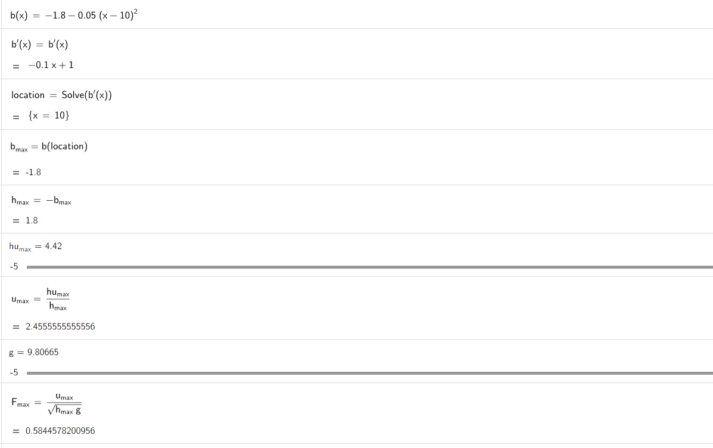
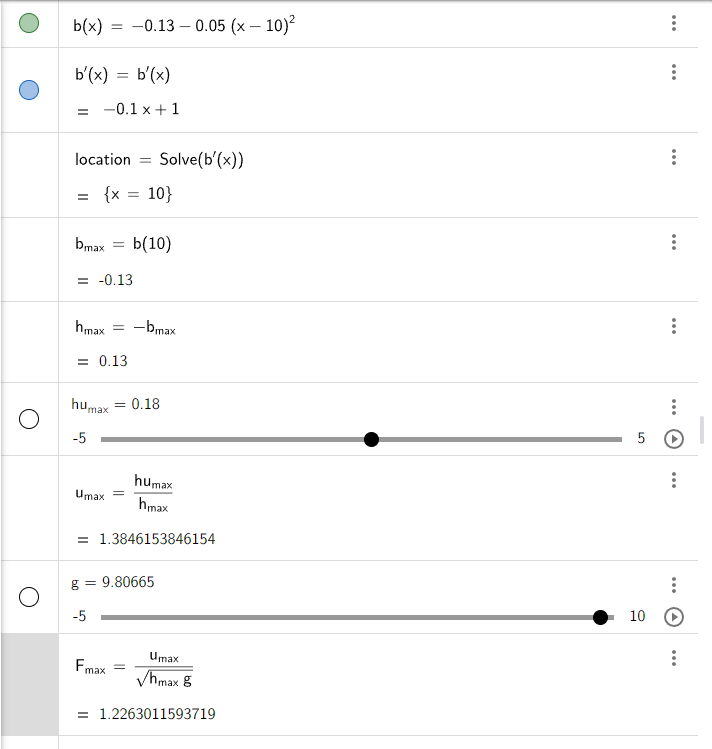
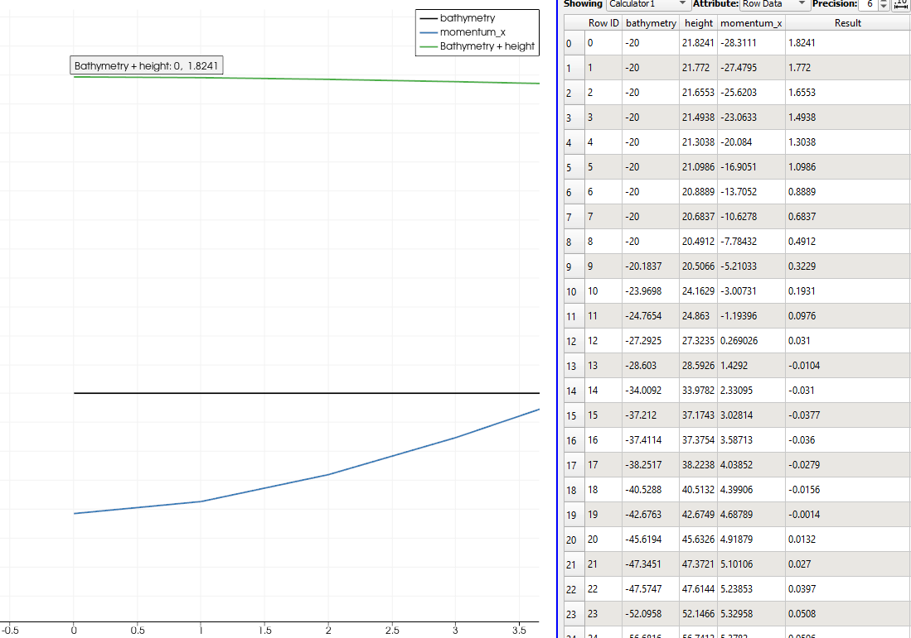

Bathymetry and Boundary Conditions
===========================================

Non-zero Source Term
-----------------------
Adding bathymetry to the f-wave solver is easy because you can subtract it
from the multiplication of the inverse and the jump in fluxes: 


.. math:: 
   \begin{bmatrix}
         \alpha_1 \\
         \alpha_2
       \end{bmatrix} =
       \begin{bmatrix}
         1 & 1 \\
         \lambda^{\text{Roe}}_1 & \lambda^{\text{Roe}}_2
       \end{bmatrix}^{-1} \Delta f - \Delta x \Psi_{i-1/2}.
   

The term :math:`\Delta x \Psi_{i-1/2}` summarizes the effect of the bathymetry:

.. math::
   :label: eq:psi

   \Delta x \Psi_{i-1/2} := \begin{bmatrix}
                                   0 \\
                                   -g (b_r - b_l) \frac{h_l+h_r}{2}
                                 \end{bmatrix}.


Now, let's implement the bathymetry in our F-wave solver:

1. Let's modify the ``eigencoefficientAlpha`` function:

.. code-block:: cpp

   void tsunami_lab::solvers::fwave::eigencoefficientAlpha(t_real i_inverse[4],
                                                        t_real i_delta_f[2],
                                                        t_real i_b,
                                                        t_real o_eigencoefficients[2]){
      //  ∆f - bathymetry
    i_delta_f[1] = i_delta_f[1] - i_b;
    //m x n ° n x p = 
    o_eigencoefficients[0] = (i_inverse[0] * i_delta_f[0]) + (i_inverse[1] * i_delta_f[1]);
    o_eigencoefficients[1] = (i_inverse[2] * i_delta_f[0]) + (i_inverse[3] * i_delta_f[1]);

   }


2. Now, let's modify our ``netupdates`` function: 

.. code-block:: cpp

  void tsunami_lab::solvers::fwave::netUpdates(t_real   i_hL,
                                             t_real   i_hR,
                                             t_real   i_huL,
                                             t_real   i_huR,
                                             t_real   i_bL,
                                             t_real   i_bR,
                                             t_real   o_minus_A_deltaQ[2],
                                             t_real   o_plus_A_deltaQ[2]){  
    bool l_updateR = true;
    bool l_updateL = true;

    //two dry cells next to each other you cant divide by zero
    if(i_hL == 0 && i_hR == 0 ){
        o_minus_A_deltaQ[1] = 0;
        o_minus_A_deltaQ[0] = 0;
        o_plus_A_deltaQ[1] = 0;
        o_plus_A_deltaQ[0] = 0;

        return;
    
    }
    //left cell is a dry cell
    else if(i_hL == 0){

        i_hL = i_hR;
        i_huL = -i_huR;
        i_bL = i_bR;
        l_updateL = false;
        
    }
    //right cell is a dry cell
    else if(i_hR == 0){

        i_hR = i_hL;
        i_huR = -i_huL;
        i_bR = i_bL;
        l_updateR = false;
    }


    t_real l_uL = i_huL / i_hL;
    t_real l_uR = i_huR / i_hR;
      
    t_real l_sL = 0;
    t_real l_sR = 0;

    eigenvalues(i_hL,i_hR,l_uL,l_uR,l_sL,l_sR);

    t_real l_inverse[4];

    inverseMatrix(l_sL, l_sR, l_inverse);

    t_real l_fdelta[2];
    flux(i_hL,i_hR,i_huL,i_huR,l_fdelta);
    
    t_real l_b = (-m_g) * (i_bR-i_bL) *((i_hL+i_hR)/2);

    t_real l_eigencoefficients[2];
    eigencoefficientAlpha(l_inverse,l_fdelta,l_b,l_eigencoefficients);

   
    t_real l_eigens[2] = {l_sL,l_sR};
    decompose(l_eigencoefficients,l_eigens,o_minus_A_deltaQ,o_plus_A_deltaQ);
    

    //if left cell is dry its A-∆Q is zero
    if(!l_updateL){
        o_minus_A_deltaQ[1] = 0;
        o_minus_A_deltaQ[0] = 0;
    //if left cell is dry its A+∆Q is zero 
    }if(!l_updateR){
        o_plus_A_deltaQ[1] = 0;
        o_plus_A_deltaQ[0] = 0;
      }
   }
    


2.  Let's add the bathymetry to the ``WavePropagation.h`` file:


   .. code-block:: cpp

      
      virtual void setBathymetry(t_idx  i_ix,
                               t_idx  i_iy,
                               t_real i_b)=0;

      virtual t_real const * getBathymetry() = 0;


   3. At last, let us add it to the ``WavePropagation1d.cpp`` file: 

         3.1. You have to allocate the memory for the bathymetry cells and init it to zero :

            .. code-block:: cpp

              tsunami_lab::patches::WavePropagation1d::WavePropagation1d( t_idx i_nCells,bool i_choice ) {
                  m_choice = i_choice;
                  m_nCells = i_nCells;

               // allocate memory including a single ghost cell on each side
                  for( unsigned short l_st = 0; l_st < 2; l_st++ ) {
                  m_h[l_st] = new t_real[  m_nCells + 2 ];
                  m_hu[l_st] = new t_real[ m_nCells + 2 ];
                  }
                  m_b = new t_real[ m_nCells + 2 ];

               // init to zero
                  for( unsigned short l_st = 0; l_st < 2; l_st++ ) {
                  for( t_idx l_ce = 0; l_ce < m_nCells; l_ce++ ) {
                  m_h[l_st][l_ce] = 0;
                  m_hu[l_st][l_ce] = 0;
                  m_b[l_ce] = 0;
                     }
                  }
               }

         3.2. Now, let's include it in the timeStep function:

          .. code-block:: cpp

            void tsunami_lab::patches::WavePropagation1d::timeStep( t_real i_scaling) {
               // pointers to old and new data
               t_real * l_hOld  = m_h[m_step];
               t_real * l_huOld = m_hu[m_step];


               t_real * l_b  = m_b; 

               m_step = (m_step+1) % 2;
               t_real * l_hNew =  m_h[m_step];
               t_real * l_huNew = m_hu[m_step];


               // init new cell quantities
               for( t_idx l_ce = 1; l_ce < m_nCells+1; l_ce++ ) {
                  l_hNew[l_ce]  = l_hOld[l_ce];
                  l_huNew[l_ce] = l_huOld[l_ce];
               }

               // iterate over edges and update with Riemann solutions
               for( t_idx l_ed = 0; l_ed < m_nCells+1; l_ed++ ) {
                  // determine left and right cell-id
                  t_idx l_ceL = l_ed;
                  t_idx l_ceR = l_ed+1;

                  // compute net-updates
                  t_real l_netUpdates[2][2];
                  //std:: cout << l_bOld[l_ceR] << std::endl ;

                  if(m_choice){
                     solvers::Roe::netUpdates(l_hOld[l_ceL],
                                             l_hOld[l_ceR],
                                             l_huOld[l_ceL],
                                             l_huOld[l_ceR],
                                             l_netUpdates[0],
                                             l_netUpdates[1]);
                  }else{
                     solvers::fwave::netUpdates( l_hOld[l_ceL],
                                                l_hOld[l_ceR],
                                                l_huOld[l_ceL],
                                                l_huOld[l_ceR],
                                                l_b[l_ceR],
                                                l_b[l_ceL],
                                                l_netUpdates[0],
                                                l_netUpdates[1]);
                  }
    
                  // update the cells' quantities
                  l_hNew[l_ceL]  -= i_scaling * l_netUpdates[0][0];
                  l_huNew[l_ceL] -= i_scaling * l_netUpdates[0][1] ;


                  l_hNew[l_ceR]  -= i_scaling * l_netUpdates[1][0];
                  l_huNew[l_ceR] -= i_scaling * l_netUpdates[1][1] ;
    
  
    
               }
            }

         3.3. Now, let's set the boundary of the bathymetry in the  ``setGhostOutflow`` function:

            .. code-block:: cpp

               void tsunami_lab::patches::WavePropagation1d::setGhostOutflow() {
                  t_real * l_h = m_h[m_step];
                  t_real * l_hu = m_hu[m_step];
                  t_real * l_b = m_b;

                  // set left boundary
                  l_h[0] = l_h[1];
                  l_hu[0] = l_hu[1];
                  l_b[0] = l_b[1];

                  // set right boundary
                  l_h[m_nCells+1]  = l_h[m_nCells];
                  l_hu[m_nCells+1] = l_hu[m_nCells];
                  l_b[m_nCells+1]  = l_b[m_nCells];
               }
   
         3.3.4. lastly we have to add the bathymetry to the ``~WavePropagation1d`` function:

         .. code-block:: cpp

            tsunami_lab::patches::WavePropagation1d::~WavePropagation1d() {
               for( unsigned short l_st = 0; l_st < 2; l_st++ ) {
                  delete[] m_h[l_st];
                  delete[] m_hu[l_st];
               }
               delete[] m_b;
            }


Effect of bathymetry in our F-Wave Solver
..........................................

Now, let's see the effect of bathymetry in our F-Wave solver. We are going to conduct a simulation using the Roe solver and
our F-Wave solver for a specific setup to observe the impact of the bathymetry.

The setup we are going to use for the comparison:

.. code-block:: cpp

   l_setup = new tsunami_lab::setups::DamBreak1d(90,60,5);

But before we simulate, we add a function that computes the bathymetry. So, we go to the ``DamBreak1d.cpp`` and add bathymetry there.


.. code-block:: cpp

   tsunami_lab::t_real tsunami_lab::setups::DamBreak1d::getBathymetry( t_real i_x,
                                                                    t_real ) const {
 
   return (-1.8-0.05*(i_x-10) *(i_x-10));
  
   }


Now, let's examine the results for 500 cells:


   .. video:: _static/Bathymetrie_effect.mp4
      :width: 700
      :autoplay:


The height and momentum of the F-Wave solver are represented in dark blue and green, while those of the Roe solver are
in red and light blue. In the video, we will notice that the bathymetry affected the wave speed and height. This is because the bathymetric
features can influence the speed through wave refraction.
Shallow areas may cause waves to shoal (decrease in depth), which leads to changes in wave height and wavelength.

Reflecting Boundary Conditions
------------------------------
Now, let's implement the reflecting boundary condition as defined in the following equation:

   .. math::

      h_{i} &:= h_{i-1} \\
      (hu)_{i} &:= -(hu)_{i-1} \\
      b_{i} &:= b_{i-1}

1. The first thing is to change our ``setGhostOutflow`` function in the ``WavePropagation1d.cpp`` file:

.. code-block:: cpp 

   void tsunami_lab::patches::WavePropagation1d::setGhostOutflow(bool i_choiceBoundry) {
  m_choiceBoundry = i_choiceBoundry;
  t_real * l_h = m_h[m_step];
  t_real * l_hu = m_hu[m_step];
  t_real * l_b = m_b;

  // set left boundary
  l_h[0] = l_h[1];
  l_hu[0] = l_hu[1];
  l_b[0] = l_b[1];

    // set right boundary
  l_h[m_nCells+1] = l_h[m_nCells ];
  l_b[m_nCells+1] = l_b[m_nCells ];


  if(i_choiceBoundry == true){
    //reflecting boundary :same values except that the reflecting cell receives the paricel velocity with opposite sign
    l_hu[m_nCells+ 1] = -(l_hu[m_nCells ]);
  }
  else
  {
    l_hu[m_nCells+1] = l_hu[m_nCells];
   }
   }  
  
We added a boolean variable so that the ``reflecting boundary`` is not always active

.. Important::

  We also have to modify ``setGhostOutflow`` and also add all occurrences with the boolean input parameter.

2. Now we have to change our wave solver that it matches the boundary by modifying the  ``net-updates`` function:

.. code-block:: cpp

   void tsunami_lab::solvers::fwave::netUpdates(t_real   i_hL,
                                             t_real   i_hR,
                                             t_real   i_huL,
                                             t_real   i_huR,
                                             t_real   i_bL,
                                             t_real   i_bR,
                                             t_real   o_minus_A_deltaQ[2],
                                             t_real   o_plus_A_deltaQ[2]){  
    bool l_updateR = true;
    bool l_updateL = true;

    //two dry cells next to each other you cant divide by zero
    if(i_hL == 0 && i_hR == 0 ){
        o_minus_A_deltaQ[1] = 0;
        o_minus_A_deltaQ[0] = 0;
        o_plus_A_deltaQ[1] = 0;
        o_plus_A_deltaQ[0] = 0;

        return;
    
    }
    //left cell is a dry cell
    else if(i_hL == 0){

        i_hL = i_hR;
        i_huL = -i_huR;
        i_bL = i_bR;
        l_updateL = false;
        
    }
    //right cell is a dry cell
    else if(i_hR == 0){

        i_hR = i_hL;
        i_huR = -i_huL;
        i_bR = i_bL;
        l_updateR = false;
    }


    t_real l_uL = i_huL / i_hL;
    t_real l_uR = i_huR / i_hR;
      
    t_real l_sL = 0;
    t_real l_sR = 0;

    eigenvalues(i_hL,i_hR,l_uL,l_uR,l_sL,l_sR);

    t_real l_inverse[4];

    inverseMatrix(l_sL, l_sR, l_inverse);

    t_real l_fdelta[2];
    flux(i_hL,i_hR,i_huL,i_huR,l_fdelta);
    
    t_real l_b = (-m_g) * (i_bR-i_bL) *((i_hL+i_hR)/2);

    t_real l_eigencoefficients[2];
    eigencoefficientAlpha(l_inverse,l_fdelta,l_b,l_eigencoefficients);

   
    t_real l_eigens[2] = {l_sL,l_sR};
    decompose(l_eigencoefficients,l_eigens,o_minus_A_deltaQ,o_plus_A_deltaQ);
    

    //if left cell is dry its A-∆Q is zero
    if(!l_updateL){
        o_minus_A_deltaQ[1] = 0;
        o_minus_A_deltaQ[0] = 0;
    //if left cell is dry its A+∆Q is zero 
    }if(!l_updateR){
        o_plus_A_deltaQ[1] = 0;
        o_plus_A_deltaQ[0] = 0;
      }

    

   }


one-sided solution of the shock-shock setup
.............................................

1. to solve this task we have to change the shock shock setup to match the task where
reflecting boundary conditions at the right boundary, and outflow boundary conditions at the left boundary.

.. code-block:: cpp

   tsunami_lab::t_real tsunami_lab::setups::ShockShock::getMomentumX(t_real i_x,
                                                                  t_real)const{
      
      return m_hu;                                                                                                                          
                                                                  
   }

2. Now, we need to implement a shock setup in the main, and we have to set the ``setGhostOutflow`` function to true in the main: 

.. code-block:: cpp 
   
   l_setup = new tsunami_lab::setups::ShockShock(6,
                                                6,
                                                5);
   
   l_waveProp->setGhostOutflow(true);
   ....


3. Lastly, let's simulate the shock setup:


   .. video:: _static/shockshockWithReflectionBoundry.mp4
      :width: 700
      :autoplay:


Hydraulic Jumps
---------------

Maximum Froude value and location
..................................

The Froude number can be calculated through this formula:

.. math:: F := \frac{u}{\sqrt{gh}}.

To calculate the maximum Froude value and the location of subcritical flow and supercritical flow, we need to determine the maximum of the following function:

.. math::
   

   \begin{aligned}
         b(x) &=
           \begin{cases}
             -1.8 - 0.05 (x-10)^2 \quad   &\text{if } x \in (8,12) \\
             -2 \quad &\text{else}
           \end{cases}\\
         h(x, 0) &= -b(x) \quad \text{if } x \in [0,25] \\
         hu(x, 0) &= 4.42 \quad \text{if } x \in [0,25].
       \end{aligned}

and: 

.. math::
   

   \begin{aligned}
         b(x) &=
           \begin{cases}
             -0.13 - 0.05 (x-10)^2 \quad   &\text{if } x \in (8,12) \\
             -0.33 \quad &\text{else}
           \end{cases}\\
         h(x, 0) &= -b(x) \quad \text{if } x \in [0,25] \\
         hu(x, 0) &= 0.18 \quad \text{if } x \in [0,25].
       \end{aligned}


The calculations for the location and the value of the maximum Froude number for the subcritical setting can be observed in the following picture:




And for the supercritical setting, the calculations can be observed here:




setup
.......

1. subcritical setting:

   1.1 Now, let's compute the subcritical setting as a setup. We will have to create three files: ``SubcriticalFlow.cpp`` , ``SubcriticalFlow.h`` , ``SubcriticalFlow.test.cpp``

      1.1.1. Let's start with the ``SubcriticalFlow.h`` file :

         .. code-block:: cpp

            /**
            * @author Ward Tammaa
            *
            * @section DESCRIPTION
            * subcriticalFlow.
            **/
            #ifndef TSUNAMI_LAB_SETUPS_SUBCRITICAL_FLOW_H
            #define TSUNAMI_LAB_SETUPS_SUBCRITICAL_FLOW_H

            #include "../Setup.h"

            namespace tsunami_lab {
            namespace setups {
            class SubcriticalFlow;
               }
            }

           class tsunami_lab::setups::SubcriticalFlow: public Setup {

             public:

               /**
                * Gets the water height at a given point.
                *
                * @param i_x x-coordinate of the queried point.
                * @return height at the given point.
                **/
               t_real getHeight( t_real i_x,
                      t_real      ) const;

               /**
                * Gets the momentum in x-direction.
                *
                * @return momentum in x-direction.
                **/
               t_real getMomentumX( t_real ,
                         t_real ) const;

               /**
                * Gets the momentum in y-direction.
                * @return momentum in y-direction.
                **/
               t_real getMomentumY( t_real,
                         t_real ) const;
                         
               t_real getBathymetry( t_real i_x,
                          t_real ) const ;
            };

            #endif

      1.1.2. Now, let's implement the  ``SubcriticalFlow.cpp`` using the following settings : 
            For the **subcritical flow** we use the following initial values:

                      .. math::
                           \begin{aligned}
                              b(x) &=
                                 \begin{cases}
                                    -1.8 - 0.05 (x-10)^2 \quad   &\text{if } x \in (8,12) \\
                                    -2 \quad &\text{else}
                           \end{cases}\\
                         h(x, 0) &= -b(x) \quad \text{if } x \in [0,25] \\
                         hu(x, 0) &= 4.42 \quad \text{if } x \in [0,25].
                        \end{aligned}

            the equivalent code for the settings :

            .. code-block:: cpp
               
               /**
                * @author Ward Tammaa (alex.breuer AT uni-jena.de)
                *
                * @section DESCRIPTION
                * SubcriticalFlow.
                **/
               #include "SubcriticalFlow.h"
               #include <cmath>

               tsunami_lab::t_real tsunami_lab::setups::SubcriticalFlow::getHeight( t_real i_x,
                                                                t_real      ) const {
                 return -getBathymetry(i_x,0);
               }

               tsunami_lab::t_real tsunami_lab::setups::SubcriticalFlow::getMomentumX( t_real,
                                                                   t_real ) const {
                 return 4.42;
               }

               tsunami_lab::t_real tsunami_lab::setups::SubcriticalFlow::getMomentumY( t_real,
                                                                   t_real ) const {
                 return 0;
               }

               tsunami_lab::t_real tsunami_lab::setups::SubcriticalFlow::getBathymetry( t_real i_x,
                                                                    t_real ) const {
                 if(i_x > 8 && i_x < 12){
                   return (-1.8-0.05*pow((i_x-10), 2));
                 }else{
                   return -2;
                 }

               }

            1.1.3. lastly let's implement a unit test for subcriticalFlow in the ``SubcriticalFlow.test.cpp`` file:

                  .. code-block:: cpp
               
                        /**
                       * @author Ward Tammaa 
                        *
                        * @section DESCRIPTION
                        * Tests SubcriticalFlow.
                        **/
                       #include <catch2/catch.hpp>
                       #include "SubcriticalFlow.h"

                       TEST_CASE( "Test the Subcritical flow setup.", "[SubcriticalFlow]" ) {
                         tsunami_lab::setups::SubcriticalFlow l_subcriticalFlow;

                         // left side
                         REQUIRE( l_subcriticalFlow.getHeight( 2, 0 ) == 2 );

                         REQUIRE( l_subcriticalFlow.getMomentumX( 2, 0 ) == 4.42f);

                         REQUIRE( l_subcriticalFlow.getMomentumY( 2, 0 ) == 0 );

                         REQUIRE( l_subcriticalFlow.getBathymetry( 2, 0 ) == -2 );


                         REQUIRE( l_subcriticalFlow.getHeight( 2, 5 ) == 2 );

                         REQUIRE( l_subcriticalFlow.getMomentumX( 2, 5 ) == 4.42f);

                         REQUIRE( l_subcriticalFlow.getMomentumY( 2, 2 ) == 0 );

                         REQUIRE( l_subcriticalFlow.getBathymetry( 10, 0 ) == -1.8f );

                         // right side


                         REQUIRE( l_subcriticalFlow.getHeight( 10, 0 ) == 1.8f);

                         REQUIRE( l_subcriticalFlow.getMomentumX( 4, 0 ) == 4.42f);

                         REQUIRE( l_subcriticalFlow.getMomentumY( 4, 0 ) == 0 );

                         REQUIRE( l_subcriticalFlow.getBathymetry( 2, 0 ) == -2.0f );


                         REQUIRE( l_subcriticalFlow.getHeight( 4, 5 ) == 2 );

                         REQUIRE( l_subcriticalFlow.getMomentumX( 4, 5 ) == 4.42f);

                         REQUIRE( l_subcriticalFlow.getMomentumY( 4, 2 ) == 0 );  

                         REQUIRE( l_subcriticalFlow.getBathymetry( 10, 0 ) == -1.8f );

                     }


2. supercritical setting:

2.1 Now, let's compute the Supercritical Flow setting as a setup. We will have to create three files: ``SupercriticalFlow.cpp`` , ``SupercriticalFlow.h`` , ``SupercriticalFlow.test.cpp``

      2.1.1. Let's start with the ``SupercriticalFlow.h`` file :

         .. code-block:: cpp 

            /**
            * @author Ward Tammaa 
            *
            * @section DESCRIPTION
            * supercriticalflow.
            **/
            #ifndef TSUNAMI_LAB_SETUPS_SUPERCRITICAL_FLOW_H
            #define TSUNAMI_LAB_SETUPS_SUPERCRITICAL_FLOW_H

            #include "../Setup.h"

            namespace tsunami_lab {
            namespace setups {
            class SupercriticalFlow;
               }
            }

           class tsunami_lab::setups::SupercriticalFlow: public Setup {

             public:

               /**
                * Gets the water height at a given point.
                *
                * @param i_x x-coordinate of the queried point.
                * @return height at the given point.
                **/
               t_real getHeight( t_real i_x,
                      t_real      ) const;

               /**
                * Gets the momentum in x-direction.
                *
                * @return momentum in x-direction.
                **/
               t_real getMomentumX( t_real ,
                         t_real ) const;

               /**
                * Gets the momentum in y-direction.
                * @return momentum in y-direction.
                **/
               t_real getMomentumY( t_real,
                         t_real ) const;
                         
               t_real getBathymetry( t_real i_x,
                          t_real ) const ;
            };

            #endif

      2.1.2. Now, let's implement the ``SupercriticalFlow.cpp`` using the following settings : 
            For the **Supercritical flow** we use the following initial values:

                     .. math::
                         \begin{aligned}
                           b(x) &=
                              \begin{cases}
                                 -0.13 - 0.05 (x-10)^2 \quad   &\text{if } x \in (8,12) \\
                                 -0.33 \quad &\text{else}
                           \end{cases}\\
                              h(x, 0) &= -b(x) \quad \text{if } x \in [0,25] \\
                              hu(x, 0) &= 0.18 \quad \text{if } x \in [0,25].
                           \end{aligned}


            the equivalent code for the settings :

            .. code-block:: cpp
               
               /**
                * @author Ward Tammaa 
                *
                * @section DESCRIPTION
                * SupercriticalFlow.
                **/
               #include "SupercriticalFlow.h"
               #include <cmath>

               tsunami_lab::t_real tsunami_lab::setups::SupercriticalFlow::getHeight( t_real i_x,
                                                                t_real      ) const {
                 return -getBathymetry(i_x,0);
               }

               tsunami_lab::t_real tsunami_lab::setups::SupercriticalFlow::getMomentumX( t_real,
                                                                   t_real ) const {
                 return 0.18;
               }

               tsunami_lab::t_real tsunami_lab::setups::SupercriticalFlow::getMomentumY( t_real,
                                                                   t_real ) const {
                 return 0;
               }

               tsunami_lab::t_real tsunami_lab::setups::SupercriticalFlow::getBathymetry( t_real i_x,
                                                                    t_real ) const {
               if(i_x > 8 && i_x < 12){
      	         return -0.13-0.05*((i_x-10)*(i_x-10));
               }else{
                  return -0.33;
               }

               

            2.1.3. lastly let's implement a unit test for SupercriticalFlow in the ``SupercriticalFlow.test.cpp`` file:

                  .. code-block:: cpp
               
                        /**
                       * @author Ward Tammaa 
                        *
                        * @section DESCRIPTION
                        * Tests SubcriticalFlow.
                        **/
                       #include <catch2/catch.hpp>
                       #include "SupercriticalFlow.h"

                       TEST_CASE( "Test the SupercriticalFlow setup.", "[SupercriticalFlow]" ) {
                         tsunami_lab::setups::SupercriticalFlow l_supercriticalFlow;

                        // left side
                        REQUIRE( l_supercriticalFlow.getHeight( 2, 0 ) == 0.33f );

                        REQUIRE( l_supercriticalFlow.getMomentumX( 2, 0 ) == 0.18f);

                        REQUIRE( l_supercriticalFlow.getMomentumY( 2, 0 ) == 0 );

                          REQUIRE( l_supercriticalFlow.getBathymetry( 2, 0 ) == -0.33f );


                          REQUIRE( l_supercriticalFlow.getHeight( 2, 5 ) == 0.33f );

                          REQUIRE( l_supercriticalFlow.getMomentumX( 2, 5 ) == 0.18f);

                          REQUIRE( l_supercriticalFlow.getMomentumY( 2, 2 ) == 0 );

                          REQUIRE( l_supercriticalFlow.getBathymetry( 10, 0 ) == -0.13f );

                          // right side


                          REQUIRE( l_supercriticalFlow.getHeight( 10, 0 ) == 0.13f);

                          REQUIRE( l_supercriticalFlow.getMomentumX( 4, 0 ) == 0.18f);

                          REQUIRE( l_supercriticalFlow.getMomentumY( 4, 0 ) == 0 );

                          REQUIRE( l_supercriticalFlow.getBathymetry( 2, 0 ) == -0.33f );


                          REQUIRE( l_supercriticalFlow.getHeight( 4, 5 ) == 0.33f );

                          REQUIRE( l_supercriticalFlow.getMomentumX( 4, 5 ) == 0.18f);

                          REQUIRE( l_supercriticalFlow.getMomentumY( 4, 2 ) == 0 );  

                          REQUIRE( l_supercriticalFlow.getBathymetry( 10, 0 ) == -0.13f );


lastly lets change the end time in the ``main.cpp`` to 200 for the simulation:

.. code-block:: cpp

   tsunami_lab::t_real l_endTime = 200;
   tsunami_lab::t_real l_dxy = 25;


Hydraulic jump in the supercritical solution 
----------------------------------------------

Now, let's simulate the Supercritical Flow. Navigate to the ``main.cpp`` file and run the supercritical setup

.. code-block:: cpp

   l_setup = new tsunami_lab::setups::SupercriticalFlow();

                                           

The position of the hydraulic jump can be observed in the following simulation: 

   .. video:: _static/SupercriticalFlow.mp4
      :width: 700
      :autoplay:

The hydraulic jump is located at 45th cell of 100 cells:

.. math:: P := \frac{45}{100} * 25m = 11.25m 

We can observe that our F-wave solver fails to converge to the analytically expected constant momentum at the 46th cell.


1D Tsunami Simulation
---------------------

Extract bathymetry data for the 1D domain
..........................................

to extract the bathymetry data for our 1D domain we need to install the following tools: 

- GMT
- gebco

.. code-block:: 

   sudo apt install gmt

GEBCO can be installed `here <https://www.bodc.ac.uk/data/open_download/gebco/gebco_2023/zip/>`_ .

Now let's extract the data:

1. first we have to cut the data from the nc file:

.. code-block:: 

   gmt grdcut -R138/147/35/39 data_in/GEBCO_2023.nc -G data_temp/GEBCO_2023_cut.nc

.. important:: 

   gmt grdcut -R~which region to cut out~ ~from which data~ -G ~output file~ :

The nc file can be checked with the following command:

.. code-block:: 

   gmt grdcut -R~what to cut out~ ~from which data~ -G ~output file~ :


2. The data can be extracted with the following command from the cuted nc file

.. code-block::

   gmt grdtrack -GGEBCO_2023_cut.nc -E141.024949/37.316569/146.0/37.365691+i250e+d -Ar > dem.csv
   
.. important:: 

   gmt grdtrack -G~input file -E from where to where (points)+i250e+d -Ar ~output file~ 


Extend the class csv
.....................

To extract the bathymetry data, we have to navigate to the ``Csv.cpp`` file.
and implement the following ``read`` function and add bathymetry to the ``write`` function.

.. code-block:: cpp

   std::vector<tsunami_lab::t_real> tsunami_lab::io::Csv::read(const std::string & filename,
                                                std::size_t  columnIndex){
    //checks whether file exists 
    std::vector<t_real> selectedColumn;

    std::ifstream file(filename);
    if (!file.is_open()) {
        std::cerr << "Error opening file: " << filename << std::endl;
        return selectedColumn;
    }
    
    std::string line;
    while (std::getline(file, line)) {
        std::istringstream iss(line);
        std::string token;
        for (std::size_t i = 0; std::getline(iss, token, ',') && i <= columnIndex; ++i) {
            if (i == columnIndex) {
                selectedColumn.push_back(std::stod(token));
                break;
            }
        }
    }

    return selectedColumn;
   }

   void tsunami_lab::io::Csv::write( t_real            i_dxy,
                                  t_idx                i_nx,
                                  t_idx                i_ny,
                                  t_idx                i_stride,
                                  t_real       const * i_h,
                                  t_real       const * i_hu,
                                  t_real       const * i_hv,
                                  t_real       const * i_b,
                                  std::ostream       & io_stream ) {
  // write the CSV header
  io_stream << "x,y";
  if( i_h  != nullptr ) io_stream << ",height";
  if( i_hu != nullptr ) io_stream << ",momentum_x";
  if( i_hv != nullptr ) io_stream << ",momentum_y";
  if( i_b != nullptr ) io_stream <<  ",bathymetry";
  io_stream << "\n";

  // iterate over all cells
  for( t_idx l_iy = 0; l_iy < i_ny; l_iy++ ) {
    for( t_idx l_ix = 0; l_ix < i_nx; l_ix++ ) {
      // derive coordinates of cell center
      t_real l_posX = (l_ix + 0.5) * i_dxy;
      t_real l_posY = (l_iy + 0.5) * i_dxy;

      t_idx l_id = l_iy * i_stride + l_ix;

      // write data
      io_stream << l_posX << "," << l_posY;
      if( i_h  != nullptr ) io_stream << "," << i_h[l_id];
      if( i_hu != nullptr ) io_stream << "," << i_hu[l_id];
      if( i_hv != nullptr ) io_stream << "," << i_hv[l_id];
      if( i_b  != nullptr ) io_stream << "," << i_b[l_id];
      io_stream << "\n";
      }
   }
   io_stream << std::flush;
   }


Now we have to check our data in the csv file to find out how far our points are.
In our csv file the furthest point is ``440499.999828`` meter away so we implement it in the main fucntion.

.. code-block:: cpp 

   l_dxy = 440500.0 / l_nx;


**Now we can read out csv file.** 


setup TsunamiEvent1d
.....................

to implement the TsunamiEvent1d setup first we will have to creat the following files : ``TsunamiEvent1d.cpp`` , ``TsunamiEvent1d.h`` and ``TsunamiEvent1d.test.cpp``

We have to include the ``Csv.h`` to gain access to the bathymetry values.
In the constructor we call the ``read`` methode with a path to the csv values ``filename = "data/data_end.csv"```
and the ``collumnIndex = 3`` because the bathymetry values are stored at index 3 in the csv file.

.. code-block:: cpp

   #include "TsunamiEvent1d.h"
   #include "../../io/Csv.h"
   #include <cmath>
   #include <cstddef> 


   tsunami_lab::setups::TsunamiEvent1d::TsunamiEvent1d(t_real i_delta){

    m_delta = i_delta;

    const std::string filename = "data/data_end.csv";
    std::size_t columnIndex = 3;
    m_bathymetry_values = tsunami_lab::io::Csv::read(filename,columnIndex); 
    
   }

Now we implement a displacement methode that satisfies this functionality:

   .. math::

      d(x) = \begin{cases}
               10\cdot\sin(\frac{x-175000}{37500} \pi + \pi), & \text{ if } 175000 < x < 250000 \\
               0, &\text{else}.
               \end{cases}

The method should look like this:

   .. code-block:: cpp

      tsunami_lab::t_real tsunami_lab::setups::TsunamiEvent1d::displacement( t_real i_x) const{
    
         if(i_x > 175000 && i_x < 250000){
            return 10* sin(((i_x-175000)/(37500))* M_PI + M_PI);
         }
         else
         {
            return 0;
         }
      }

``M_PI`` is :math:`\pi` in the function above.

We have to add two methods to get the right bathymetry value. One method determines the bathymetry value in the csv file and 
one that uses bathymetry value of the csv file and satisfies the following:

.. math::

   \begin{split}
       h  &= \begin{cases}
               \max( -b_\text{in}, \delta), &\text{if } b_\text{in} < 0 \\
               0, &\text{else}
             \end{cases}\\
       hu &= 0\\
       b  &= \begin{cases}
               \min(b_\text{in}, -\delta) + d, & \text{ if } b_\text{in} < 0\\
               \max(b_\text{in}, \delta) + d, & \text{ else}.
             \end{cases}
   \end{split}

with:

   .. code-block:: cpp

      tsunami_lab::t_real tsunami_lab::setups::TsunamiEvent1d::getHeight( t_real i_x,
                                                                    t_real      )const{
      t_real l_bin = getBathymetryCsv(i_x);                           
      if(l_bin < 0 ){
         if( -l_bin < m_delta){
            return m_delta;
         }
         else
            {
               return -l_bin;
            }
         }
         else
         {
            return 0;
         }                                                                                                                                                                              
      }

and the method that determines the bathymetry value in the csv file:

   .. code-block:: cpp

      tsunami_lab::t_real tsunami_lab::setups::TsunamiEvent1d::getBathymetryCsv(t_real i_x) const{
         //i_x gets divided by 250 because every cell is in 250m steps
         std::size_t l_index = i_x /250; 
         return m_bathymetry_values[l_index];
      }

the same ```getBathymetryCsv`` method is used to determine the height which satisfies that following:

      .. math::
            \begin{split}
            h  &= \begin{cases}
                     \max( -b_\text{in}, \delta), &\text{if } b_\text{in} < 0 \\
                     0, &\text{else}
                  \end{cases}\\
            \end{split}
            
            
   .. code-block:: cpp

      tsunami_lab::t_real tsunami_lab::setups::TsunamiEvent1d::getHeight( t_real i_x,
                                                                    t_real      )const{
         t_real l_bin = getBathymetryCsv(i_x);                           
         if(l_bin < 0 ){
            if( -l_bin < m_delta){
               return m_delta;
            }
            else
            {
               return -l_bin;
            }
         }
         else
         {
         return 0;
         }                                                                                                                                                                                    
      }


   

and lastly ``hu`` which gets initialized with zero :

   .. code-block:: cpp

      tsunami_lab::t_real tsunami_lab::setups::TsunamiEvent1d::getMomentumY(  t_real,
                                                                        t_real)const{
         return 0;                                                                                                                                                                      
      }


      tsunami_lab::t_real tsunami_lab::setups::TsunamiEvent1d::getMomentumX(  t_real ,
                                                                        t_real)const{
         return 0;                                                                                                                       
      }


Tsunami simulation
...................
This video shows the visualization of the setup:

.. video:: _static/3.4.4.mp4
      :width: 700
      :autoplay:


The runup is hardly observeable that's why another zoomed in picture at the left boundary:


   
the runup is approximately ``1.8241`` meters.


Personal Contribution
---------------------

- Ward Tammaa, Daniel Schicker Doxygen Documentation
- Mohamad Khaled Minawe, Ward Tammaa, Daniel Schicker Sphnix Documentation
- Daniel Schicker, Mohamad Khaled Minawe , Ward Tammaa functions implementation
- Mohamad Khaled Minawe, Daniel Schicker, Ward Tammaa Unit Testing
- Mohamad Khaled Minawe, Daniel Schicker Geogebra Datei(Calculations for the Unit Tests)
- Ward Tammaa Hosting the code , Action runner


    