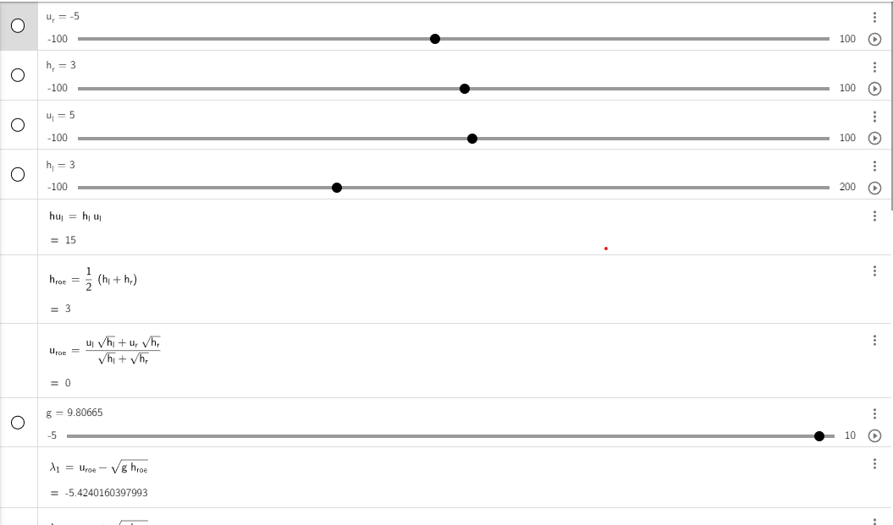
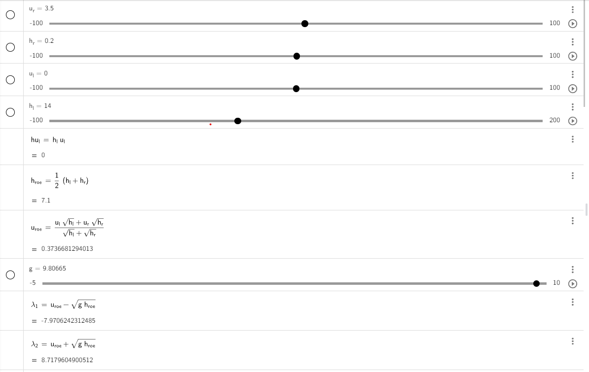

Finite Volume Discretization
===========================================

Finite Volume Discretization is a powerful and widely used numerical technique in the field of computational fluid dynamics (CFD)
and other scientific and engineering disciplines. It plays a crucial role in the simulation and analysis of physical processes, particularly those governed by partial differential equations (PDEs)

Integrating our f-wave solver into the one-dimensional implementation of a wave propagation
-------------------------------------------------------------------------------------------
There are several ways to integrate our F-wave solver into the one-dimensional wave propagation implementation, including the following options:

- Using the command prompt.

- Utilizing a configuration file, and so on.

Today, we will focus on using the command prompt to integrate our solver with the following files: ``WavePropagation1d.h``, ``WavePropagation1d.cpp``, ``WavePropagation1d.test.cpp``. Let's proceed step by step:

Integration of the F-wave solver
.................................

1. In the ``WavePropagation1d.h``, we will define a boolean member to choose the two solver. Update the code in "WavePropagation1d.h" as follows:

.. code-block:: cpp

   class tsunami_lab::patches::WavePropagation1d: public WavePropagation {  
   private:
    bool m_choice = true;
   }

 
2. We will modify the constructor in the ``WavePropagation1d.cpp`` file to include the boolean variable. This change enables us to select between the Roe solver and our F-wave solver within the test files and the command prompt.  

.. code-block:: cpp

   tsunami_lab::patches::WavePropagation1d::WavePropagation1d( t_idx i_nCells,bool i_choice ) {
      m_choice = i_choice;
      m_nCells = i_nCells;

  // allocate memory including a single ghost cell on each side
      for( unsigned short l_st = 0; l_st < 2; l_st++ ) {
      m_h[l_st] = new t_real[  m_nCells + 2 ];
      m_hu[l_st] = new t_real[ m_nCells + 2 ];
   }

  // init to zero
      for( unsigned short l_st = 0; l_st < 2; l_st++ ) {
         for( t_idx l_ce = 0; l_ce < m_nCells; l_ce++ ) {
          m_h[l_st][l_ce] = 0;
            m_hu[l_st][l_ce] = 0;
         }
      }
   }  

3. In the same file, we will navigate to the ``timeStep`` function and add a call to ``netupdates`` based on the user's choice.. 

.. code-block:: cpp
   
   void tsunami_lab::patches::WavePropagation1d::timeStep( t_real i_scaling ) {
   // compute net-updates
      if(m_choice){
      solvers::Roe::netUpdates( l_hOld[l_ceL],
                              l_hOld[l_ceR],
                              l_huOld[l_ceL],
                              l_huOld[l_ceR],
                              l_netUpdates[0],
                              l_netUpdates[1] );
    }else{
      solvers::fwave::netUpdates( l_hOld[l_ceL],
                                  l_hOld[l_ceR],
                                  l_huOld[l_ceL],
                                  l_huOld[l_ceR],
                                  l_netUpdates[0],
                                  l_netUpdates[1]);
      }
   }

4. To conclude, we navigate to the "main.cpp" file, where we need to modify the solver constructor to permit the selection between our F-wave and Roe solver options.

.. code-block:: cpp

   // construct solver
  tsunami_lab::patches::WavePropagation *l_waveProp;
  if (i_argc > 2) {
      for (char* ptr = i_argv[2]; *ptr; ++ptr) {
          *ptr = std::tolower(static_cast<unsigned char>(*ptr));
      }
      if (std::strstr(i_argv[2], "roe") != nullptr) {
          std::cout << "ROE Will be Used" << std::endl;
          l_waveProp = new tsunami_lab::patches::WavePropagation1d( l_nx , true );
      } else {
          std::cout << "FWAVE Will be Used" << std::endl;
          l_waveProp = new tsunami_lab::patches::WavePropagation1d( l_nx , false );
      }
  }else{
    std::cout << "FWAVE Will be Used" << std::endl;
    l_waveProp = new tsunami_lab::patches::WavePropagation1d( l_nx , false );
  }  

.. Important:: 
   To select between the F-wave and Roe solver, we execute the following command.

      .. code-block:: 

          ./build/tsunami_lab 200 Roe 

   or 

      .. code-block::

          ./build/tsunami_lab 200 fwave 

   if the user does not choose any solver, the F-wave solver will be choosen automatically.

5. To create a unit test for our solvers, we need to include a ``true`` or ``false`` argument in the constructor of the unit test:

   .. code-block:: cpp

      TEST_CASE( "Test the 1d wave propagation solver.", "[WaveProp1d]" ) {
      // constructs the 1d wave propagation solver.
      tsunami_lab::patches::WavePropagation1d m_waveProp( 100 , true );
      ...
      }
   .. Important::
      ``true`` will use the ``Roe solver`` and ``false`` will use the ``Fwave solver``

Constant middle states
.......................

   Now, we are going to check for some middle states. This file,
   `middle_states\.csv <https://scalable.uni-jena.de/assets/tsunami_lab/middle_states.csv>`_ , contains a collection of constant middle states that arise immediately in the Riemann solution at the initial discontinuity. We will use it as a sanity test. Let's implement a unit test for the middle state."

   1. We access a CSV file and search for suitable values to use in a unit test. In this example, we will select the initial values from the file.

   .. note:: 

      ``hLeft: 8899.326826472694``, ``hRight: 8899.326826472694`` , ``huLeft: 122.0337839252433`` , ``huRight: -122.0337839252433`` , ``hStar: 8899.739847378269``

   .. important:: 

      ``hStar`` represents the height in the middle state.

   2. we construct a test unit like that 

      .. code-block:: cpp

         TEST_CASE( "Test the 1d wave propagation wave for the middle states.", "[middle states]" ){

         tsunami_lab::patches::WavePropagation1d middle_states1(100, true);

         for (std::size_t l_ce = 0; l_ce < 50; l_ce++)
         {
         middle_states1.setHeight(l_ce,
                                 0,
                                 8899.326826472694);
         middle_states1.setMomentumX(l_ce,
                                    0,
                                    122.0337839252433);
                                 }
         for (std::size_t l_ce = 50; l_ce < 100; l_ce++)
         {
         middle_states1.setHeight(l_ce,
                                 0,
                                 8899.326826472694);
         middle_states1.setMomentumX(l_ce,
                                    0,
                                    -122.0337839252433);
         }

         middle_states1.setGhostOutflow();

  
         for (int i = 0; i < 17; i++)
         {
            middle_states1.timeStep(0.001);
         }

  
         REQUIRE(middle_states1.getHeight()[49] == Approx(8899.74));

         REQUIRE(middle_states1.getHeight()[50] == Approx(8899.74));
         }

.. important:: 
   We will observe that the height after 17 time steps is 
   approaching the initial height of 8899.326826.

GitHub Actions
................

We've established a workflow within GitHub that currently operates as a self-hosted background process. We've implemented a "tests-runner.yml" file to automatically test everything following each push and pull request.

Shock and Rarefaction Waves
---------------------------

Next, we will delve into the setup implementation of both the ``shock shock problem`` and the ``rare_reare problem``:

Shock-Shock problem
...................
We'll apply our solver to solve situations where two streams of water move in opposite directions and crash into each other :math:`x_\text{dis}` . The situation is defined by the following configuration:

   .. math::

      \begin{cases}
           Q_i = q_{l} \quad &\text{if } x_i \le x_\text{dis} \\
           Q_i = q_{r} \quad &\text{if }   x_i > x_\text{dis}
         \end{cases} \qquad q_l \in \mathbb{R}^+ \times \mathbb{R}^+, \; q_r \in \mathbb{R}^+ \times \mathbb{R}^-,

1. Before we begin, let's navigate to the setup folder and generate three files: ``ShockShock.cpp`` , ``ShockShock.h`` and for testing purposes, create ``ShockShock.test.cpp`` .

2. Now, let's start implementing each file, beginning with ``ShockShock.h``.

.. code-block:: cpp

   #ifndef TSUNAMI_LAB_SETUPS_SHOCK_SHOCK_H
   #define TSUNAMI_LAB_SETUPS_SHOCK_SHOCK_H

   #include "Setup.h"

   namespace tsunami_lab {
         namespace setups {
            class ShockShock;
      }
   }

   class tsunami_lab::setups::ShockShock: public Setup {
      private:
    //! height 
      t_real m_height = 0;

    //! impulse 
    t_real m_hu = 0;

    //! location of the dam
    t_real m_locationDam = 0;

   public:

    /**
     * Constructor.
     *
     * @param i_height water height 
     * @param i_hu water impulse 
     * @param i_locationDam location (x-coordinate) of the dam.    
     **/

    ShockShock( t_real i_height,
                t_real i_hu,
                t_real i_locationDam);

    /**
     * Gets the water height at a given point.
     *
     * @return height at the given point.
     **/
    t_real getHeight( t_real,
                      t_real) const;

    /**
     * Gets the momentum in x-direction.
     * @param i_x x-coordinate of the queried point.
     * @return momentum in x-direction.
     **/
    t_real getMomentumX( t_real i_x,
                         t_real ) const;

    /**
     * Gets the momentum in y-direction.
     * @return momentum in y-direction.
     **/
    t_real getMomentumY( t_real,
                         t_real ) const;

   };

3. We will implement the configuration for the ``Shock Shock Problem`` in the ``ShockShock.h`` file :

.. code-block:: cpp

   #include "ShockShock.h"

   tsunami_lab::setups::ShockShock::ShockShock(t_real i_height,
                                            t_real i_hu,
                                            t_real i_locationDam){
         m_height = i_height;
         m_hu = i_hu;
         m_locationDam = i_locationDam;
   }

   tsunami_lab::t_real tsunami_lab::setups::ShockShock::getHeight( t_real,
                                                                t_real)const{
    return m_height;                                                                                                                      
                                                                  
   }

   tsunami_lab::t_real tsunami_lab::setups::ShockShock::getMomentumX(t_real i_x,
                                                                  t_real)const{
    if( i_x <= m_locationDam ) {
        return m_hu;
    }
    else {
        return -m_hu;
      }                                                                                                                         
                                                                  
   }

   tsunami_lab::t_real tsunami_lab::setups::ShockShock::getMomentumY(t_real,
                                                                  t_real)const{
    return 0;                                                                                                                                                                      
   }  

4. Lastly, to verify that the implemented setup functions correctly, we'll implement the  ``ShockShock.test.cpp`` file :

.. code-block:: cpp

   #include <catch2/catch.hpp>
   #include "ShockShock.h"

   TEST_CASE( "Test the shock-shock setup.", "[ShockShock]" ) {
      tsunami_lab::setups::ShockShock l_shockShock( 25, 55, 3 );

      // left side
      REQUIRE( l_shockShock.getHeight(    2, 0 ) == 25 );
      REQUIRE( l_shockShock.getMomentumX( 2, 0 ) == 55 );
      REQUIRE( l_shockShock.getMomentumY( 2, 0 ) == 0 );

      REQUIRE( l_shockShock.getHeight(  3, 0 ) == 25 );
      REQUIRE( l_shockShock.getMomentumX( 3, 0 ) == 55 );
      REQUIRE( l_shockShock.getMomentumY( 3, 0 ) == 0 );

      // right side
      REQUIRE( l_shockShock.getHeight(    5, 0 ) == 25 );
      REQUIRE( l_shockShock.getMomentumX( 5, 0 ) == -55 );
      REQUIRE( l_shockShock.getMomentumY( 5, 0 ) == 0 );

      REQUIRE( l_shockShock.getHeight(    60, 0 ) == 25 );
      REQUIRE( l_shockShock.getMomentumX( 60, 0 ) == -55 );
      REQUIRE( l_shockShock.getMomentumY( 60, 0 ) == 0 );
   }

Rare Rare Porblems
..................

We can configure rare-rare Riemann problems with two streams of water moving away from each other at a specific position, denoted as :math:`x_\text{dis}` . The scenario is outlined as follows:

.. math::

   \begin{cases}
           Q_i = q_{l} \quad &\text{if } x_i \le x_\text{dis} \\
           Q_i = q_{r} \quad &\text{if }   x_i > x_\text{dis}
         \end{cases} \qquad q_l \in \mathbb{R}^+ \times \mathbb{R}^+, \; q_r \in \mathbb{R}^+ \times \mathbb{R}^-,

and 

.. math::
   

   q_l=
           \begin{bmatrix}
             h_l \\ (hu)_l
           \end{bmatrix}, \quad
         q_r =
           \begin{bmatrix}
             h_r \\ (hu)_r
           \end{bmatrix} =
           \begin{bmatrix}
             h_l \\ -(hu)_l
           \end{bmatrix}.

1. Before we begin, let's navigate to the setup folder again and generate three files: ``RareRare.cpp`` , ``RareRare.h`` and for testing purposes, create ``RareRare.test.cpp`` .

2. Now, let's start implementing each file, beginning with ``RareRare.h``:

.. code-block:: cpp

   #ifndef TSUNAMI_LAB_SETUPS_Rare_Rare_H
   #define TSUNAMI_LAB_SETUPS_Rare_Rare_H

   #include "Setup.h"

   namespace tsunami_lab {
      namespace setups {
         class RareRare;
      }
   }

   class tsunami_lab::setups::RareRare: public Setup {
   private:
    //! height  
    t_real m_height = 0;
    
    //! impulse
    t_real m_hu = 0;

    //! location of the dam
    t_real m_locationDam = 0;

  public:
    /**
     * Constructor.
     *
     * @param i_height water height 
     * @param i_hu water impulse 
     * @param i_locationDam location (x-coordinate) of the dam.    
     **/

    RareRare( t_real i_height,
              t_real i_hu,
              t_real i_locationDam);

    /**
     * Gets the water height at a given point.
     * @return height at the given point.
     **/
    t_real getHeight( t_real ,
                      t_real ) const;

    /**
     * Gets the momentum in x-direction.
     * @param i_x x-coordinate of the queried point.
     * @return momentum in x-direction.
     **/
    t_real getMomentumX( t_real i_x,
                         t_real ) const;

    /**
     * Gets the momentum in y-direction.
     * @return momentum in y-direction.
     **/
    t_real getMomentumY( t_real,
                         t_real ) const;

   };

3. We will implement the configuration for the ``Rare Rare Problem`` in the :

.. code-block:: cpp

   #include "RareRare.h"

   tsunami_lab::setups::RareRare::RareRare(t_real i_height,
                                        t_real i_hu,
                                        t_real i_locationDam){
   m_height      = i_height;
   m_hu          = i_hu;
   m_locationDam = i_locationDam;
   }

   tsunami_lab::t_real tsunami_lab::setups::RareRare::getHeight(t_real,
                                                             t_real)const{
    return m_height;                                                                                                                                                                                    
   }

   tsunami_lab::t_real tsunami_lab::setups::RareRare::getMomentumX(t_real i_x,
                                                                  t_real)const{
    if( i_x <= m_locationDam ) {
        return -m_hu;
    }
    else {
        return m_hu;
      }                                                                                                                         
                                                                  
   }

   tsunami_lab::t_real tsunami_lab::setups::RareRare::getMomentumY(t_real,
                                                                  t_real)const{
    return 0;                                                                                                                                                                      
   }

4. Lastly, to verify that the implemented setup functions correctly, we'll implement the  ``RareRare.test.cpp`` file :

.. code-block:: cpp

   #include <catch2/catch.hpp>
   #include "RareRare.h"

   TEST_CASE( "Test the rare-rare setup.", "[RareRare]" ) {
   tsunami_lab::setups::RareRare l_rareRare( 25,55,3);

  // left side
   REQUIRE( l_rareRare.getHeight(    2, 0 ) == 25 );
   REQUIRE( l_rareRare.getMomentumX( 2, 0 ) == -55 );
   REQUIRE( l_rareRare.getMomentumY( 2, 0 ) == 0 );

   REQUIRE( l_rareRare.getHeight(  3, 0 ) == 25 );
   REQUIRE( l_rareRare.getMomentumX( 3, 0 ) == -55 );
   REQUIRE( l_rareRare.getMomentumY( 3, 0 ) == 0 );

   // right side
   REQUIRE( l_rareRare.getHeight(    5, 0 ) == 25 );
   REQUIRE( l_rareRare.getMomentumX( 5, 0 ) == 55 );
   REQUIRE( l_rareRare.getMomentumY( 5, 0 ) == 0 );

   REQUIRE( l_rareRare.getHeight(    60, 0 ) == 25 );
   REQUIRE( l_rareRare.getMomentumX( 60, 0 ) == 55 );
   REQUIRE( l_rareRare.getMomentumY( 60, 0 ) == 0 );
   }

The influence of :math:`u_l` and :math:`h_l` on the wave speed in both shock-shock and rare-rare setup 
......................................................................................................

After experimenting with different sets of initial water heights :math:`h_l` and particle velocities :math:`u_l` . we observed that the primary variable affecting wave velocities is the initial height. 
Both :math:`u_l` and :math:`h_l` exert an influence on momentum.
Specifically, as :math:`h_l`and :math:`u_l` increase in magnitude, the momentum also increases, leading to higher middle state heights. However, the changes in particle velocities do not affect the wave speed; 
only the initial height has an impact on both :math:`\lambda_{1}` and :math:`\lambda_{2}`.
This relationship becomes evident through our Geogebra calculations,
which demonstrate that only :math:`h_l` affect the wave speed. This connection is further illuminated by the following equations for our approximate Riemann solver.

.. math::
   
   \begin{aligned}
         \lambda^{\text{Roe}}_{1}(q_l, q_r) &= u^{\text{Roe}}(q_l, q_r) - \sqrt{gh^{\text{Roe}}(q_l, q_r)}, \\
         \lambda^{\text{Roe}}_{2}(q_l, q_r) &= u^{\text{Roe}}(q_l, q_r) + \sqrt{gh^{\text{Roe}}(q_l, q_r)},
   \end{aligned}

And this relationship is also evident through our generated CSV files.

  
   
**1. Shock-Shock setup:**

1. :math:`h_l` = 10 , :math:`u_l` = 15 : 

 .. video:: _static/scene1.mp4
      :width: 700
      :autoplay:

2. :math:`h_l` = 20 , :math:`u_l` = 15 :

 .. video:: _static/scene2.mp4
      :width: 700
      :autoplay:

3. :math:`h_l` = 40 , :math:`u_l` = 15 :

 .. video:: _static/scene3.mp4
      :width: 700
      :autoplay:

4. :math:`h_l` = 10 , :math:`u_l` = 20 :

 .. video:: _static/scene4.mp4
      :width: 700
      :autoplay:

4. :math:`h_l` = 20 , :math:`u_l` = 20 :

 .. video:: _static/scene5.mp4
      :width: 700
      :autoplay:

**2. Shock-Shock setup:**

1. :math:`h_l` = 10 , :math:`u_l` = 5 : 

 .. video:: _static/scene6.mp4
      :width: 700
      :autoplay:

2. :math:`h_l` = 10 , :math:`u_l` = 8 : 

 .. video:: _static/scene7.mp4
      :width: 700
      :autoplay:

3. :math:`h_l` = 20 , :math:`u_l` = 5 : 

 .. video:: _static/scene8.mp4
      :width: 700
      :autoplay:

It can be observed that simulations featuring greater initial height will consistently exhibit higher wave speeds for both setups.

**3. Geogebra calculations:**

both setup are outlined as follows: 

.. math::
   

   q_l=
           \begin{bmatrix}
             h_l \\ (hu)_l
           \end{bmatrix}, \quad
         q_r =
           \begin{bmatrix}
             h_r \\ (hu)_r
           \end{bmatrix} =
           \begin{bmatrix}
             h_l \\ -(hu)_l
           \end{bmatrix}.

so we do the calculations:

:math:`h_l` = :math:`h_r` , :math:`-(hu_l) =` = :math:`hu_r`

if :math:`h_l` = :math:`h_r` , :math:`hu_l =` = :math:`-(hu_r)` then :math:`u^{\text{Roe}}(q_l, q_r)`  will always equal zero.

This implies that :math:`\lambda_{1/2} =  \mp \sqrt{gh}`

For example, consider the situation illustrated in the picture.

Dam-Break
---------

Evaluating how various factors influence the configuration of a dam-break scenario
....................................................................................

To begin, we will explore a range of initial water height scenarios, aiming to formulate a conclusion based on our experimentation:

:math:`h_l` = 14 , :math:`h_r` = 4, :math:`hu` = 0 : 

 .. video:: _static/h_l=14-h_r=4.mp4
      :width: 700
      :autoplay:

:math:`h_l` = 14 , :math:`h_r` = 8, :math:`hu` = 0 : 

 .. video:: _static/h_l=14-h_r=8.mp4
      :width: 700
      :autoplay:

:math:`h_l` = 50 , :math:`h_r` = 12, :math:`hu` = 0 : 

 .. video:: _static/h_l=50-h_r=12.mp4
      :width: 700
      :autoplay:

:math:`h_l` = 50 , :math:`h_r` = 18, :math:`hu` = 0 : 

 .. video:: _static/h_l=50-h_r=18.mp4
      :width: 700
      :autoplay:

To understand the significance of particle velocity, it is necessary to make a temporary modification to the getMomentumX() function.

Note: :math:`hu_r = h_r * u_r`  so we need to modify the getMomentumX to return either `hu_ur` or `hu_ul` 

Now, let's conduct a few tests to further enhance our conclusion.

:math:`h_l` = 18 , :math:`h_r` = 5, :math:`hu_l` = 0, :math:`hu_r` = 0.5 : 

 .. video:: _static/hl18-hr5-hul0-hr0,5.mp4
      :width: 700
      :autoplay:

:math:`h_l` = 40 , :math:`h_r` = 10, :math:`hu_l` = 10, :math:`hu_r` = 14 : 

 .. video:: _static/hl40-hr10-hul10-hr14.mp4
      :width: 700
      :autoplay:

So we noticed these points:

The greater the initial height difference, the more significant the momentum observed within the middle state.

The speed of the shock wave seems largely unaffected by variations in the right height, whereas the rarefaction wave demonstrates reduced speed with increasing initial height differences.

The speed of the shock wave appears to be directly proportional to the square root of the left height.

Although a higher momentum on the right side does result in a marginal increase in the speed of the shock wave, the effect is generally minor.

Evacuation time
...............

The provided information consists of the following data:
:math:`q_l=[14, 0]^T` , :math:`q_r=[3.5, 0.7]^T` and :math:`s_{\text{village}}= 25 km`

Now, let's calculate the wave speed using this information.

so for :math:`\lambda_{1/2}` we get :math:`\lambda_{1}= 8.71 \frac{m}{s}` and  :math:`\lambda_{2}= -7.97 \frac{m}{s}`.You can determine the time it takes for the wave to reach the village by using the formula:  :math:`time= \frac{distance}{wave speed}`.

**so we get :** 

:math:`time_{\text{evacuation}} = \frac{25000 m}{8.71 \frac{m}{s}}  = 2870.26 s = 0.797 h = 47 min`

This can also be calculated through a simulation:

.. video:: _static/village_evakutaion.mp4
   :width: 700
   :autoplay:

The simulation has 118 CSV solutions, and the shock wave reaches 9.79m, which means it has moved around 5.14m. Therefore, we have
:math:`t = \frac{41}{118} * 1,5s = 0.52 s`. the speed of the shock wave is given by: :math:`v_{\text{shockwave}} = \frac{5.14m}{0.52s} = 9,88 \frac{m}{s} = 35.56 \frac{km}{h}`.
Hence, the evacuation time is: :math:`time_{\text{evacuation}} = \frac{25 km}{35.56 \frac{km}{h}} = 0.70h = 42 min`

Personal Contribution
---------------------

- Ward Tammaa, Daniel Schicker Doxygen Documentation
- Mohamad Khaled Minawe, Ward Tammaa Sphnix Documentation
- Daniel Schicker, Mohamad Khaled Minawe , Ward Tammaa functions implementation
- Mohamad Khaled Minawe, Daniel Schicker, Ward Tammaa Unit Testing
- Mohamad Khaled Minawe, Daniel Schicker Geogebra Datei(Calculation for the Unit Tests)
- Ward Tammaa Hosting the code, Action runner

    