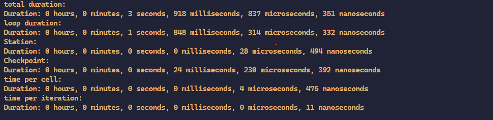
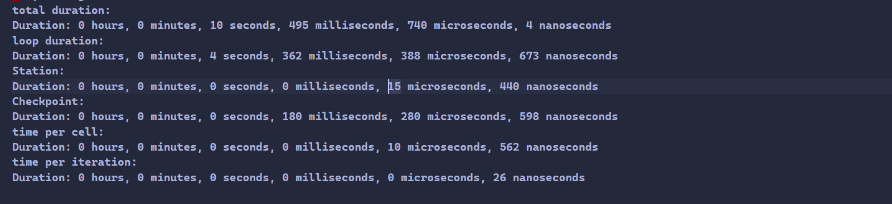
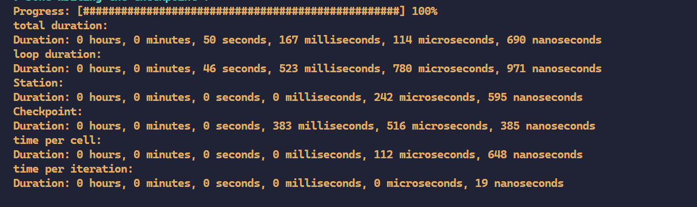
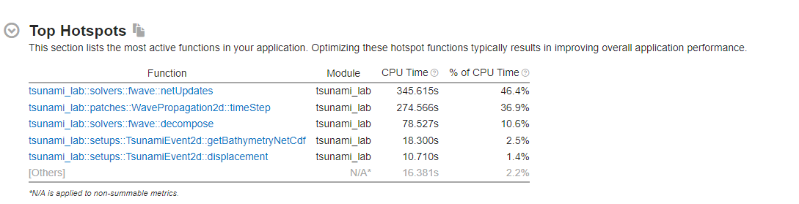
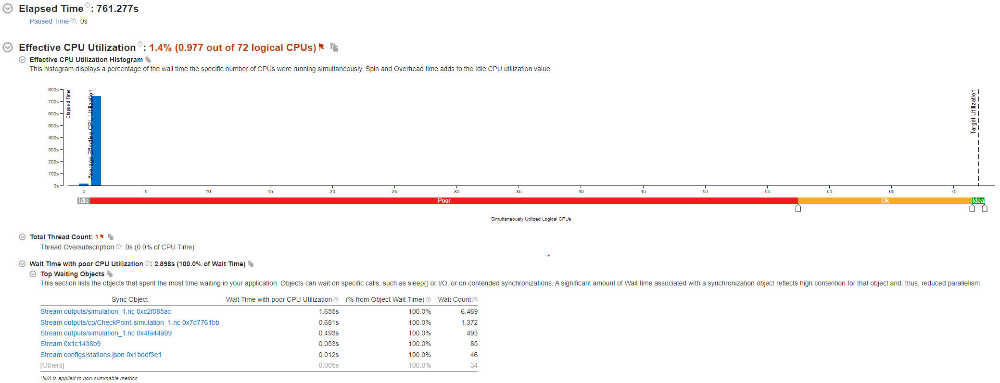

Optimization
=============

ARA
---

Upload your code and Ch. 6s input data to the cluster. Compile your code on the cluster and add support for generic compiler
.............................................................................................................................

To deploy the project on the cluster, we cloned it from our Git repository and included all submodules.

.. code-block:: shell

   git submodule init
   git submodule update

To compile our code, we utilized an sbatch script, necessitating adjustments to the paths in our sconstruct.

.. code-block:: shell

   #!/bin/bash
   #SBATCH --job-name=tsunami
   #SBATCH --output=tsunami_output.txt
   #SBATCH --error=tsunami_error.txt
   #SBATCH --partition=s_hadoop
   #SBATCH --nodes=1
   #SBATCH --ntasks=1
   #SBATCH --time=10:00
   #SBATCH --cpus-per-task=72

   # Set the email address where notifications should be sent.
   #SBATCH --mail-user=minawe.mohamad.khaled@uni-jena.de

   # Specify the types of email notifications you want to receive.
   #SBATCH --mail-type=BEGIN,END,FAIL

   # Load modules 
      module load tools/python/3.8
      module load compiler/gcc/11.2.0
      module load compiler/intel/2020-Update2
      module load libs/hdf5/1.10.8-gcc-10.2.0
      module load libs/zlib/1.2.11-intel-2018
      module load libs/netcdf/4.6.1-intel-2018
      python3.8 -m pip install --user scons

      date
      cd /beegfs/ni57qip/tsunami_lab
      scons custom_cxx=/cluster/spack/opt/spack/linux-centos7-broadwell/gcc-10.2.0/gcc-11.2.0-c27urtyjryzoyyqfms5m3ewi6vrtvt44/bin/gcc use_report=false
      ./build/tsunami_lab

then in the sconstruct we had to add pathes for the compiler.
and we used the following sconstruct:

.. code-block:: python

   ##
   # @author Alexander Breuer (alex.breuer AT uni-jena.de)
   #
   # @section DESCRIPTION
   # Entry-point for builds.
   ##
   import SCons
   import os
   import SCons.Script

   print( '####################################' )
   print( '### Tsunami Lab                  ###' )
   print( '###                              ###' )
   print( '### https://scalable.uni-jena.de ###' )
   print( '####################################' )
   print()
   print('runnning build script')

   # configuration
   vars = Variables()

   vars.AddVariables(
      EnumVariable('mode',
                  'compile modes, option \'san\' enables address and undefined behavior sanitizers',
                  'release',
                  allowed_values=('release', 'debug', 'release+san', 'debug+san')
                  ),
      BoolVariable('use_report',
                  'Enable compiler optimization report',
                  False  # Set the default value to False; adjust as needed
                  ),
      PathVariable('custom_cxx',
                  'Path to a custom C++ compiler',
                  os.environ.get('CXX', ''),
                  PathVariable.PathAccept
                  )
   )

   # exit in the case of unknown variables
   if vars.UnknownVariables():
   print( "build configuration corrupted, don't know what to do with: " + str(vars.UnknownVariables().keys()) )
   exit(1)

   # create environment
   env = Environment( variables = vars )

   if env['custom_cxx']:
      env.Replace(CXX=env['custom_cxx'])
      print("Selected Compiler: Custom Compiler")

   compiler_path = env['CXX']     
   compiler_name = os.path.basename(compiler_path)

   if env['use_report']:
   if not (compiler_name == 'icpc'):
      print("Warning: Cannot generate report because you are running the code on the GNU Compiler.")
   else:
      env.Append(CXXFLAGS=['-qopt-report=5'])
      print("the report is in the build folder")  

   # generate help message
   Help( vars.GenerateHelpText( env ) )

   # add default flags
   if (compiler_name == 'icpc'):
      env.Append( CXXFLAGS = [ '-std=c++17',
                           '-Wall',
                           '-Wextra',
                           '-Werror' ] )
   else:    
   env.Append( CXXFLAGS = [ '-std=c++17',
                           '-Wall',
                           '-Wextra',
                           '-Wpedantic',
                           '-Werror' ] )

   # set optimization mode
   if 'debug' in env['mode']:
   env.Append( CXXFLAGS = [ '-g',
                              '-O2' ] )
   else:
   env.Append( CXXFLAGS = [ '-O3' ] )

   # add sanitizers
   if 'san' in  env['mode']:
   env.Append( CXXFLAGS =  [ '-g',
                              '-fsanitize=float-divide-by-zero',
                              '-fsanitize=bounds',
                              '-fsanitize=address',
                              '-fsanitize=undefined',
                              '-fno-omit-frame-pointer' ] )
   env.Append( LINKFLAGS = [ '-g',
                              '-fsanitize=address',
                              '-fsanitize=undefined' ] )
   

   conf = Configure(env)
   if not conf.CheckLibWithHeader('netcdf','netcdf.h','c++'):
   exit(1)

   # add Catch2
   env.Append(CXXFLAGS = [ '-isystem', 'submodules/Catch2/single_include'])

   # add nlohmann json 
   env.Append(CXXFLAGS = ['-isystem', 'submodules/json/single_include'])

   # get source files
   VariantDir( variant_dir = 'build/src',
               src_dir     = 'src' )

   env.sources = []
   env.tests = []

   Export('env')
   SConscript( 'build/src/SConscript' )
   Import('env')

   env.Program( target = 'build/tsunami_lab',
               source = env.sources + env.standalone )

   env.Program( target = 'build/tests',
               source = env.sources + env.tests )

We tried using ``os.environ`` to fetch the compiler paths, but it only retrieved the path of the GNU compiler on the cluster. Everything worked perfectly on our local PC.

However, we encountered two errors on the cluster while compiling the code with the Intel compiler

to build the project with a custom compiler:

.. code-block:: shell
   
   scons custom_cxx=/opt/intel/oneapi/compiler/2023.2.2/linux/bin/intel64/icpc use_report=True

The ``custom_cxx`` option is used to specify the compiler by providing its path. Meanwhile, ``use_report``
is utilized to determine whether to generate a report, which is only available when utilizing the Intel compiler.

After discussing with Professor Alex, it appears that we misused os.environ. The correct implementation is as follows:

.. code-block:: python
   :emphasize-lines: 48,49,50

   ##
   # @author Alexander Breuer (alex.breuer AT uni-jena.de)
   #
   # @section DESCRIPTION
   # Entry-point for builds.
   ##
   import SCons
   import os
   import SCons.Script

   print( '####################################' )
   print( '### Tsunami Lab                  ###' )
   print( '###                              ###' )
   print( '### https://scalable.uni-jena.de ###' )
   print( '####################################' )
   print()
   print('runnning build script')

   # configuration
   vars = Variables()

   vars.AddVariables(
      EnumVariable('mode',
                  'compile modes, option \'san\' enables address and undefined behavior sanitizers',
                  'release',
                  allowed_values=('release', 'debug', 'release+san', 'debug+san')
                  ),
      BoolVariable('use_report',
                  'Enable compiler optimization report',
                  False  # Set the default value to False; adjust as needed
                  ),
      PathVariable('custom_cxx',
                  'Path to a custom C++ compiler',
                  os.environ.get('CXX', ''),
                  PathVariable.PathAccept
                  )
   )

   # exit in the case of unknown variables
   if vars.UnknownVariables():
   print( "build configuration corrupted, don't know what to do with: " + str(vars.UnknownVariables().keys()) )
   exit(1)

   # create environment
   env = Environment( ENV=os.environ,
                     variables = vars )
   

   if env['custom_cxx']:
      env.Replace(CXX=env['custom_cxx'])
      print("Selected Compiler: Custom Compiler")

   compiler_path = env['CXX']     
   compiler_name = os.path.basename(compiler_path)

   if env['use_report']:
   if not (compiler_name == 'icpc'):
      print("Warning: Cannot generate report because you are running the code on the GNU Compiler.")
   else:
      env.Append(CXXFLAGS=['-qopt-report=5'])
      print("the report is in the build folder")  

   # generate help message
   Help( vars.GenerateHelpText( env ) )

   # add default flags
   if (compiler_name == 'icpc'):
      env.Append( CXXFLAGS = [ '-std=c++17',
                           '-Wall',
                           '-Wextra',
                           '-Werror'] )
   else:    
   env.Append( CXXFLAGS = [ '-std=c++17',
                           '-Wall',
                           '-Wextra',
                           '-Wpedantic',
                           '-Werror' ] )

   # set optimization mode
   if 'debug' in env['mode']:
   env.Append( CXXFLAGS = [ '-g',
                              '-O2' ] )
   else:
   env.Append( CXXFLAGS = [ '-O1'] )

   # add sanitizers
   if 'san' in  env['mode']:
   env.Append( CXXFLAGS =  [ '-g',
                              '-fsanitize=float-divide-by-zero',
                              '-fsanitize=bounds',
                              '-fsanitize=address',
                              '-fsanitize=undefined',
                              '-fno-omit-frame-pointer' ] )
   env.Append( LINKFLAGS = [ '-g',
                              '-fsanitize=address',
                              '-fsanitize=undefined' ] )
   
   conf = Configure(env)
   if not conf.CheckLibWithHeader('netcdf','netcdf.h','c++'):
   exit(1)

   # add Catch2
   env.Append(CXXFLAGS = [ '-isystem', 'submodules/Catch2/single_include'])

   # add nlohmann json 
   env.Append(CXXFLAGS = ['-isystem', 'submodules/json/single_include'])

   # get source files
   VariantDir( variant_dir = 'build/src',
               src_dir     = 'src' )

   env.sources = []
   env.tests = []

   Export('env')
   SConscript( 'build/src/SConscript' )
   Import('env')

   env.Program( target = 'build/tsunami_lab',
               source = env.sources + env.standalone )

   env.Program( target = 'build/tests',
               source = env.sources + env.tests )

Following the modification, we encountered errors preventing the execution of both the GNU and Intel compilers.

.. code-block:: shell 

   CXX=gcc 

   /usr/bin/ld: build/src/tests.o: undefined reference to symbol 'nextafter@@GLIBC_2.2.5'
   //usr/lib64/libm.so.6: error adding symbols: DSO missing from command line
   collect2: error: ld returned 1 exit status

   CXX=icpc 

   /cluster/spack/opt/spack/linux-centos7-broadwell/gcc-10.2.0/gcc-11.2.0-c27urtyjryzoyyqfms5m3ewi6vrtvt44/include/c++/11.2.0/tuple(649): error: pack "_UElements" does not have the same number of elements as "_Elements"
            __and_<is_nothrow_constructible<_Elements, _UElements>...>::value;
                                                       ^
          detected during:
            instantiation of "bool std::tuple<_Elements...>::__nothrow_constructible<_UElements...>() [with _Elements=<const std::string &>, _UElements=<>]" at line 502 of "/cluster/spack/opt/spack/linux-centos7-broadwell/gcc-10.2.0/gcc-11.2.0-c27urtyjryzoyyqfms5m3ewi6vrtvt44/include/c++/11.2.0/bits/stl_map.h"
            instantiation of "std::map<_Key, _Tp, _Compare, _Alloc>::mapped_type &std::map<_Key, _Tp, _Compare, _Alloc>::operator [with _Key=std::string, _Tp=nlohmann::json_abi_v3_11_2::basic_json<std::map, std::vector, std::string, bool, int64_t={long}, uint64_t={unsigned long}, double, std::allocator, nlohmann::json_abi_v3_11_2::adl_serializer, std::vector<uint8_t={unsigned char}, std::allocator<uint8_t={unsigned char}>>, void>,
                      _Compare=std::less<void>, _Alloc=std::allocator<std::pair<const std::string, nlohmann::json_abi_v3_11_2::basic_json<std::map, std::vector, std::string, bool, int64_t={long}, uint64_t={unsigned long}, double, std::allocator, nlohmann::json_abi_v3_11_2::adl_serializer, std::vector<uint8_t={unsigned char}, std::allocator<uint8_t={unsigned char}>>, void>>>]" at line 7013 of "submodules/json/single_include/nlohmann/json.hpp"
            instantiation of "bool nlohmann::json_abi_v3_11_2::detail::json_sax_dom_callback_parser<BasicJsonType>::key(nlohmann::json_abi_v3_11_2::detail::json_sax_dom_callback_parser<BasicJsonType>::string_t &) [with BasicJsonType=nlohmann::json_abi_v3_11_2::basic_json<std::map, std::vector, std::string, bool, int64_t={long}, uint64_t={unsigned long}, double, std::allocator, nlohmann::json_abi_v3_11_2::adl_serializer, std::vector<uint8_t={unsigned char}, std::allocator<uint8_t={unsigned
                      char}>>, void>]" at line 12319 of "submodules/json/single_include/nlohmann/json.hpp"
            instantiation of "bool nlohmann::json_abi_v3_11_2::detail::parser<BasicJsonType, InputAdapterType>::sax_parse_internal(SAX *) [with BasicJsonType=nlohmann::json_abi_v3_11_2::basic_json<std::map, std::vector, std::string, bool, int64_t={long}, uint64_t={unsigned long}, double, std::allocator, nlohmann::json_abi_v3_11_2::adl_serializer, std::vector<uint8_t={unsigned char}, std::allocator<uint8_t={unsigned char}>>, void>,
                      InputAdapterType=nlohmann::json_abi_v3_11_2::detail::iterator_input_adapter<const char *>, SAX=nlohmann::json_abi_v3_11_2::detail::json_sax_dom_callback_parser<nlohmann::json_abi_v3_11_2::basic_json<std::map, std::vector, std::string, bool, int64_t={long}, uint64_t={unsigned long}, double, std::allocator, nlohmann::json_abi_v3_11_2::adl_serializer, std::vector<uint8_t={unsigned char}, std::allocator<uint8_t={unsigned char}>>, void>>]" at line 12198 of
                      "submodules/json/single_include/nlohmann/json.hpp"
            instantiation of "void nlohmann::json_abi_v3_11_2::detail::parser<BasicJsonType, InputAdapterType>::parse(bool, BasicJsonType &) [with BasicJsonType=nlohmann::json_abi_v3_11_2::basic_json<std::map, std::vector, std::string, bool, int64_t={long}, uint64_t={unsigned long}, double, std::allocator, nlohmann::json_abi_v3_11_2::adl_serializer, std::vector<uint8_t={unsigned char}, std::allocator<uint8_t={unsigned char}>>, void>,
                      InputAdapterType=nlohmann::json_abi_v3_11_2::detail::iterator_input_adapter<const char *>]" at line 23262 of "submodules/json/single_include/nlohmann/json.hpp"
            instantiation of "nlohmann::json_abi_v3_11_2::basic_json<ObjectType, ArrayType, StringType, BooleanType, NumberIntegerType, NumberUnsignedType, NumberFloatType, AllocatorType, JSONSerializer, BinaryType, CustomBaseClass> nlohmann::json_abi_v3_11_2::basic_json<ObjectType, ArrayType, StringType, BooleanType, NumberIntegerType, NumberUnsignedType, NumberFloatType, AllocatorType, JSONSerializer, BinaryType, CustomBaseClass>::parse(IteratorType, IteratorType,
                      nlohmann::json_abi_v3_11_2::basic_json<ObjectType, ArrayType, StringType, BooleanType, NumberIntegerType, NumberUnsignedType, NumberFloatType, AllocatorType, JSONSerializer, BinaryType, CustomBaseClass>::parser_callback_t, bool, bool) [with ObjectType=std::map, ArrayType=std::vector, StringType=std::string, BooleanType=bool, NumberIntegerType=int64_t={long}, NumberUnsignedType=uint64_t={unsigned long}, NumberFloatType=double, AllocatorType=std::allocator,
                      JSONSerializer=nlohmann::json_abi_v3_11_2::adl_serializer, BinaryType=std::vector<uint8_t={unsigned char}, std::allocator<uint8_t={unsigned char}>>, CustomBaseClass=void, IteratorType=const char *]" at line 24399 of "submodules/json/single_include/nlohmann/json.hpp"

            compilation aborted for build/src/io/Csv/Csv.cpp (code 2)
            scons: *** [build/src/io/Csv/Csv.o] Error 2
            scons: building terminated because of errors.

If we refrain from making any modifications, we can successfully build our project using the GNU compiler.
To make a comparison between the two compilers, we will execute the simulation
using the g++ compiler on the cluster, and then replicate the same settings with our Intel compiler on our home device.
We will utilize the SConstruct without making any modifications.

Run different scenarios using interactive and batch jobs
.........................................................

We executed two scenarios, one for Tohoku and another for Chile, using the following configuration file:

**chile**:

.. code-block:: cpp

   {
      "solver" : "fwave",
      "dimension_x" : 3500000,
      "dimension_y" : 2950000,
      "setup" :  "tsunamievent2d",
      "nx" : 700,
      "ny" : 590,
      "k"  : 3,
      "hu" : 0,
      "location" : 0,
      "hv":0.0,
      "hr": 55,
      "hl": 25,
      "domain_start_x" : -3000000,
      "domain_start_y" : -1450000,
      "wavepropagation" : "2d",
      "endtime" : 36000,
      "writer" : "netcdf",
      "bathfile" : "data/output/chile_gebco20_usgs_250m_bath_fixed.nc",
      "disfile" : "data/output/chile_gebco20_usgs_250m_displ_fixed.nc",
      "outputfilename": "simulation.nc",
      "usecheckpoint" : false
   }

**tohoku**:

.. code-block:: cpp 

   {
      "solver" : "fwave",
      "dimension_x" : 2700000,
      "dimension_y" : 1500000,
      "setup" :  "tsunamievent2d",
      "nx" : 700,
      "ny" : 590,
      "k"  : 3,
      "hu" : 0,
      "location" : 0,
      "hv":0.0,
      "hr": 55,
      "hl": 25,
      "domain_start_x" : -200000,
      "domain_start_y" : -750000,
      "wavepropagation" : "2d",
      "endtime" : 36000,
      "writer" : "netcdf",
      "bathfile" : "data/output/tohoku_gebco20_ucsb3_250m_bath.nc",
      "disfile" : "data/output/tohoku_gebco20_ucsb3_250m_displ.nc",
      "outputfilename": "simulation.nc",
      "usecheckpoint" : false
   }

We examined the output for both scenarios and found no discrepancies.

Add a timer to your solver which allows you to measure the duration of the time stepping loop. 
................................................................................................

lets add a timer in our main.cpp file and lets not forgett to exlude the io overhead nad the setup time from the measurements

.. code-block:: cpp

   int main() {

      auto l_startTimer = std::chrono::high_resolution_clock::now(); 

      tsunami_lab::t_idx l_nx = 0;
      tsunami_lab::t_idx l_ny = 1;
      tsunami_lab::t_real l_dxy = 25;

      ........

      std::chrono::nanoseconds l_durationWriting = std::chrono::nanoseconds::zero();
      std::chrono::nanoseconds l_durationWritingStation = std::chrono::nanoseconds::zero();
      std::chrono::nanoseconds l_durationWritingCheckpoint = std::chrono::nanoseconds::zero();
      std::chrono::nanoseconds l_durationWritingConstat = std::chrono::nanoseconds::zero();

      .......

      auto l_loopTimer = std::chrono::high_resolution_clock::now();
  
      if(l_temp_writer == "netcdf"){
         l_netCdf = new tsunami_lab::io::NetCdf(l_nx,l_ny,l_k,l_outputFile);
         auto l_startWritingCostant = std::chrono::high_resolution_clock::now();
         l_netCdf->fillConstants(l_nx,
                                 l_ny,
                                 l_k,
                                 l_waveProp->getStride(),
                                 l_dxy,
                                 l_domain_start_x,
                                 l_domain_start_y,
                                 l_waveProp->getBathymetry(),
                                 l_outputFile);
         auto l_endWritingCostant = std::chrono::high_resolution_clock::now();
         l_durationWritingConstat =  l_endWritingCostant  - l_startWritingCostant ;            
      }

      while( l_simTime < l_temp_endtime ){
         l_waveProp->setGhostOutflow(false);
         if( l_timeStep % 25 == 0 ) {

            auto l_startWriting = std::chrono::high_resolution_clock::now();

            if(l_temp_writer == "csv"){
            std::string l_path = "outputs/solution_" + std::to_string(l_time_step_index) + ".csv";
            std::ofstream l_file;
            l_file.open( l_path );
            tsunami_lab::io::Csv::write(l_dxy,
                                          l_nx,
                                          l_ny,
                                          l_waveProp->getStride(),
                                          l_domain_start_x,
                                          l_domain_start_y,
                                          l_temp_waveprop,
                                          l_waveProp->getHeight(),
                                          l_waveProp->getMomentumX(),
                                          l_waveProp->getMomentumY(),
                                          l_waveProp->getBathymetry(),
                                          l_file);
            auto l_endWriting = std::chrono::high_resolution_clock::now();
            l_durationWriting += l_endWriting - l_startWriting;

            l_file.close();
            }else{
            
            l_netCdf->updateFile( l_nx,
                                    l_ny,
                                    l_waveProp->getStride(),
                                    l_time_step_index,
                                    l_k,
                                    l_simTime,
                                    l_waveProp->getHeight(),
                                    l_waveProp->getMomentumX(),
                                    l_waveProp->getMomentumY(),
                                    l_outputFile);
            auto l_endWriting = std::chrono::high_resolution_clock::now();
            //duration of the writing method
            l_durationWriting += l_endWriting - l_startWriting ;

                                    
            }
            l_time_step_index++;
            
         if(l_temp_waveprop == "2d"){  
            if(l_time_step_index%7 == 0 ){
               auto l_startWritingCheckpoint = std::chrono::high_resolution_clock::now();
            std::cout << "\n\033[1;34m" << "Started writing a new Checkpoint ."<< "\033[0m" << std::endl;
            l_netCdf->createCheckPoint(l_temp_solver,
                                          l_domain_start_x,
                                          l_domain_start_y,
                                          l_temp_dimension_x,
                                          l_temp_dimension_y,
                                          l_temp_endtime,
                                          l_simTime,
                                          l_frequency,
                                          l_dt,
                                          l_last_simTime_time,
                                          l_waveProp->getBathymetry(),
                                          l_waveProp->getHeight(),
                                          l_waveProp->getMomentumX(),
                                          l_waveProp->getMomentumY(),
                                          l_time_step_index,
                                          l_waveProp->getStride(),
                                          l_nx,
                                          l_ny,
                                          l_k,
                                          l_temp_setup,
                                          tsunami_lab::io::Station::Stringify(),
                                          l_checkPointName,
                                          l_temp_disFile,
                                          l_temp_bathFile);

               auto l_endWritingCheckpoint = std::chrono::high_resolution_clock::now();
               l_durationWritingCheckpoint += l_endWritingCheckpoint - l_startWritingCheckpoint ;

            std::cout << "\033[1;32m\u2713 " << "Done writing the Checkpoint ."<< "\033[0m"<< std::endl;
            }
            }
         }
         
         //STATIONS_---------------------------------------------START 
         if(l_current_frequency_time <= l_simTime){
            auto l_startWritingStation = std::chrono::high_resolution_clock::now();
            for (const auto& station : l_stations) {
            std::string l_foldername = "stations/"+station.i_name;
            if (!std::filesystem::exists(l_foldername)){
               std::filesystem::create_directory(l_foldername);
            }
            //compute cell ID
            tsunami_lab::t_idx l_ix = ((station.i_x - l_domain_start_x ) / l_dxy )+ l_waveProp->getGhostcellX();
            tsunami_lab::t_idx l_iy = ((station.i_y - l_domain_start_y ) / l_dxy )+ l_waveProp->getGhostcellY();
            if(l_temp_waveprop == "1d"){
               l_iy = 0; 
            }
            tsunami_lab::t_idx l_id = l_iy * l_waveProp->getStride() + l_ix;
            const tsunami_lab::t_real* l_water_height =  l_waveProp->getHeight();
            const tsunami_lab::t_real* l_water_hu =  l_waveProp->getMomentumX();
            const tsunami_lab::t_real* l_water_hv =  l_waveProp->getMomentumY();
            std::string l_station_path = l_foldername +"/"+ station.i_name+".csv";
            if(l_temp_waveprop == "2d"){
            tsunami_lab::io::Station::write(l_ix,
                                             l_iy,
                                             l_simTime,
                                             l_water_height[l_id],
                                             l_water_hu[l_id],
                                             l_water_hv[l_id],
                                             l_station_path,
                                             l_temp_waveprop);
            }else{
               tsunami_lab::io::Station::write(l_ix,
                                             l_iy,
                                             l_simTime,
                                             l_water_height[l_id],
                                             l_water_hu[l_id],
                                             -1,
                                             l_station_path,
                                             l_temp_waveprop);
            }
            }
            l_last_simTime_time = l_simTime;
            l_current_frequency_time = l_current_frequency_time + l_frequency;
            auto l_endWritingStation = std::chrono::high_resolution_clock::now();
            l_durationWritingStation += l_endWritingStation - l_startWritingStation ;

         }
         //STATIONS----------------------------------------------END

         l_waveProp->timeStep( l_scaling);
         l_timeStep++;
         l_simTime += l_dt;
         updateProgressBar(l_simTime, l_temp_endtime,50);

      }

Now let's calculate the time per cell and iteration.

.. code-block:: cpp 

   auto l_endTimer = std::chrono::high_resolution_clock::now();
   auto l_duration = l_endTimer - l_startTimer;
   auto l_durationLoop = l_endTimer - l_loopTimer;

  std::cout << std::endl;
  std::cout << "total duration: " << std::endl;
  printDuration(l_duration);
  std::cout << "loop duration: " << std::endl;
  printDuration(l_durationLoop - l_durationWritingStation - l_durationWritingCheckpoint - l_durationWriting- l_durationWritingConstat);
  std::cout << "Station: " << std::endl;
  printDuration(l_durationWritingStation);
  std::cout << "Checkpoint: " << std::endl;
  printDuration(l_durationWritingCheckpoint);
  std::cout << "time per cell: " << std::endl;
  printDuration((l_durationLoop - l_durationWritingStation - l_durationWritingCheckpoint - l_durationWriting- l_durationWritingConstat)/(l_nx * l_ny));
  std::cout << "time per iteration: " << std::endl;
  printDuration((l_durationLoop - l_durationWritingStation - l_durationWritingCheckpoint - l_durationWriting- l_durationWritingConstat)/(l_timeStep * l_nx * l_ny));

he ``printDuration`` is a method that we implemented to display the time in hours, minutes, seconds, and nanoseconds.

.. code-block:: cpp 

   void printDuration(std::chrono::nanoseconds duration) {
   auto hours = std::chrono::duration_cast<std::chrono::hours>(duration);
      duration -= hours;

      auto minutes = std::chrono::duration_cast<std::chrono::minutes>(duration);
      duration -= minutes;

      auto seconds = std::chrono::duration_cast<std::chrono::seconds>(duration);
      duration -= seconds;

      auto milliseconds = std::chrono::duration_cast<std::chrono::milliseconds>(duration);
      duration -= milliseconds;

      auto microseconds = std::chrono::duration_cast<std::chrono::microseconds>(duration);
      duration -= microseconds;

      auto nanoseconds = duration;

      std::cout << "Duration: " << hours.count() << " hours, "
               << minutes.count() << " minutes, "
               << seconds.count() << " seconds, "
               << milliseconds.count() << " milliseconds, "
               << microseconds.count() << " microseconds, "
               << nanoseconds.count() << " nanoseconds" << std::endl;
   }

Is the cluster faster than your own computer
............................................

We compiled both events on Mohamad Khaled Minawe's PC and the cluster, then compared the results.
the results for both can be seen in the following pictures:

For Chile:

Mohamad Khaled Minawe's PC:

cluster:

For Tohoku:

Mohamad Khaled Minawe's PC:

cluster:

.. image:: _static/tohoku_event_cluster_node.png
   :width: 700px
   :align: right

The pictures indicate that Mohamad Khaled's PC is significantly faster than the cluster.

Compilers
---------

Recompile your code using recent versions of the GNU and Intel compilers
.........................................................................

We encountered an issue that prevented us from compiling our code on the cluster. However, we were able to successfully compile it on our home machine.
Initially, let's obtain the APT Package Manager from the Intel website by executing the following commands:

 `site`_:

.. _site: https://www.intel.com/content/www/us/en/developer/tools/oneapi/base-toolkit-download.html?operatingsystem=linux&distributions=aptpackagemanager

.. code-block:: shell

   sudo apt install intel-basekit

   wget -O- https://apt.repos.intel.com/intel-gpg-keys/GPG-PUB-KEY-INTEL-SW-PRODUCTS.PUB \ | gpg --dearmor | sudo tee /usr/share/keyrings/oneapi-archive-keyring.gpg > /dev/null

   echo "deb [signed-by=/usr/share/keyrings/oneapi-archive-keyring.gpg] https://apt.repos.intel.com/oneapi all main" | sudo tee /etc/apt/sources.list.d/oneAPI.list

   sudo apt update

Now, install the compiler by executing the following command: 

.. code-block:: shell 

   sudo apt install intel-oneapi-compiler-dpcpp-cpp-and-cpp-classic-2023.2.2

The SConstruct file we utilized on our machine can be located above.

Now, let's compare the compilers used in both scenarios :

chile:

   intel:

      .. image:: _static/intelCompiler.png
         :width: 700px
         :align: right

   GNU:

       .. image:: _static/GNU.png
         :width: 700px
         :align: right

Tohoku:

   intel:

      .. image:: _static/intelCompiler1.png
         :width: 700px
         :align: right

   GNU:

       .. image:: _static/GNU1.png
         :width: 700px
         :align: right

Compile your code using both compilers and try different optimization switches
...............................................................................

When utilizing the -O0 optimization flag with the Intel compiler, an error arises. It appears that the Intel Compiler encounters issues with directory iterators in this scenario.

.. code-block:: 

   main.cpp:(.text._ZNSt10filesystem7__cxx1118directory_iteratorD1Ev[_ZNSt10filesystem7__cxx1118directory_iteratorD1Ev]+0x14):
   undefined reference to `std::__shared_ptr<std::filesystem::__cxx11::_Dir, (__gnu_cxx::_Lock_policy)2>::~__shared_ptr()'
   scons: *** [build/tsunami_lab] Error 1
   scons: building terminated because of errors.    

Let's now examine the distinctions between the GNU Compiler Collection (GCC) and the Intel C++ Compiler (ICPC) for the tohoku scenario.
To perform a comparison for equality, we will compile both on our local machine.

our Local machine has a cpu : Intel Core i7 13700KF 3.49-5.40GHz

.. list-table:: Title
   :widths: 25 25 50
   :header-rows: 2

   * - Flags
     - GNU Compiler
     - Intel Compiler
   * - -O1
     - 0min,59sec,307millisecond,936microseconds,430nanoseconds
     - 2min,53sec,193millisecond,220microseconds,610nanoseconds
   * - -O2
     - 0min,47sec,892millisecond,959microseconds,954nanoseconds
     - 0min,42sec,789millisecond,730microseconds,514nanoseconds  
   * - -O3
     - 0min,46sec,549millisecond,543microseconds,532nanoseconds
     - 0min,42seconds,277milliseconds,904microseconds,396 nanoseconds
   * - -Ofast
     - 0min,44sec,182millisecond,275microseconds,818nanoseconds
     - 40seconds,746 milliseconds,525microseconds,167nanoseconds

In this table, we conducted a comparison of loop execution times, excluding IO header and setup time. 
It is evident that the Intel compiler outperforms the GNU compiler when utilizing specific flags. The Intel Compiler (icc)
stands out as the preferred choice for performance-critical computations, especially on clusters with Intel CPUs.
Using the ``-O1`` optimization flags, it may be observed that the GNU compiler tends to outperform the Intel compiler.

not lets compare the time per cell and time per iteration

time per iteration:

.. list-table:: Title
   :widths: 25 25 50
   :header-rows: 4

   * - Flags
     - GNU Compiler
     - Intel Compiler
   * - -O1
     - 25 nanoseconds
     - 73 nanoseconds
   * - -O2
     - 20 nanoseconds
     - 18 nanoseconds  
   * - -O3
     - 19 nanoseconds
     - 18 nanoseconds
   * - -Ofast
     - 18 nanoseconds
     - 17 nanoseconds

time per cell:

.. list-table:: Title
   :widths: 25 25 50
   :header-rows: 2

   * - Flags
     - GNU Compiler
     - Intel Compiler
   * - -O1
     - 143 microseconds,602 nanoseconds
     - 419 microseconds, 354 nanoseconds
   * - -O2
     - 115 microseconds,963 nanoseconds
     - 103 microseconds,607 nanoseconds  
   * - -O3
     - 112 microseconds,710 nanoseconds
     - 106 microseconds,554 nanoseconds
   * - -Ofast
     - 106 microseconds,978 nanoseconds
     - 103 microseconds,512 nanoseconds

As previously mentioned, the Intel compiler outperforms the GNU compiler. However, when employing the -O1 flag, it becomes evident that the GNU compiler surpasses the Intel compiler. In the time per iteration table,
we observe that with the -O2 and -O3 flags, the GNU compiler is approaching the performance level of the Intel Compiler.

Historically, the Intel Compiler has been known for producing highly optimized code for Intel architectures. It can take advantage of specific
features of Intel processors, such as vectorization and other optimizations. This can lead to better performance on Intel CPUs compared to GCC in some cases.

GCC, on the other hand, is a widely used open-source compiler that supports multiple architectures, not just Intel. It is known for its portability and the
ability to generate code for various platforms. GCC is the default compiler on many Unix-like systems, and it is commonly used in open-source projects.

Research potential implications of the optimization flags on the numerical accuracy
...................................................................................

Optimization flags, are settings that developers can use to instruct the compiler on how to
optimize the generated machine code for a program. These flags can significantly impact the performance of the compiled code, but they can also have implications
for numerical accuracy. Here are some potential implications to consider:

**Precision and Accuracy:**

Floating-point precision: Some optimization flags may alter the default floating-point precision.
For example, flags like -ffast-math may sacrifice precision for speed by allowing the compiler to use less accurate, but faster, floating-point operations.

**Math Library Replacement:**

Libm replacement: Some compilers allow replacing the standard math library functions
with potentially faster, but less accurate, implementations. This can impact the accuracy of mathematical computations.

**Here are a few optimization flags that may impact numerical accuracy:**

-ffast-math:  flag enables additional optimizations that may violate strict mathematical rules. It can result in faster code but may sacrifice numerical accuracy.

-funsafe-math-optimizations: Similar to -ffast-math, this flag enables additional optimizations that may violate strict mathematical rules. 
It can result in faster code but may sacrifice numerical accuracy.

-fassociative-math: This flag allows the compiler to associate floating-point operations, potentially changing the order of operations.
While it can enhance performance, it might introduce small differences in results due to changes in the order of evaluation.

Intel compilers option
.......................

To produce an optimization report, execute the following command:

.. code-block:: shell 

   scons custom_cxx=/opt/intel/oneapi/compiler/2023.2.2/linux/bin/intel64/icpc use_report=True

Prior to executing the command, we will generate an optimization report using the -O3 flag and then proceed to run our solver for the Tohoku scenario.
And don't forget to include the ``-qopt-report`` flag in the SCons construct.

.. code-block:: python

      vars.AddVariables(
         EnumVariable('mode',
                     'compile modes, option \'san\' enables address and undefined behavior sanitizers',
                     'release',
                     allowed_values=('release', 'debug', 'release+san', 'debug+san')
                     ),
         BoolVariable('use_report',
                     'Enable compiler optimization report',
                     False  # Set the default value to False; adjust as needed
                     ),
         PathVariable('custom_cxx',
                     'Path to a custom C++ compiler',
                     os.environ.get('CXX', ''),
                     PathVariable.PathAccept
                     )
      )

      # exit in the case of unknown variables
      if vars.UnknownVariables():
      print( "build configuration corrupted, don't know what to do with: " + str(vars.UnknownVariables().keys()) )
      exit(1)

      # create environment
      env = Environment( variables = vars )

      if env['custom_cxx']:
         env.Replace(CXX=env['custom_cxx'])
         print("Selected Compiler: Custom Compiler")

      compiler_path = env['CXX']     
      compiler_name = os.path.basename(compiler_path)

      if env['use_report']:
      if not (compiler_name == 'icpc'):
         print("Warning: Cannot generate report because you are running the code on the GNU Compiler.")
      else:
         env.Append(CXXFLAGS=['-qopt-report=5'])
         print("the report is in the build folder")  

Now, after executing our solver, navigate to the build folder. Inside, you will find optimization reports for each file.
lets Analyze the time-consuming parts of the code. 
lets start from our fwave solver : 

.. code-block:: cpp 

      Begin optimization report for: tsunami_lab::solvers::fwave::netUpdates(tsunami_lab::t_real, tsunami_lab::t_real, tsunami_lab::t_real, tsunami_lab::t_real, tsunami_lab::t_real, tsunami_lab::t_real, tsunami_lab::t_real *, tsunami_lab::t_real *)

      Report from: Interprocedural optimizations [ipo]

   INLINE REPORT: (tsunami_lab::solvers::fwave::netUpdates(tsunami_lab::t_real, tsunami_lab::t_real, tsunami_lab::t_real, tsunami_lab::t_real, tsunami_lab::t_real, tsunami_lab::t_real, tsunami_lab::t_real *, tsunami_lab::t_real *)) [6/8=75.0%] build/src/solvers/fwave.cpp(121,74)
   -> INLINE: (163,5) tsunami_lab::solvers::fwave::eigenvalues(tsunami_lab::t_real, tsunami_lab::t_real, tsunami_lab::t_real, tsunami_lab::t_real, tsunami_lab::t_real &, tsunami_lab::t_real &) (isz = 22) (sz = 37)
      -> INLINE (MANUAL): (13,21) std::sqrt(float) (isz = 0) (sz = 7)
      -> INLINE (MANUAL): (14,21) std::sqrt(float) (isz = 0) (sz = 7)
      -> INLINE (MANUAL): (24,34) std::sqrt(float) (isz = 0) (sz = 7)
   -> INLINE: (167,5) tsunami_lab::solvers::fwave::inverseMatrix(tsunami_lab::t_real, tsunami_lab::t_real, tsunami_lab::t_real *) (isz = 14) (sz = 23)
   -> INLINE: (170,5) tsunami_lab::solvers::fwave::flux(tsunami_lab::t_real, tsunami_lab::t_real, tsunami_lab::t_real, tsunami_lab::t_real, tsunami_lab::t_real *) (isz = 59) (sz = 72)
      -> EXTERN: (40,21) pow(double, double) noexcept(true)
      -> EXTERN: (41,27) pow(double, double) noexcept(true)
      -> EXTERN: (46,21) pow(double, double) noexcept(true)
      -> EXTERN: (47,27) pow(double, double) noexcept(true)
   -> INLINE: (175,5) tsunami_lab::solvers::fwave::eigencoefficientAlpha(tsunami_lab::t_real *, tsunami_lab::t_real *, tsunami_lab::t_real, tsunami_lab::t_real *) (isz = 25) (sz = 36)
   -> INLINE: (179,5) tsunami_lab::solvers::fwave::decompose(tsunami_lab::t_real *, tsunami_lab::t_real *, tsunami_lab::t_real *, tsunami_lab::t_real *) (isz = 64) (sz = 75)

In your report, the functions pow(double, double) are marked as EXTERN. This suggests that the implementation of the pow function
is not available in the current translation unit, and the compiler has generated external calls to this function. However, all other functions within the **NetUpdate** function are completely inlined. Let's examine and evaluate the
**wavepropagation2::timestep**, which consumes the most time along with the **NetUpdate** function.

.. code-block:: cpp 

   begin optimization report for: tsunami_lab::patches::WavePropagation2d::timeStep(tsunami_lab::patches::WavePropagation2d *, tsunami_lab::t_real)

      Report from: Interprocedural optimizations [ipo]

      INLINE REPORT: (tsunami_lab::patches::WavePropagation2d::timeStep(tsunami_lab::patches::WavePropagation2d *, tsunami_lab::t_real)) [11/24=45.8%] build/src/patches/wavepropagation2d/WavePropagation2d.cpp(48,75)
      -> INDIRECT- (VIRTUAL): (66,19)  tsunami_lab::patches::WavePropagation2d::setGhostOutflow(tsunami_lab::patches::WavePropagation2d *, bool)  (isz = 906) (sz = 913)
         [[ Unable to inline indirect callsite  <1>]]
      -> INLINE (MANUAL): (71,21) tsunami_lab::patches::WavePropagation2d::getIndex(tsunami_lab::patches::WavePropagation2d *, tsunami_lab::t_idx, tsunami_lab::t_idx) (isz = 1) (sz = 11)
      -> INLINE (MANUAL): (72,21) tsunami_lab::patches::WavePropagation2d::getIndex(tsunami_lab::patches::WavePropagation2d *, tsunami_lab::t_idx, tsunami_lab::t_idx) (isz = 1) (sz = 11)
      -> EXTERN: (75,9) tsunami_lab::solvers::Roe::netUpdates(tsunami_lab::t_real, tsunami_lab::t_real, tsunami_lab::t_real, tsunami_lab::t_real, tsunami_lab::t_real *, tsunami_lab::t_real *)
      -> EXTERN: (82,9) tsunami_lab::solvers::fwave::netUpdates(tsunami_lab::t_real, tsunami_lab::t_real, tsunami_lab::t_real, tsunami_lab::t_real, tsunami_lab::t_real, tsunami_lab::t_real, tsunami_lab::t_real *, tsunami_lab::t_real *)
      -> INDIRECT- (VIRTUAL): (112,19)  tsunami_lab::patches::WavePropagation2d::setGhostOutflow(tsunami_lab::patches::WavePropagation2d *, bool)  (isz = 906) (sz = 913)
         [[ Unable to inline indirect callsite  <1>]]
      -> INLINE (MANUAL): (118,21) tsunami_lab::patches::WavePropagation2d::getIndex(tsunami_lab::patches::WavePropagation2d *, tsunami_lab::t_idx, tsunami_lab::t_idx) (isz = 1) (sz = 11)
      -> INLINE (MANUAL): (119,21) tsunami_lab::patches::WavePropagation2d::getIndex(tsunami_lab::patches::WavePropagation2d *, tsunami_lab::t_idx, tsunami_lab::t_idx) (isz = 1) (sz = 11)
      -> EXTERN: (122,9) tsunami_lab::solvers::Roe::netUpdates(tsunami_lab::t_real, tsunami_lab::t_real, tsunami_lab::t_real, tsunami_lab::t_real, tsunami_lab::t_real *, tsunami_lab::t_real *)
      -> EXTERN: (129,9) tsunami_lab::solvers::fwave::netUpdates(tsunami_lab::t_real, tsunami_lab::t_real, tsunami_lab::t_real, tsunami_lab::t_real, tsunami_lab::t_real, tsunami_lab::t_real, tsunami_lab::t_real *, tsunami_lab::t_real *)

The Netupdate function is considered an external function, signifying that it is defined in other translation units (source files) and is not inlined at the call site. Instead, the compiler generates a call to the
external function, and the implementation of the function is anticipated to be located elsewhere in the program.

now lets see the vectorization:

In the context of WavePropagation2D, it becomes apparent that the loop was not successfully vectorized by our compiler.

.. code-block:: shell

   LOOP BEGIN at build/src/patches/wavepropagation2d/WavePropagation2d.cpp(19,3)
      remark #15382: vectorization support: call to function __cxa_throw_bad_array_new_length() cannot be vectorized   [ build/src/patches/wavepropagation2d/WavePropagation2d.cpp(20,55) ]
      remark #15382: vectorization support: call to function operator new cannot be vectorized   [ build/src/patches/wavepropagation2d/WavePropagation2d.cpp(20,55) ]
      remark #15382: vectorization support: call to function memset(void *, int, unsigned long) cannot be vectorized   [ build/src/patches/wavepropagation2d/WavePropagation2d.cpp(20,55) ]
      remark #15382: vectorization support: call to function __cxa_throw_bad_array_new_length() cannot be vectorized   [ build/src/patches/wavepropagation2d/WavePropagation2d.cpp(21,55) ]
      remark #15382: vectorization support: call to function operator new cannot be vectorized   [ build/src/patches/wavepropagation2d/WavePropagation2d.cpp(21,55) ]
      remark #15382: vectorization support: call to function memset(void *, int, unsigned long) cannot be vectorized   [ build/src/patches/wavepropagation2d/WavePropagation2d.cpp(21,55) ]
      remark #15382: vectorization support: call to function __cxa_throw_bad_array_new_length() cannot be vectorized   [ build/src/patches/wavepropagation2d/WavePropagation2d.cpp(22,55) ]
      remark #15382: vectorization support: call to function operator new cannot be vectorized   [ build/src/patches/wavepropagation2d/WavePropagation2d.cpp(22,55) ]
      remark #15382: vectorization support: call to function memset(void *, int, unsigned long) cannot be vectorized   [ build/src/patches/wavepropagation2d/WavePropagation2d.cpp(22,55) ]
      remark #15344: loop was not vectorized: vector dependence prevents vectorization
   LOOP END

   LOOP BEGIN at build/src/patches/wavepropagation2d/WavePropagation2d.cpp(27,3)
      remark #15344: loop was not vectorized: vector dependence prevents vectorization
      remark #15346: vector dependence: assumed OUTPUT dependence between this->m_h[l_st][l_ce] (29:7) and this->m_hv[l_st][l_ce] (31:7)
      remark #15346: vector dependence: assumed OUTPUT dependence between this->m_hv[l_st][l_ce] (31:7) and this->m_h[l_st][l_ce] (29:7)
      remark #25015: Estimate of max trip count of loop=2

      LOOP BEGIN at build/src/patches/wavepropagation2d/WavePropagation2d.cpp(28,5)
      <Predicate Optimized v1>
         remark #25422: Invariant Condition at line 32 hoisted out of this loop
         remark #15344: loop was not vectorized: vector dependence prevents vectorization
         remark #15346: vector dependence: assumed OUTPUT dependence between this->m_h[l_st][l_ce] (29:7) and U9_V[l_ce] (33:9)
         remark #15346: vector dependence: assumed OUTPUT dependence between U9_V[l_ce] (33:9) and this->m_h[l_st][l_ce] (29:7)
         remark #25439: unrolled with remainder by 2  
      LOOP END

Now, let's examine whether the compiler successfully vectorized the extensive loops in the NetCDF code.

.. code-block:: shell

   LOOP BEGIN at build/src/patches/wavepropagation2d/WavePropagation2d.cpp(68,2)
   remark #15523: loop was not vectorized: loop control variable l_ey was found, but loop iteration count cannot be computed before executing the loop

   LOOP BEGIN at build/src/patches/wavepropagation2d/WavePropagation2d.cpp(69,5)
      remark #15523: loop was not vectorized: loop control variable l_ex was found, but loop iteration count cannot be computed before executing the loop
      remark #25456: Number of Array Refs Scalar Replaced In Loop: 1
      LOOP END
   LOOP END

Indeed, it is evident that the compiler was unable to vectorize the large loop.

Vtune
------

We utilized the GCC compiler with the -O2 flag to compile our code on the cluster for Vtune analysis, and subsequently examined the results locally.

the slurm script we used :

.. code-block:: shell 

   #!/bin/bash
   #SBATCH --job-name=tsunami
   #SBATCH --output=tsunami_output.txt
   #SBATCH --error=tsunami_error.txt
   #SBATCH --partition=s_hadoop
   #SBATCH --nodes=1
   #SBATCH --ntasks=1
   #SBATCH --time=10:00
   #SBATCH --cpus-per-task=72

   # Set the email address where notifications should be sent.
   #SBATCH --mail-user=minawe.mohamad.khaled@uni-jena.de

   # Specify the types of email notifications you want to receive.
   #SBATCH --mail-type=BEGIN,END,FAIL

   # Load modules 
      module load tools/python/3.8
      module load compiler/gcc/11.2.0
      module load compiler/intel/2020-Update2
      module load libs/hdf5/1.10.8-gcc-10.2.0
      module load libs/zlib/1.2.11-intel-2018
      module load libs/netcdf/4.6.1-intel-2018
      python3.8 -m pip install --user scons

      date
      cd /beegfs/ni57qip/tsunami_lab
      scons custom_cxx=/cluster/spack/opt/spack/linux-centos7-broadwell/gcc-10.2.0/gcc-11.2.0-c27urtyjryzoyyqfms5m3ewi6vrtvt44/bin/gcc use_report=false
      /cluster/intel/vtune_profiler_2020.2.0.610396/bin64/vtune -collect hotspots -app-working-dir beegfs/ni57qip/tsunami_lab /beegfs/ni57qip/tsunami_lab/build/tsunami_lab

analysis
........

To initiate the process, let's begin by conducting a hotspot analysis:

The function that proved to be the most time-consuming was ``Netupdate``, along with ``timestep`` and ``decompose``. While it was anticipated that NetUpdate operations and the timestep would be resource-intensive in our code, what caught us by surprise 
was that the decompose function also turned out to be a significant time-consuming component. The reason for that is probably the two if statements in the decompose function, which are executed in each iteration.
Finally, it's worth noting that the role of ``getBathymetryNetcdf`` in the TsunamiEvent2d had a relatively minor impact on resource consumption. This outcome was unexpected, as I had anticipated that the operation of reading bathymetry data would be more resource-intensive compared to the ``getBathymetryNetcdf`` .

finally let's begin by conducting a Thread analysis:

In the analysis, we observe that the thread oversubscription becomes
negligible when considering only the causes leading to it. The effective CPU utilization is approximately 1.4%. This metric gauges
how efficiently the application makes use of the available CPUs, offering insights into the parallel efficiency. It is important to note that
the CPU utilization metric is solely based on effective time and excludes spin and overhead time. A 100% CPU utilization implies that all logical CPUs are
fully engaged in the application's computations.
The low metric value in our analysis can be attributed to thread/process underutilization. By employing multithreading, there is potential to enhance performance,
as indicated by the possibility of achieving a better utilization of resources.

Think about how you could improve the performance of your code
................................................................

In this task, a few tips were given on how we could improve our code.

- inlining or templates
- algorithmic features, e.g., the reuse of calculated values
- avoidance of unnecessary square roots or divisions!

1. we first found out what "inline" means and when to use it.

"C++ provides inline functions to reduce the function call overhead.
An inline function is a function that is expanded in line when it is called"
(Source : https://www.geeksforgeeks.org/inline-functions-cpp/)

But we found out that:
"It is also possible to define the inline function inside the class.
In fact, all the functions defined inside the class are implicitly inline."
(Source : https://www.geeksforgeeks.org/inline-functions-cpp/)

That means that we don't need to use the keyword ``inline`` in our code because
we already defined all the functions inside the class.

2. We have rewritten our MakeLowerResGrid function in our netcdf.cpp so that if k = 1 we do not go through the four for loops.

.. code-block:: cpp
   :emphasize-lines: 48-73

         void tsunami_lab::io::NetCdf::makeLowerResGrid( t_real const* oldgrid,
                                                   t_idx i_nx,
                                                   t_idx i_ny,
                                                   t_idx i_k,
                                                   t_idx i_stride,
                                                   t_idx i_time_step,
                                                   bool twoDimensionsOnly,
                                                   int m_varId,
                                                   int l_ncId) {
      if(i_k != 1)
      {
         t_idx result_x = i_nx / i_k;
         t_idx result_y = i_ny / i_k;
         std::vector<t_real> grid(result_x * result_y);

         for (t_idx l_iy = 0; l_iy < result_y; l_iy++) // für y wert neues feld
         {
               for (t_idx l_ix = 0; l_ix < result_x; l_ix++) // für x wert neues feld
               {
                  for (t_idx l_jy = 0; l_jy < i_k; l_jy++) // iterator von 0 bis k um von l_iy and zu zählen
                  {
                     for (t_idx l_jx = 0; l_jx < i_k; l_jx++) // iterator von 0 bis k um von l_ix and zu zählen
                     {  
                           grid[l_iy * result_x + l_ix] += oldgrid[(l_iy * i_k + l_jy+1) * i_stride + (l_ix * i_k + l_jx+1)];
                     }
                  }
                  grid[l_iy * result_x + l_ix] /= (i_k * i_k);
               }
         }

         std::vector<size_t> l_startp;
         std::vector<size_t> l_endp;
         std::vector<ptrdiff_t> l_stridep;
         if(twoDimensionsOnly)
         {
               l_startp     = {0,0};
               l_endp      = {result_y,result_x};
               l_stridep = {1,1};
         } else {
               l_startp     = {i_time_step,0,0};
               l_endp      = {1,result_y,result_x};
               l_stridep = {1,1,1}; 
         }
         int l_err;
         l_err = nc_put_vars_float(l_ncId, m_varId, l_startp.data(), l_endp.data(), l_stridep.data(), grid.data());
         checkNcErr(l_err,__FILE__, __LINE__);
      }
      else // if k == 1 then just put the old grid
      {
         std::vector<t_real> grid(i_nx * i_ny);
         for(t_idx l_iy = 0; l_iy < i_ny; l_iy++)
         {
               for(t_idx l_ix = 0; l_ix < i_nx; l_ix++)
               {
                  grid[l_iy * i_nx + l_ix] = oldgrid[(l_iy+1) * i_stride + (l_ix+1)];
               }
         }
         std::vector<size_t> l_startp;
         std::vector<size_t> l_endp;
         std::vector<ptrdiff_t> l_stridep;
         if(twoDimensionsOnly)
         {
               l_startp     = {0,0};
               l_endp      = {i_ny,i_nx};
               l_stridep = {1,1};
         } else {
               l_startp     = {i_time_step,0,0};
               l_endp      = {1,i_ny,i_nx};
               l_stridep = {1,1,1};
         }
         int l_err;
         l_err = nc_put_vars_float(l_ncId, m_varId, l_startp.data(), l_endp.data(), l_stridep.data(), grid.data());
         checkNcErr(l_err,__FILE__, __LINE__);
      }
   }

3. In our Netcdf.cpp we changed l_coordianteX and l_coordianteY to a vector to avoid allocations.
   
.. code-block:: c++
   :emphasize-lines: 1,2

      std::vector<t_real> l_coordinateX(i_nx / i_k);
      std::vector<t_real> l_coordinateY(i_ny / i_k);
      
      for( t_idx l_iy = 0; l_iy < (i_ny / i_k); l_iy++ )
      {
         l_coordinateY[l_iy] = ((l_iy + 0.5) * i_dxy * i_k)+ i_domainstart_y;
      }
      // put y coordinates
      l_err = nc_put_var_float(l_ncId, m_varIdY, l_coordinateY.data());
      checkNcErr(l_err,__FILE__, __LINE__);

      for(t_idx l_ix = 0; l_ix < (i_nx / i_k); l_ix++) 
      {
         l_coordinateX[l_ix] = ((l_ix + 0.5) * i_dxy * i_k)+ i_domainstart_x;
      }
      // put x coordinates
      l_err = nc_put_var_float(l_ncId, m_varIdX, l_coordinateX.data());
      checkNcErr(l_err,__FILE__, __LINE__);

4. Now to the compute-intensive parts: ``WavePropagation2D``
    
As already indicated by the many comments in the last submission,
we have removed the indexes for m_step in the class wavepropagation2d.cpp as this actually always produces the same pattern and you can hardcode the 0 and the 1 instead of computing it.

.. code-block:: c++
   :emphasize-lines: 39,40,41,46,47,48,89,90,91,93,94,95

   tsunami_lab::patches::WavePropagation2d::WavePropagation2d( t_idx i_xCells,t_idx i_yCells, bool i_choice ) {
   
      m_choice = i_choice;
      m_xCells = i_xCells; // anzahl der spalten
      m_yCells = i_yCells; // anzahl der zeilen

      // allocate memory including a single ghost cell on each side
      for( unsigned short l_st = 0; l_st < 2; l_st++ ) {
         m_h[l_st]  = new t_real[ (m_xCells+2) * (m_yCells+2) ]{};
         m_hu[l_st] = new t_real[ (m_xCells+2) * (m_yCells+2) ]{};
         m_hv[l_st] = new t_real[ (m_xCells+2) * (m_yCells+2) ]{};
      }
      m_b = new t_real[(m_xCells+2) * (m_yCells+2)]{};

      // init to zero
      for( unsigned short l_st = 0; l_st < 2; l_st++ ) {
         for( t_idx l_ce = 0; l_ce <  (m_xCells+2) * (m_yCells+2) ; l_ce++ ) {
            m_h[l_st][l_ce] = 0;
            m_hu[l_st][l_ce] = 0;
            m_hv[l_st][l_ce] = 0;
            if(l_st==0){
            m_b[l_ce] = 0;
            }
         }
      }
      }
      //free memory
      tsunami_lab::patches::WavePropagation2d::~WavePropagation2d() {
      delete[] m_b;
      for( unsigned short l_st = 0; l_st < 2; l_st++ ) {
         delete[] m_hv[l_st];
         delete[] m_h[l_st];
         delete[] m_hu[l_st];
      }
      }

      void tsunami_lab::patches::WavePropagation2d::timeStep( t_real i_scaling) {
      // pointers to old and new data
      t_real * l_hOld  = m_h[0]; //0
      t_real * l_huOld = m_hu[0]; // alte werte 0
      t_real * l_hvOld = m_hv[0]; // SECOND ITERATION : l_hold zeigt nun auf 
                                                         //die neuen werte aus der letzten rehcnung

      t_real * l_b  = m_b; 
      //m_step = (m_step+1) % 2;
      t_real * l_hNew =  m_h[1]; // neue werte 1
      t_real * l_huNew = m_hu[1]; //SECOND ITERATION : l_hNew zeigt nun auf die alten werte
      t_real * l_hvNew = m_hv[1];

      //es werrden die alten werte in die neuen geschrieben 
      for( t_idx l_ce = 1; l_ce < ((m_xCells+2) * (m_yCells+2)); l_ce++ ) {
         l_hNew[l_ce]  = l_hOld[l_ce];
         l_huNew[l_ce] = l_huOld[l_ce];
         l_hvNew[l_ce] = l_hvOld[l_ce];
      }
      setGhostOutflow(false);
      
         for(t_idx l_ex = 1; l_ex < m_xCells +1;l_ex++){
            for(t_idx l_ey = 1; l_ey < m_yCells +1;l_ey++){ 
            t_real l_netUpdates[2][2];
            t_idx l_ceL = getIndex(l_ex,l_ey);
            t_idx l_ceR = getIndex(l_ex+1,l_ey);

            if(m_choice){ // die netupdates werden mit old gemacht und in hnew gespeichert
            solvers::Roe::netUpdates(l_hOld[l_ceL],
                                    l_hOld[l_ceR],
                                    l_huOld[l_ceL],
                                    l_huOld[l_ceR],
                                    l_netUpdates[0],
                                    l_netUpdates[1]);
            }else{
            solvers::fwave::netUpdates( l_hOld[l_ceL],
                                          l_hOld[l_ceR],
                                          l_huOld[l_ceL],
                                          l_huOld[l_ceR],
                                          l_b[l_ceL],
                                          l_b[l_ceR],
                                          l_netUpdates[0],
                                          l_netUpdates[1]);
            }
            l_hNew[l_ceL]  -= i_scaling * l_netUpdates[0][0];
            l_huNew[l_ceL] -= i_scaling * l_netUpdates[0][1];
            l_hNew[l_ceR]  -= i_scaling * l_netUpdates[1][0];
            l_huNew[l_ceR] -= i_scaling * l_netUpdates[1][1];
            
         } // das neuste ist in new 

      }
      l_hOld  = m_h[1]; //der pointer l_hOld zeigt nun auf die neuen werte
      l_huOld = m_hu[1];
      l_hvOld = m_hv[1];
      //m_step = (m_step+1) % 2;
      l_hNew =  m_h[0];
      l_huNew = m_hu[0]; //l_huNew zeigt nun auf die alten werte
      l_hvNew = m_hv[0];

      //l_hNew bekommt die neuen werte kopiert aus l_hOld (welche die neuen werte enthält)
      for( t_idx l_ce = 0; l_ce < ((m_xCells+2) * (m_yCells+2)); l_ce++ ) {
         l_hNew[l_ce]  = l_hOld[l_ce];
         l_huNew[l_ce] = l_huOld[l_ce];
         l_hvNew[l_ce] = l_hvOld[l_ce];
      } // beide haben nun die gleichen werte
      setGhostOutflow(false);

      for(t_idx l_ex = 1; l_ex < m_xCells +1;l_ex++){
         for(t_idx l_ey = 1; l_ey < m_yCells +1;l_ey++){
            t_real l_netUpdates[2][2];

            t_idx l_ceL = getIndex(l_ex,l_ey);
            t_idx l_ceR = getIndex(l_ex,l_ey+1);
            
            if(m_choice){ // der kopiervorgang wird gebraucht da hnew auch die neuen werte braucht um auf ihnen 
                        // die aktuellen änderungne zu speichern damit hnew wieder aktuell ist
            solvers::Roe::netUpdates( l_hOld[l_ceL],
                                       l_hOld[l_ceR],
                                       l_hvOld[l_ceL],
                                       l_hvOld[l_ceR],
                                       l_netUpdates[0],
                                       l_netUpdates[1]);
            }else{
            solvers::fwave::netUpdates( l_hOld[l_ceL],
                                          l_hOld[l_ceR],
                                          l_hvOld[l_ceL],
                                          l_hvOld[l_ceR],
                                          l_b[l_ceL],
                                          l_b[l_ceR],
                                          l_netUpdates[0],
                                          l_netUpdates[1]);
            }
            l_hNew[l_ceL]  -= i_scaling * l_netUpdates[0][0];
            l_hvNew[l_ceL] -= i_scaling * l_netUpdates[0][1];
            l_hNew[l_ceR]  -= i_scaling * l_netUpdates[1][0];
            l_hvNew[l_ceR] -= i_scaling * l_netUpdates[1][1];
         }//die berechnungen werden in l_New geschrieben und l_old zeigt auf die alten werte
      }
   }

In fact we can reduce the amount of memory we allocate because we never use m_hu and m_hv at the same time. So we can allocate only one of them and then switch between them.
Instead of 7 allocations we only need 6 allocations.

.. code-block:: c++
   :emphasize-lines: 10,11,12,13,14,15,21,22,23,24,25,26,49,50,51,52,58,59,60,61,93,94,95,96,101,102,103,104

   tsunami_lab::patches::WavePropagation2d::WavePropagation2d(t_idx i_xCells, t_idx i_yCells, bool i_choice, bool i_choiceBoundary)
   {
   m_choice = i_choice;                // solver choice
   m_choiceBoundry = i_choiceBoundary; // Ghostzellverwaltung
   m_xCells = i_xCells;                // anzahl der spalten
   m_yCells = i_yCells;                // anzahl der zeilen

   // allocate memory including a single ghost cell on each side

   m_h = new t_real[(m_xCells + 2) * (m_yCells + 2)]{};
   m_hu = new t_real[(m_xCells + 2) * (m_yCells + 2)]{};
   m_hv = new t_real[(m_xCells + 2) * (m_yCells + 2)]{};
   m_b = new t_real[(m_xCells + 2) * (m_yCells + 2)]{};
   m_h_temp = new t_real[(m_xCells + 2) * (m_yCells + 2)];
   m_momentum_temp = new t_real[(m_xCells + 2) * (m_yCells + 2)];
   }
   // free memory
   tsunami_lab::patches::WavePropagation2d::~WavePropagation2d()
   {

   delete[] m_h;
   delete[] m_hu;
   delete[] m_hv;
   delete[] m_b;
   delete[] m_h_temp;
   delete[] m_momentum_temp;
   }

   void tsunami_lab::patches::WavePropagation2d::timeStep(t_real i_scaling)
   {

   setGhostCollumn();
   for (t_idx l_ce = 1; l_ce < ((m_xCells + 2) * (m_yCells + 2)); l_ce++)
   { // zuerst hu
      m_h_temp[l_ce] = m_h[l_ce];
      m_momentum_temp[l_ce] = m_hu[l_ce];
   }

   for (t_idx l_ex = 1; l_ex < m_xCells + 1; l_ex++)
   {
      for (t_idx l_ey = 1; l_ey < m_yCells + 1; l_ey++)
      {
         t_real l_netUpdates[2][2];
         t_idx l_ceL = getIndex(l_ex, l_ey);
         t_idx l_ceR = getIndex(l_ex + 1, l_ey);

         if (m_choice)
         {
         solvers::Roe::netUpdates(m_h_temp[l_ceL],
                                    m_h_temp[l_ceR],
                                    m_momentum_temp[l_ceL],
                                    m_momentum_temp[l_ceR],
                                    l_netUpdates[0],
                                    l_netUpdates[1]);
         }
         else
         {
         solvers::fwave::netUpdates(m_h_temp[l_ceL],
                                    m_h_temp[l_ceR],
                                    m_momentum_temp[l_ceL],
                                    m_momentum_temp[l_ceR],
                                    m_b[l_ceL],
                                    m_b[l_ceR],
                                    l_netUpdates[0],
                                    l_netUpdates[1]);
         }
         m_h[l_ceL] -= i_scaling * l_netUpdates[0][0];
         m_hu[l_ceL] -= i_scaling * l_netUpdates[0][1];
         m_h[l_ceR] -= i_scaling * l_netUpdates[1][0];
         m_hu[l_ceR] -= i_scaling * l_netUpdates[1][1];
      }
   }

   setGhostRow();
   for (t_idx l_ce = 0; l_ce < ((m_xCells + 2) * (m_yCells + 2)); l_ce++)
   { // jetzt
      m_h_temp[l_ce] = m_h[l_ce];
      m_momentum_temp[l_ce] = m_hv[l_ce];
   }

   for (t_idx l_ex = 1; l_ex < m_xCells + 1; l_ex++)
   {
      for (t_idx l_ey = 1; l_ey < m_yCells + 1; l_ey++)
      {
         t_real l_netUpdates[2][2];

         t_idx l_ceL = getIndex(l_ex, l_ey);
         t_idx l_ceR = getIndex(l_ex, l_ey + 1);

         if (m_choice)
         {
         solvers::Roe::netUpdates(m_h_temp[l_ceL],
                                    m_h_temp[l_ceR],
                                    m_momentum_temp[l_ceL],
                                    m_momentum_temp[l_ceR],
                                    l_netUpdates[0],
                                    l_netUpdates[1]);
         }
         else
         {
         solvers::fwave::netUpdates(m_h_temp[l_ceL],
                                    m_h_temp[l_ceR],
                                    m_momentum_temp[l_ceL],
                                    m_momentum_temp[l_ceR],
                                    m_b[l_ceL],
                                    m_b[l_ceR],
                                    l_netUpdates[0],
                                    l_netUpdates[1]);
         }
         m_h[l_ceL] -= i_scaling * l_netUpdates[0][0];
         m_hv[l_ceL] -= i_scaling * l_netUpdates[0][1];
         m_h[l_ceR] -= i_scaling * l_netUpdates[1][0];
         m_hv[l_ceR] -= i_scaling * l_netUpdates[1][1];
      }
   }
   }

   void tsunami_lab::patches::WavePropagation2d::setGhostRow()
   {
   // bottom row & top row
   if (m_choiceBoundry)
   {
      for (t_idx l_g = 1; l_g < m_xCells + 1; l_g++)
      {
         m_h[l_g] = m_h[getIndex(l_g, 1)];
         m_h[getIndex(l_g, m_yCells + 1)] = m_h[getIndex(l_g, m_yCells)];
         m_hv[l_g] = -m_hv[getIndex(l_g, 1)];
         m_hv[getIndex(l_g, m_yCells + 1)] = -m_hv[getIndex(l_g, m_yCells)];
         m_b[l_g] = m_b[getIndex(l_g, 1)];
         m_b[getIndex(l_g, m_yCells + 1)] = m_b[getIndex(l_g, m_yCells)];
      }
   }
   else
   {
      for (t_idx l_g = 1; l_g < m_xCells + 1; l_g++)
      {
         m_h[l_g] = m_h[getIndex(l_g, 1)];
         m_h[getIndex(l_g, m_yCells + 1)] = m_h[getIndex(l_g, m_yCells)];
         m_hv[l_g] = m_hv[getIndex(l_g, 1)];
         m_hv[getIndex(l_g, m_yCells + 1)] = m_hv[getIndex(l_g, m_yCells)];
         m_b[l_g] = m_b[getIndex(l_g, 1)];
         m_b[getIndex(l_g, m_yCells + 1)] = m_b[getIndex(l_g, m_yCells)];
      }
   }
   }

We have another function that does unnecessary assignments : ``setGhostOutflow``
**The idea** : We call this method twice, once before the x sweep and once before the y sweep. since we don't want to treat all ghost cells during the sweeps, we split the method into 2 which either treat only the ghost rows or the ghost columns

.. code-block:: c++

      void tsunami_lab::patches::WavePropagation2d::setGhostRow()
   {
   // bottom row & top row
   if (m_choiceBoundry)
   {
      for (t_idx l_g = 1; l_g < m_xCells + 1; l_g++)
      {
         m_h[l_g] = m_h[getIndex(l_g, 1)];
         m_h[getIndex(l_g, m_yCells + 1)] = m_h[getIndex(l_g, m_yCells)];
         m_hv[l_g] = -m_hv[getIndex(l_g, 1)];
         m_hv[getIndex(l_g, m_yCells + 1)] = -m_hv[getIndex(l_g, m_yCells)];
         m_b[l_g] = m_b[getIndex(l_g, 1)];
         m_b[getIndex(l_g, m_yCells + 1)] = m_b[getIndex(l_g, m_yCells)];
      }
   }
   else
   {
      for (t_idx l_g = 1; l_g < m_xCells + 1; l_g++)
      {
         m_h[l_g] = m_h[getIndex(l_g, 1)];
         m_h[getIndex(l_g, m_yCells + 1)] = m_h[getIndex(l_g, m_yCells)];
         m_hv[l_g] = m_hv[getIndex(l_g, 1)];
         m_hv[getIndex(l_g, m_yCells + 1)] = m_hv[getIndex(l_g, m_yCells)];
         m_b[l_g] = m_b[getIndex(l_g, 1)];
         m_b[getIndex(l_g, m_yCells + 1)] = m_b[getIndex(l_g, m_yCells)];
      }
   }
   }

   void tsunami_lab::patches::WavePropagation2d::setGhostCollumn()
   {
   // leftest and rightest column
   if (m_choiceBoundry)
   {
      for (t_idx l_g = 1; l_g < m_yCells + 1; l_g++)
      {
         m_h[getIndex(0, l_g)] = m_h[getIndex(1, l_g)];
         m_h[getIndex(m_xCells + 1, l_g)] = m_h[getIndex(m_xCells, l_g)];
         m_hu[getIndex(0, l_g)] = -m_hu[getIndex(1, l_g)];
         m_hu[getIndex(m_xCells + 1, l_g)] = -m_hu[getIndex(m_xCells, l_g)];
         m_b[getIndex(0, l_g)] = m_b[getIndex(1, l_g)];
         m_b[getIndex(m_xCells + 1, l_g)] = m_b[getIndex(m_xCells, l_g)];
      }
   }
   else
   {
      for (t_idx l_g = 1; l_g < m_yCells + 1; l_g++)
      {
         m_h[getIndex(0, l_g)] = m_h[getIndex(1, l_g)];
         m_h[getIndex(m_xCells + 1, l_g)] = m_h[getIndex(m_xCells, l_g)];
         m_hu[getIndex(0, l_g)] = m_hu[getIndex(1, l_g)];
         m_hu[getIndex(m_xCells + 1, l_g)] = m_hu[getIndex(m_xCells, l_g)];
         m_b[getIndex(0, l_g)] = m_b[getIndex(1, l_g)];
         m_b[getIndex(m_xCells + 1, l_g)] = m_b[getIndex(m_xCells, l_g)];
      }
   }
   
Now we do only have half assignemnts in each call!

Finally, our wavepropagation should be faster than the previous one because we have reduced the amount of memory we allocate and we have reduced the amount of assignments we do in each call.

.. warning::
   We have compared the code with the previous one, but it turned out that the old one was a bit faster than the optimized code.
   From our perspective, however, the new code should be more performant.
   (GUESS: It could be that the optimization flags lead to the non-optimized code being more optimizable than the code we optimized but this is just a guess...)

Personal Contribution
---------------------

- Ward Tammaa, Daniel Schicker Doxygen Documentation
- Mohamad Khaled Minawe, Ward Tammaa, Daniel Schicker Sphnix Documentation
- Daniel Schicker, Mohamad Khaled Minawe , Ward Tammaa functions implementation
- Mohamad Khaled Minawe, Daniel Schicker, Ward Tammaa Unit Testing
- Mohamad Khaled Minawe, Daniel Schicker Geogebra Datei(Calculations for the Unit Tests)
- Ward Tammaa Hosting the code , Action runner

    