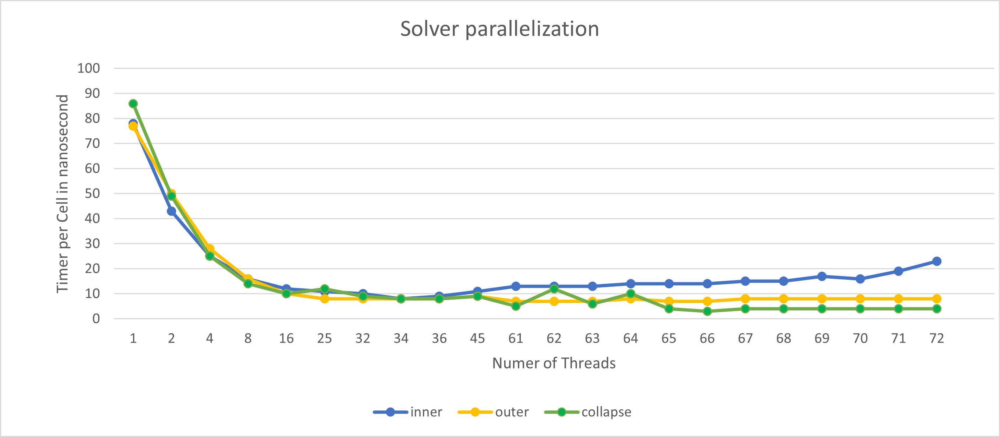

Parallelization
===============

Parallelize your solver using OpenMP!
-------------------------------------

.. warning:: 
    The following code is the final solution of our parallelization of the WavePropagation2D.cpp, main.cpp and netcdf.cpp
    In "Comparison of parallel and sequential execution" is explained how we came to this solution and what we tried before.
    

For this task we parallelized our x and y sweep in ``WavePropagation2D.cpp``:

.. code-block:: c++
    :emphasize-lines: 5,12

        void tsunami_lab::patches::WavePropagation2d::timeStep(t_real i_scaling)
    {

    #pragma omp parallel for schedule(static) default(none) shared(m_h, m_hu, m_hv, m_b) firstprivate(m_xCells, m_yCells)
    for (t_idx l_ce = 1; l_ce < ((m_xCells + 2) * (m_yCells + 2)); l_ce++)
    {
        m_h_temp[l_ce] = m_h[l_ce];
        m_momentum_temp[l_ce] = m_hu[l_ce];
    }
    
    #pragma omp parallel for schedule(static) default(none) shared(m_h, m_hv, m_b, m_h_temp, m_momentum_temp) firstprivate(i_scaling, m_xCells, m_yCells, m_choice)
    for (t_idx l_ex = 1; l_ex < m_xCells + 1; l_ex++)
    {
        for (t_idx l_ey = 1; l_ey < m_yCells + 1; l_ey++)
        {

as well as the part where we set up the solver in our ``main.cpp``:

.. code-block:: c++
    :emphasize-lines: 1,11

    #pragma omp parallel for reduction(max:l_hMax) default(none) shared(l_setup,l_waveProp,l_nx,l_ny,l_dxy,l_domain_start_x,l_domain_start_y)
        //every variable is private when first delcared in the loop
        for( tsunami_lab::t_idx l_cy = 0; l_cy < l_ny; l_cy++ ){
        for( tsunami_lab::t_idx l_cx = 0; l_cx < l_nx; l_cx++ ){
            tsunami_lab::t_real l_y = l_cy * l_dxy + l_domain_start_y;
            tsunami_lab::t_real l_x = l_cx * l_dxy + l_domain_start_x;

            // get initial values of the setup
            tsunami_lab::t_real l_h = l_setup->getHeight( l_x,
                                                        l_y );
            l_hMax = std::max( l_h, l_hMax );

and our ``makeLowerResGrid`` function in ``netcdf.cpp``:

.. code-block:: c++
    :emphasize-lines: 1

    #pragma omp parallel for collapse(2) schedule(static) default(none) shared(grid,oldgrid) firstprivate(result_x,result_y,i_stride,i_k)
            for (t_idx l_iy = 0; l_iy < result_y; l_iy++) // für y wert neues feld
            {
                for (t_idx l_ix = 0; l_ix < result_x; l_ix++) // für x wert neues feld
                {
                    for (t_idx l_jy = 0; l_jy < i_k; l_jy++) // iterator von 0 bis k um von l_iy and zu zählen
                    {
                        for (t_idx l_jx = 0; l_jx < i_k; l_jx++) // iterator von 0 bis k um von l_ix and zu zählen
                        {  
                            grid[l_iy * result_x + l_ix] += oldgrid[(l_iy * i_k + l_jy+1) * i_stride + (l_ix * i_k + l_jx+1)];
                        }
                    }
                    grid[l_iy * result_x + l_ix] /= (i_k * i_k);
                }
            }

Comparison of parallel and sequential execution
-----------------------------------------------

For the following tests we used the following config file with 500 seconds of simulation time:

.. code-block:: c++

    {
    "solver" : "fwave",
    "dimension_x" : 2699750,
    "dimension_y" : 1499750,
    "setup" :  "tsunamievent2d",
    "nx" : 5400,
    "ny" : 3000,
    "k"  : 5,
    "hu" : 0,
    "location" : 0,
    "hv":0.0,
    "hr": 55,
    "hl": 25,
    "domain_start_x" : -199875,
    "domain_start_y" : -749875,
    "wavepropagation" : "2d",
    "endtime" : 500,
    "writer" : "netcdf",
    "bathfile" : "data/output/tohoku_gebco20_ucsb3_250m_bath.nc",
    "disfile" : "data/output/tohoku_gebco20_ucsb3_250m_displ.nc",
    "outputfilename": "simulation.nc",
    "usecheckpoint" : false
    }

The first goal was to find out if it is faster to parallelize the outer for loop or the inner loop in our ``WavePropagation2D``,
or if it is fastest to parallelize both with collapse(2).

.. note:: Since the position and the amount of for loops we want to parallelize are the most important, we set all variables to shared for this test and use "default(none) as good practice

    ``default(none) shared(m_h, m_hv, m_b, m_h_temp, m_momentum_temp, i_scaling, m_xCells, m_yCells, m_choice)``

    The first value is the SpeedUp and the second value is how much time a single cell takes on average

    +-----------+-----------------------+
    | SpeedUp   | average_Time_per_cell |
    +-----------+-----------------------+

.. warning:: We know that #pragma omp parallel for collapse(2) can lead to race conditions but we wanted to test it anyway

+------------------------+----------------------------+----------------------------+--------------------------------------------+
|                        |   inner loop               |      outer loop            |      both loops                            |     
+------------------------+----------------------------+----------------------------+--------------------------------------------+
| OMP_NUM_THREADS        | #pragma omp parallel for   | #pragma omp parallel for   |  #pragma omp parallel for collapse(2)      |
+========================+============================+============================+============================================+
| 1                      | +-----------+------------+ | +-----------+------------+ | +-----------+------------+                 |
|                        | |     1     |    78ns    | | |     1     |    77ns    | | |     1     |     86ns   |                 |
|                        | +-----------+------------+ | +-----------+------------+ | +-----------+------------+                 |
+------------------------+----------------------------+----------------------------+--------------------------------------------+
| 2                      | +-----------+------------+ | +-----------+------------+ | +-----------+------------+                 |
|                        | |    1.81   |     43ns   | | |    1.54   |     50ns   | | |     1.76  |     49ns   |                 |
|                        | +-----------+------------+ | +-----------+------------+ | +-----------+------------+                 |
+------------------------+----------------------------+----------------------------+--------------------------------------------+
| 4                      | +-----------+------------+ | +-----------+------------+ | +-----------+------------+                 |
|                        | |   3.12    |     25ns   | | |    2.75   |     28ns   | | |     3.44  |     25ns   |                 |
|                        | +-----------+------------+ | +-----------+------------+ | +-----------+------------+                 |
+------------------------+----------------------------+----------------------------+--------------------------------------------+
| 8                      | +-----------+------------+ | +-----------+------------+ | +-----------+------------+                 |
|                        | |    4.88   |     16ns   | | |    4.81   |     16ns   | | |     6.12  |     14ns   |                 |
|                        | +-----------+------------+ | +-----------+------------+ | +-----------+------------+                 |
+------------------------+----------------------------+----------------------------+--------------------------------------------+
| 16                     | +-----------+------------+ | +-----------+------------+ | +-----------+------------+                 |
|                        | |    6.5    |     12ns   | | |    7.7    |     10ns   | | |     8.6   |    10ns    |                 |
|                        | +-----------+------------+ | +-----------+------------+ | +-----------+------------+                 |
+------------------------+----------------------------+----------------------------+--------------------------------------------+
| 25                     | +-----------+------------+ | +-----------+------------+ | +-----------+------------+                 |
|                        | |    7.1    |     11ns   | | |    9.63   |     8ns    | | |     7.17  |    12ns    |                 |
|                        | +-----------+------------+ | +-----------+------------+ | +-----------+------------+                 |
+------------------------+----------------------------+----------------------------+--------------------------------------------+
| 32                     | +-----------+------------+ | +-----------+------------+ | +-----------+------------+                 |
|                        | |     7.8   |     10ns   | | |    9.63   |     8ns    | | |     9.56  |     9ns    |                 |
|                        | +-----------+------------+ | +-----------+------------+ | +-----------+------------+                 |
+------------------------+----------------------------+----------------------------+--------------------------------------------+
| 34                     | +-----------+------------+ | +-----------+------------+ | +-----------+------------+                 |
|                        | |     9.75  |     8ns    | | |    9.63   |     8ns    | | |     9.56  |     8ns    |                 |
|                        | +-----------+------------+ | +-----------+------------+ | +-----------+------------+                 |
+------------------------+----------------------------+----------------------------+--------------------------------------------+
| 36                     | +-----------+------------+ | +-----------+------------+ | +-----------+------------+                 |
|                        | |     8.67  |     9ns    | | |    9.63   |     8ns    | | |     9.56  |     8ns    |                 |
|                        | +-----------+------------+ | +-----------+------------+ | +-----------+------------+                 |
+------------------------+----------------------------+----------------------------+--------------------------------------------+
| 45                     | +-----------+------------+ | +-----------+------------+ | +-----------+------------+                 |
|                        | |     7.1   |     11ns   | | |    8.56   |     9ns    | | |     9.56  |      9ns   |                 |
|                        | +-----------+------------+ | +-----------+------------+ | +-----------+------------+                 |
+------------------------+----------------------------+----------------------------+--------------------------------------------+
| 61                     | +-----------+------------+ | +-----------+------------+ | +-----------+------------+                 |
|                        | |     6     |     13ns   | | |    11     |     7ns    | | |     17.2  |      5ns   |                 |
|                        | +-----------+------------+ | +-----------+------------+ | +-----------+------------+                 |
+------------------------+----------------------------+----------------------------+--------------------------------------------+
| 62                     | +-----------+------------+ | +-----------+------------+ | +-----------+------------+                 |
|                        | |     6     |     13ns   | | |    11     |     7ns    | | |     7.17  |     12ns   |                 |
|                        | +-----------+------------+ | +-----------+------------+ | +-----------+------------+                 |
+------------------------+----------------------------+----------------------------+--------------------------------------------+
| 63                     | +-----------+------------+ | +-----------+------------+ | +-----------+------------+                 |
|                        | |     6     |     13ns   | | |    11     |     7ns    | | |     14.33 |      6ns   |                 |
|                        | +-----------+------------+ | +-----------+------------+ | +-----------+------------+                 |
+------------------------+----------------------------+----------------------------+--------------------------------------------+
| 64                     | +-----------+------------+ | +-----------+------------+ | +-----------+------------+                 |
|                        | |    5.57   |     14ns   | | |    9.63   |     8ns    | | |     8.6   |      10ns  |                 |
|                        | +-----------+------------+ | +-----------+------------+ | +-----------+------------+                 |
+------------------------+----------------------------+----------------------------+--------------------------------------------+
| 65                     | +-----------+------------+ | +-----------+------------+ | +-----------+------------+                 |
|                        | |    5.57   |     14ns   | | |    11     |     7ns    | | |     21.5  |      4ns   |                 |
|                        | +-----------+------------+ | +-----------+------------+ | +-----------+------------+                 |
+------------------------+----------------------------+----------------------------+--------------------------------------------+
| 66                     | +-----------+------------+ | +-----------+------------+ | +-----------+------------+                 |
|                        | |    5.57   |     14ns   | | |    11     |     7ns    | | |     28,6  |      3ns   |                 |
|                        | +-----------+------------+ | +-----------+------------+ | +-----------+------------+                 |
+------------------------+----------------------------+----------------------------+--------------------------------------------+
| 67                     | +-----------+------------+ | +-----------+------------+ | +-----------+------------+                 |
|                        | |     5.2   |     15ns   | | |    9.63   |     8ns    | | |     21.5  |      4ns   |                 |
|                        | +-----------+------------+ | +-----------+------------+ | +-----------+------------+                 |
+------------------------+----------------------------+----------------------------+--------------------------------------------+
| 68                     | +-----------+------------+ | +-----------+------------+ | +-----------+------------+                 |
|                        | |     5.2   |     15ns   | | |    9.63   |     8ns    | | |     21.5  |      4ns   |                 |
|                        | +-----------+------------+ | +-----------+------------+ | +-----------+------------+                 |
+------------------------+----------------------------+----------------------------+--------------------------------------------+
| 69                     | +-----------+------------+ | +-----------+------------+ | +-----------+------------+                 |
|                        | |     4.59  |     17ns   | | |    9.63   |     8ns    | | |     21.5  |      4ns   |                 |
|                        | +-----------+------------+ | +-----------+------------+ | +-----------+------------+                 |
+------------------------+----------------------------+----------------------------+--------------------------------------------+
| 70                     | +-----------+------------+ | +-----------+------------+ | +-----------+------------+                 |
|                        | |     4.86  |     16ns   | | |    9.63   |     8ns    | | |     21.5  |     4ns    |                 |
|                        | +-----------+------------+ | +-----------+------------+ | +-----------+------------+                 |
+------------------------+----------------------------+----------------------------+--------------------------------------------+
| 71                     | +-----------+------------+ | +-----------+------------+ | +-----------+------------+                 |
|                        | |     4.12  |     19ns   | | |    9.63   |     8ns    | | |     21.5  |     4ns    |                 |
|                        | +-----------+------------+ | +-----------+------------+ | +-----------+------------+                 |
+------------------------+----------------------------+----------------------------+--------------------------------------------+
| 72                     | +-----------+------------+ | +-----------+------------+ | +-----------+------------+                 |
|                        | |     3.39  |     23ns   | | |    9.63   |     8ns    | | |     21.5  |     4ns    |                 |
|                        | +-----------+------------+ | +-----------+------------+ | +-----------+------------+                 |
+------------------------+----------------------------+----------------------------+--------------------------------------------+

When visualizing the data,
you can see that the average time is decreasing and the best performance of 8ns is achieved with 34 and 36 threads.
You can also see that the parallelization of the inner for loop takes longer if you want to use more threads than you have cores.
The reason for this is the large overhead you have because you have to reassign the chunks to the threads after each iteration.

The time in the outer for loop remains relatively constant, however, only at 65 and 66 threads the time drops to 7ns.
We assume that this is not really an improvement because we have also looked at the total duration of the simulation and these are almost the same for all and it varies only slightly

With collapse(2), 2 for loops, one of which is inside the other, are combined into one and then parallelized, which makes sense IF both for loops are independent of each other.
The values that arise when you use more threads than you have cores are difficult to explain, especially when there are jumps from 9ns->5ns->12ns->6ns->10ns->4ns.

But since there is only one overhead and one for loop is faster than 2 with the same work, the time could decrease again.
Anyway, since there are race conditions, this test was just out of interest.

.. admonition:: Summary of Task 2 and 3

        Generally speaking, the outer for loop is faster than the inner for loop due to the higher overhead of the inner for loop.
        Furthermore, it is not worth using more threads than cores because it leads to increased overhead. If there are more threads than cores,
        the threads have to be distributed to the available cores, which leads to additional tasks for the scheduler and reassignment of tasks.

Study NUMA effects and use OpenMP’s first touch policy to perform NUMA-aware initializations.
---------------------------------------------------------------------------------------------

.. admonition:: Study NUMA effects

    The "NUMA effects" refer to the performance differences caused by accessing local versus non-local memory.
    When a processor accesses non-local memory, there can be a delay known as a "NUMA penalty".
    This penalty can significantly affect the performance of multiprocessor systems.

    The first touch policy is a policy that ensures that the memory is allocated on the NUMA node where the thread is running.
    For that we use the ``#pragma omp parallel for schedule(static) default(none) shared(m_h, m_hu, m_hv, m_b) firstprivate(m_xCells, m_yCells)``
    To perform NUMA-aware initializations we parallelize the for loop where we copy the momentum and the height into the temporary arrays.
     

    .. code-block:: c++
        :emphasize-lines: 5

            void tsunami_lab::patches::WavePropagation2d::timeStep(t_real i_scaling)
        {

        #pragma omp parallel for schedule(static) default(none) shared(m_h, m_hu, m_hv, m_b) firstprivate(m_xCells, m_yCells)
        for (t_idx l_ce = 1; l_ce < ((m_xCells + 2) * (m_yCells + 2)); l_ce++)
        {
            m_h_temp[l_ce] = m_h[l_ce];
            m_momentum_temp[l_ce] = m_hu[l_ce];
        }

Try different scheduling and pinning strategies.
------------------------------------------------

To obtain more accurate values this time on how much time a cell takes on average, we let the simulations run for a longer duration and test it with 32 ,34 and 36 threads, where we obsered the best performance.

    .. code-block:: c++

        {
        "solver" : "fwave",
        "dimension_x" : 2699750,
        "dimension_y" : 1499750,
        "setup" :  "tsunamievent2d",
        "nx" : 5400,
        "ny" : 3000,
        "k"  : 5,
        "hu" : 0,
        "location" : 0,
        "hv":0.0,
        "hr": 55,
        "hl": 25,
        "domain_start_x" : -199875,
        "domain_start_y" : -749875,
        "wavepropagation" : "2d",
        "endtime" : 7200,
        "writer" : "netcdf",
        "bathfile" : "data/output/tohoku_gebco20_ucsb3_250m_bath.nc",
        "disfile" : "data/output/tohoku_gebco20_ucsb3_250m_displ.nc",
        "outputfilename": "simulation.nc",
        "usecheckpoint" : false
        }

For this test, we have reserved 3 hours each for static, dynamic and guided and these 3 simulations must be completed in this time.

+------------------------+----------------------------+----------------------------+--------------------------------------------+
|                        |                            |                            |                                            |
| OMP_NUM_THREADS        | schedule(static)           | schedule(dynamic)          | schedule(guided)                           |
|                        |                            |                            |                                            |
+========================+============================+============================+============================================+
| 32                     |                            |                            |                                            |
|                        |       3ns                  |   did not complete within  |                    4ns                     |
|                        |                            |    180 min , 55% completed |                                            |
|                        |                            |                            |                                            |
|                        |                            |                            |                                            |
+------------------------+----------------------------+----------------------------+--------------------------------------------+
| 34                     |                            |                            |                                            |
|                        | 3ns                        |            /               |                  3ns                       |
|                        |                            |                            |                                            |
+------------------------+----------------------------+----------------------------+--------------------------------------------+
| 36                     |                            |                            |                                            |
|                        | 3ns                        |            /               |                    4ns                     |
|                        |                            |                            |                                            |
+------------------------+----------------------------+----------------------------+--------------------------------------------+

the static scheduler was the fastest, and because of NUMA aware initializations and a longer duration of the simulation (more precise average), the average time per cell is now 3ns.
The dynamic scheduler did not complete the first simulation within 3 hours, so we can't say anything about the average time per cell but we know that this scheduler is slower than the static scheduler.
The guided scheduler was almost as fast as the static scheduler with 4ns per cell.

.. admonition:: Pinning strategies

    The pinning strategy is a strategy that determines which thread is assigned to which core.
    The default strategy is to assign the threads to the cores in a round-robin fashion.

    .. code-block:: c++
    
        {
        "solver" : "fwave",
        "dimension_x" : 2699750,
        "dimension_y" : 1499750,
        "setup" :  "tsunamievent2d",
        "nx" : 5400,
        "ny" : 3000,
        "k"  : 5,
        "hu" : 0,
        "location" : 0,
        "hv":0.0,
        "hr": 55,
        "hl": 25,
        "domain_start_x" : -199875,
        "domain_start_y" : -749875,
        "wavepropagation" : "2d",
        "endtime" : 4500,
        "writer" : "netcdf",
        "bathfile" : "data/output/tohoku_gebco20_ucsb3_250m_bath.nc",
        "disfile" : "data/output/tohoku_gebco20_ucsb3_250m_displ.nc",
        "outputfilename": "simulation.nc",
        "usecheckpoint" : false
        }

    we tried different pinning strategies seen in the table below.
        
We splitted the cores into 4 groups and used ``close``, ``spread`` and ``MASTER`` to assign the threads to the cores.

+------------------------+----------------------------+----------------------------+--------------------------------------------+
| OMP_NUM_THREADS        |                            |                            |                                            |
|                        |  OMP_PROC_BIND=close       |                            |  OMP_PLACES="{0:9},{9:9},{18:9},{27:9}"    |
|                        |  OMP_PLACES="{0:9},{9:9},  |  OMP_PLACES="{0:9},{9:9},  |           OMP_PROC_BIND=MASTER             |
|                        |  {18:9},{27:9}"            |  {18:9},{27:9}"            |                                            |                    
|                        |                            |  OMP_PROC_BIND=spread      |                                            |
|                        |                            |                            |                                            |
+========================+============================+============================+============================================+
| 34                     |                            |                            |                                            |
|                        | 3ns                        |      3ns                   |                  20ns                      |
|                        |                            |                            |                                            |
|                        |                            |                            |                                            |
|                        |                            |                            |                                            |
+------------------------+----------------------------+----------------------------+--------------------------------------------+

OMP_PROC_BIND=spread  and OMP_PROC_BIND=close took the same time ``5 minutes, 10 seconds`` and OMP_PROC_BIND=MASTER took ``31 minutes, 5seconds`` with an average time of 20ns for a cell. 
It doesn't make sense to create different places if all cores are supposed to orient themselves to the master thread therefore, this long duration probably occurred.

We found that without using OMP_PLACES, both spread and bind took 20 seconds longer.
However, MASTER was the fastest overall, but only by a few seconds.

To compare the unparallelized code with the fully parallelized code, we simulated Tohoku for 4500 seconds (500m cell width) again, both with and without parallelization.

without parallelization:

.. code-block:: bash

    total duration: 
    duration: 7635.31 seconds = 127,26 minutes
    loop duration: 
    Duration: 2 hours, 1 minutes, 59 seconds, 112 milliseconds, 463 microseconds, 470 nanoseconds
    Station: 
    Duration: 0 hours, 0 minutes, 0 seconds, 0 milliseconds, 102 microseconds, 717 nanoseconds
    Checkpoint: 
    Duration: 0 hours, 0 minutes, 0 seconds, 0 milliseconds, 0 microseconds, 0 nanoseconds
    time per cell: 
    Duration: 0 hours, 0 minutes, 0 seconds, 0 milliseconds, 451 microseconds, 797 nanoseconds
    time per iteration: 
    Duration: 0 hours, 0 minutes, 0 seconds, 0 milliseconds, 0 microseconds, 81 nanoseconds

with parallelization:

.. code-block:: bash

    total duration: 
    duration: 342.581 seconds = 5,70968 minutes
    loop duration: 
    Duration: 0 hours, 5 minutes, 5 seconds, 373 milliseconds, 30 microseconds, 342 nanoseconds
    Station: 
    Duration: 0 hours, 0 minutes, 0 seconds, 0 milliseconds, 56 microseconds, 147 nanoseconds
    Checkpoint: 
    Duration: 0 hours, 0 minutes, 0 seconds, 0 milliseconds, 0 microseconds, 0 nanoseconds
    time per cell: 
    Duration: 0 hours, 0 minutes, 0 seconds, 0 milliseconds, 18 microseconds, 850 nanoseconds
    time per iteration: 
    Duration: 0 hours, 0 minutes, 0 seconds, 0 milliseconds, 0 microseconds, 3 nanoseconds

The parallelized code is 22.29 times faster and the time per iteration is 27 times faster than the unparallelized code.

- Ward Tammaa, Daniel Schicker Doxygen Documentation
- Daniel Schicker, Mohamad Khaled Minawe, Ward Tammaa Sphnix Documentation
- Daniel Schicker, Mohamad Khaled Minawe , Ward Tammaa functions implementation
- Mohamad Khaled Minawe, Daniel Schicker, Ward Tammaa Unit Testing
- Mohamad Khaled Minawe, Daniel Schicker Geogebra Datei(Calculations for the Unit Tests)
- Ward Tammaa Hosting the code , Action runner

    
    

    

    

