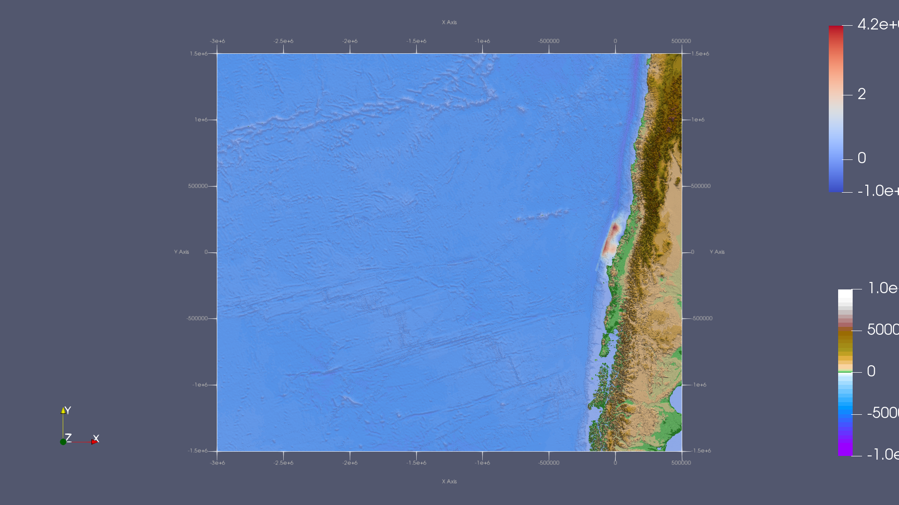
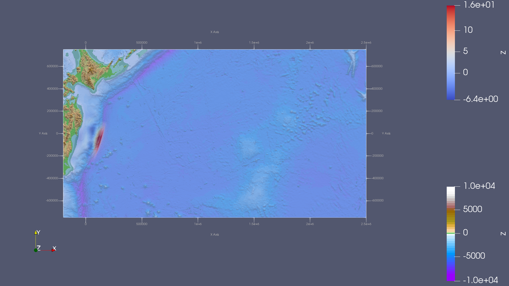
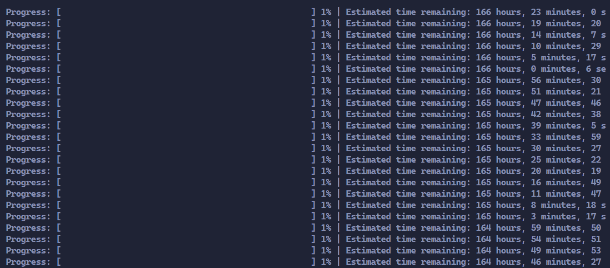
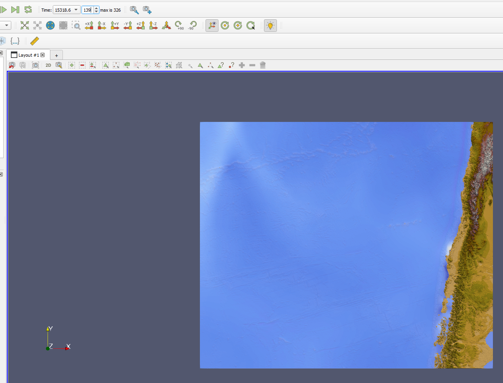
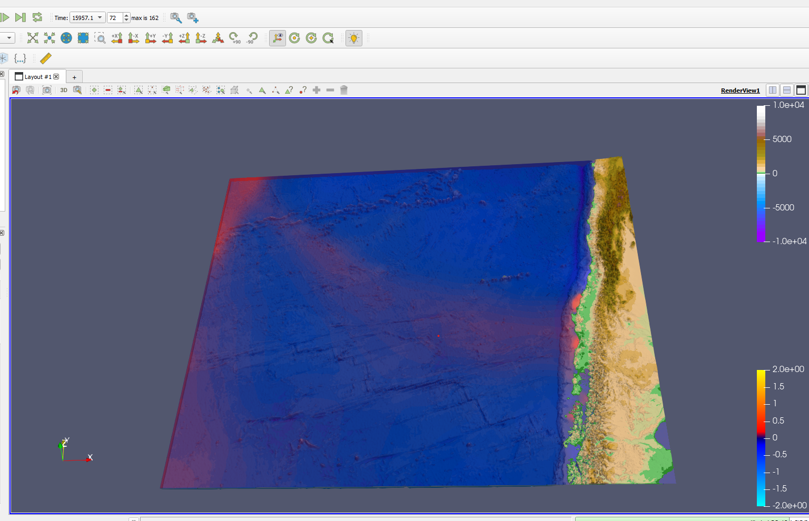
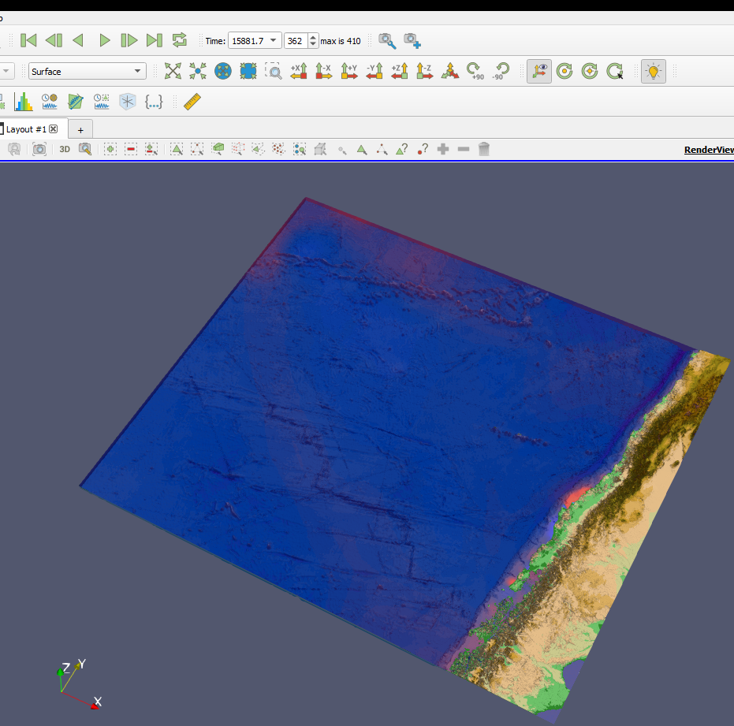
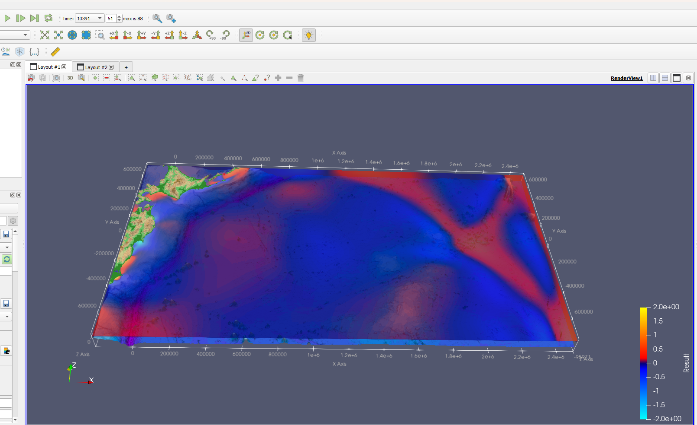
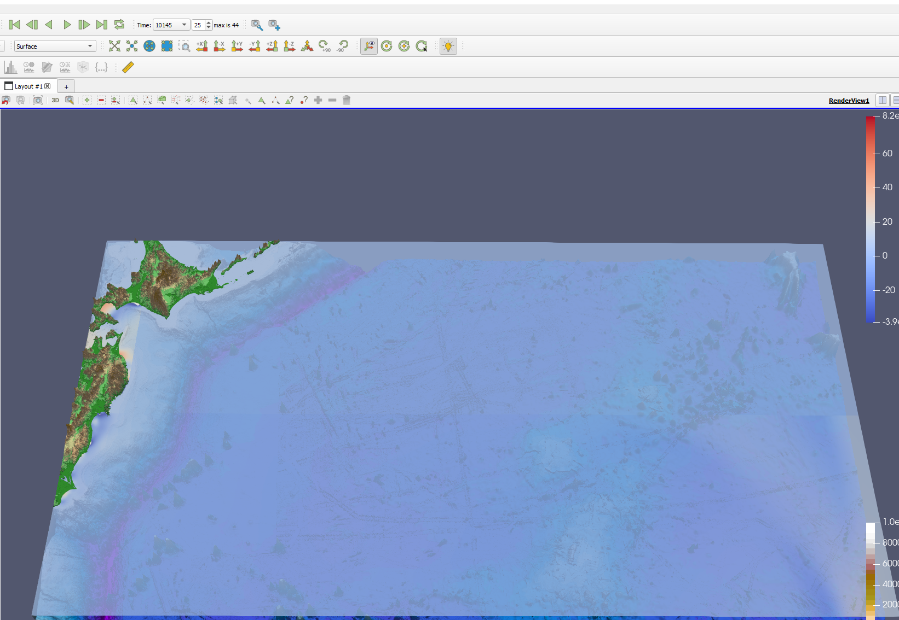
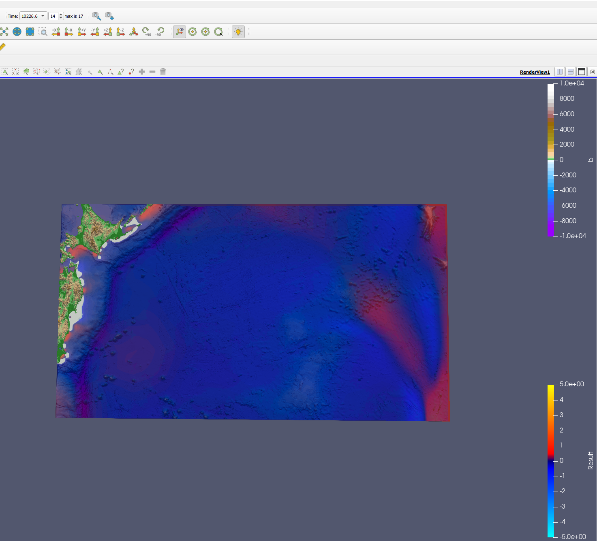

Tsunami Simulations
===========================

2010 M 8.8 Chile Event
-----------------------

Make yourself familiar with the input data
...........................................

As input data, we obtained bathymetry and displacements for the events
in Chile and Tohoku. The data can be visualized using ParaView.
While visualizing the data, we will apply the filter  " warp by scalar" to the bathymetry, setting the scaler value to 10.
Additionally, we will adjust the opacity of the bathymetry to 0.6 to enhance the visibility of the displacement.

In ParaView, we will use the following color maps `here`_:

.. _here: https://www.earthmodels.org/date-and-tools/color-tables/gmt_colortables_for_paraview.zip

Don't forget to import the color maps in ParaView.

For Chile events, we got the following visualization:

For Tohoku events, we got the following visualization:

Simulate the tsunami event and visualize the output
....................................................

.. important:: 

   Considering performance issues and time constraints, we weren't able to simulate those with the 250 m Cell width .
   For example After visualizing Chile event for 2 days, we realized that we made a mistake in
   our tsunamievent2d setup in submission 5 and we tried to simulate everything again and fixed the function.

.. code-block:: cpp

   tsunami_lab::t_real tsunami_lab::setups::TsunamiEvent2d::getBathymetryNetCdf(t_real i_x, t_real i_y) const {
    //check whether the position is within our domain
    if (i_x < m_bathymetry_x_values[0]  i_x > m_bathymetry_x_values[m_nx_bat - 1] 
        i_y < m_bathymetry_y_values[0] || i_y > m_bathymetry_y_values[m_ny_bat - 1])
    {
        return 0;
    }

    t_idx l_x = findClosestIndex(m_bathymetry_x_values,m_nx_bat, i_x);
    t_idx l_y = findClosestIndex(m_bathymetry_y_values,m_ny_bat,i_y);

    return m_bathymetry_values[l_x * m_nx_bat + l_y]; // the problem was here
   }

The correct line of the code would be: ``return m_bathymetry_values[l_y * m_nx_bat + l_x]``

For the performance issues we always got something like this:

This image shows to the 250m Chile event, depicting the estimated completion time for our solver.

We had also tried to just let it run because we thought that the expected duration would not be the same as the real simulation duration
but after more than 30 hours of simulation we stopped because the 250m cell width variants took too long.

After visualizing the Chile 500m event, we identified an additional unknown issue shown 
in the following video. However, we observed that by downgrading the resolution,
the problem no longer occurs. But you can still see the wave in the video if you look closely.

.. video:: _static/Chile_500m_problem.mp4
   :width: 700
   :height: 500
   :autoplay:

number of cell updates
........................

For the question: **What are the computational demands of your simulations (number of required cells and cell updates)?**
we will use the following formula: 

.. math:: l_{\text{nx}} * l_{\text{ny}} * timestep_{\text{amount}} * 4
   

.. important:: 

   l_nx: amount of cells in the x direction

   l_ny: amount of cells in the y direction

   amount_of_time_steps: amount of timesteps

the multiplication with `4` is due to the number of netupdates for each cell per time step. we got  2 times ``x_sweep``and ``y_sweep`` for our netupdates.

The amount of timesteps can be calculated using this formula

.. code-block:: cpp

   tsunami_lab::t_real amount_time_steps = ceil(l_temp_endtime/l_dt);

visualiztion
.............

For the Chile events, we will use different grid resolutions. However, before doing that,
we need to adjust the amound of frames we want for our simulation in  ``main.cpp``

.. code-block:: cpp 

    if( l_timeStep % 1250 == 0 )

Let's now simulate the tsunami for the following resolutions:

**1. 2500m Cell width :**

For this resolution, we will use the following config file and we will visualize it for 10 hours.

.. code-block:: cpp 

   {
   "solver" : "fwave",
   "dimension_x" : 3500000,
   "dimension_y" : 2950000,
   "setup" :  "tsunamievent2d",
   "nx" : 1400,
   "ny" : 1180,
   "hu" : 0,
   "location" : 0,
   "hv":0.0,
   "hr": 55,
   "hl": 25,
   "domain_start_x" : -3000000,
   "domain_start_y" : -1450000,
   "wavepropagation" : "2d",
   "endtime" : 36000,
   "writer" : "netcdf",
   "bathfile" : "data/output/chile_gebco20_usgs_250m_bath_fixed.nc",
   "disfile" : "data/output/chile_gebco20_usgs_250m_displ_fixed.nc"

   }

.. video:: _static/chile_2500m_10h.mp4
   :width: 700
   :height: 500
   :autoplay:

As evident in the image, the wave exits our domain approximately after 15319 seconds.
(its the white part/string on the top left side of the picture)

Now let's compute the number of net updates using our formula:

.. math:: l_{\text{nx}} * l_{\text{ny}} * timestep_{\text{amount}} * 4

.. math:: 1400 * 1180 * 6533.12 * 4  = 43170856960

**2. 5000m Cell width:**

For the 5000m Cell width resolution, we will use the following config file, and we will visualize it for 10 hours:

.. code-block:: cpp 

   {
    "solver" : "fwave",
    "dimension_x" : 3500000,
    "dimension_y" : 2950000,
    "setup" :  "tsunamievent2d",
    "nx" : 700,
    "ny" : 590,
    "hu" : 0,
    "location" : 0,
    "hv":0.0,
    "hr": 55,
    "hl": 25,
    "domain_start_x" : -3000000,
    "domain_start_y" : -1450000,
    "wavepropagation" : "2d",
    "endtime" : 36000,
    "writer" : "netcdf",
    "bathfile" : "data/output/chile_gebco20_usgs_250m_bath_fixed.nc",
    "disfile" : "data/output/chile_gebco20_usgs_250m_displ_fixed.nc"

   }

.. video:: _static/Chile_5000_10hrs.mp4
   :width: 700
   :height: 500
   :autoplay:

As evident in the image, the wave exits our domain approximately at the time of 15 957

Now let's compute the number of net updates using our formula:

.. math:: l_{\text{nx}} * l_{\text{ny}} * timestep_{\text{amount}} * 4

.. math:: 700 * 590 * 4060.92 * 4 = 17533.68

**3. 1000m Cell width:**

and for the 1000m option we will use the following config file : 

.. code-block:: cpp 

   {
      "solver" : "fwave",
      "dimension_x" : 3500000,
      "dimension_y" : 2950000,
      "setup" :  "tsunamievent2d",
      "nx" : 3500,
      "ny" : 2950,
      "hu" : 0,
      "location" : 0,
      "hv":0.0,
      "hr": 55,
      "hl": 25,
      "domain_start_x" : -3000000,
      "domain_start_y" : -1450000,
      "wavepropagation" : "2d",
      "endtime" : 18000,
      "writer" : "netcdf",
      "bathfile" : "data/chile_gebco20_usgs_250m_bath_fixed.nc",
      "disfile" : "data/chile_gebco20_usgs_250m_displ_fixed.nc"

   }

.. video:: _static/chile_1000m_5h.mp4
   :width: 700
   :height: 500
   :autoplay:

As evident in the image, the wave exits our domain approximately at the time of 15 957

now let's compute the number of netupdates using our formula:

.. math:: l_{\text{nx}} * l_{\text{ny}} * timestep_{\text{amount}} * 4

.. math:: 3500 * 2950 * 10257.4 = 105907655000
 

Tohoku Event
-------------

simulate the tsunami event and visualize the output
...................................................

Let's now simulate the tsunami for the following resolution:

**1. 2500m Cell width:**

.. code-block:: cpp 

 
   {
      "solver" : "fwave",
      "dimension_x" : 2700000,
      "dimension_y" : 1500000,
      "setup" :  "tsunamievent2d",
      "nx" : 1080,
      "ny" : 600,
      "hu" : 0,
      "location" : 0,
      "hv":0.0,
      "hr": 55,
      "hl": 25,
      "domain_start_x" : -200000,
      "domain_start_y" : -750000,
      "wavepropagation" : "2d",
      "endtime" : 36000,
      "writer" : "netcdf",
      "bathfile" : "data/output/tohoku_gebco20_ucsb3_250m_bath.nc",
      "disfile" : "data/output/tohoku_gebco20_ucsb3_250m_displ.nc"

   }

.. video:: _static/Tohuko_250mFile_2500m_10h.mp4
   :width: 700
   :height: 500
   :autoplay:
   

As evident in the image, the wave exits our domain approximately after 10000 seconds.

Now let's compute the number of netupdate using our formula:

.. math:: l_{\text{nx}} * l_{\text{ny}} * timestep_{\text{amount}} * 4

.. math:: 1080 * 600 * 4417.32 * 4 = 11449693440

Now we start with

**2. 500m Cell width:**

.. code-block:: cpp 

   {
      "solver" : "fwave",
      "dimension_x" : 2700000,
      "dimension_y" : 1500000,
      "setup" :  "tsunamievent2d",
      "nx" : 5400,
      "ny" : 3000,
      "hu" : 0,
      "location" : 0,
      "hv":0.0,
      "hr": 55,
      "hl": 25,
      "domain_start_x" : -200000,
      "domain_start_y" : -750000,
      "wavepropagation" : "2d",
      "endtime" : 18000,
      "writer" : "netcdf",
      "bathfile" : "data/tohoku_gebco20_ucsb3_250m_bath.nc",
      "disfile" : "data/tohoku_gebco20_ucsb3_250m_displ.nc"

   }

.. video:: _static/TOHOKU_500_8H.mp4
   :width: 700
   :height: 500
   :autoplay:

As evident in the image, the wave exits our domain approximately after 10 000 seconds

Now let's compute the number of net updates using our formula:

.. math:: l_{\text{nx}} * l_{\text{ny}} * timestep_{\text{amount}} * 4

.. math:: 5400 * 3000 * 8625 * 4 = 558900000000
 

**3. 1000m Cell width:**

For the 1000m cell width the simulated time is 3.5 hours 

.. code-block:: cpp 

   {
      "solver" : "fwave",
      "dimension_x" : 2700000,
      "dimension_y" : 1500000,
      "setup" :  "tsunamievent2d",
      "nx" : 2700,
      "ny" : 1500,
      "hu" : 0,
      "location" : 0,
      "hv":0.0,
      "hr": 55,
      "hl": 25,
      "domain_start_x" : -200000,
      "domain_start_y" : -750000,
      "wavepropagation" : "2d",
      "endtime" : 12600,
      "writer" : "netcdf",
      "bathfile" : "data/tohoku_gebco20_ucsb3_250m_bath.nc",
      "disfile" : "data/tohoku_gebco20_ucsb3_250m_displ.nc"

   }

.. video:: _static/Tohoku_1000m_3,5h.mp4
   :width: 700
   :height: 500
   :autoplay:

As evident in the image, the wave exits our domain approximately after 10 000 seconds

Now let's compute the number of net updates using our formula:

.. math:: l_{\text{nx}} * l_{\text{ny}} * timestep_{\text{amount}} * 4

.. math:: 2700 * 1500 * 7762 * 4 = 125744400000

The time between the earthquake rupture and the arrival of the first tsunami waves in Sõma
..........................................................................................

1. For the question: ``Find the measured data for Sõma for the March 11, 2011`` we used the following site `The National Center for Environmental Information`_:

.. _The National Center for Environmental Information: https://www.ngdc.noaa.gov/hazel/view/hazards/tsunami/runup-more-info/19241

The relevant Information are : 

Latitude: 37.83300

Longitude: 140.96700

Distance From Source(Km) :134

Travel Minutes: 9

Maximum Water Height(m): 9.3

2. travel time until the first waves reach Sõma:

   1. For this question first, To approximate the height using the csv file, we can calculate the average bathymetry
      value by adding the values together and dividing them by the number of values located between Soma and the epicenter :

      .. code-block:: cpp 

         -3.9362,
         -9.5917,
         -10.011,
         -14.636,
         -15.122,
         -20.738,
         -25.357,
         -25.949,
         -27.898,
         -30.959,
         -31.919,
         -32.675,
         -35.377,
         -35.988,
         -36.033,
         -39.395,
         -42.388,
         -43.535,
         -46.543,
         -48.412,
         -50.274,
         -51.736,
         -60.871,
         -66.789,
         -67.249,
         -81.843,
         -90.523,
         -92.603,
         -98.261,
         -106.67,
         -114.38,
         -119.41,
         -127.19,
         -129.43,
         -129.62,
         -131.4,
         -130.86,
         -131.05,
         -131.78,
         -136.93,
         -138.16,
         -139.16,
         -141.31,
         -145.29,
         -145.49,
         -147.12,
         -149.79,
         -151.39,
         -155.38,
         -163.21,
         -169.61,
         -173.66,
         -185.52,
         -194.54,
         -194.89,
         -203.06,
         -213.28,
         -216.36,
         -224.07,
         -235.6,
         -242.75,
         -246.89,
         -261.36,
         -281.08,
         -281.6,
         -302.34,
         -323.7,
         -331.87,
         -350.7,-
         -381.22,
         -401.84,
         -413.14,
         -457.6,
         -498.8,
         -499.5,
         -550.35,
         -628.92,
         -656.97,
         -717.03,
         -788.27,
         -811.56,
         -823.58,
         -854.8,
         -879.21,
         -879.34,
         -905.36,
         -945.49,
         -953.42,
         -968.75,

      We trimmed the bathymetry values starting from the point ``-3.9362,-1.2386e+05,-53000,0``  opting not
      to choose the point ``5.7205,-1.25e+05,-53487,0``
      despite it's a suitable x-coordinate, due to the positive bathymetry associated with that point.
      We concluded the trimming process at the point ``-968.75,-1000,-427.9,0``
      avoid including the point ``-994.25,1000,427.9,0`` , which comes afterward and skips the epicenter.

   2. The average value is -255.6141787 so we assume that our height equals 255.6141787 and now we can compute the wave speed with the
      following formula:

      .. math:: \lambda \approx \sqrt{gh}

   .. image:: _static/waveSpeed_Soma.png
      :width: 700px
      :height: 200px
      :scale: 100 %
      :alt: alternate text
      :align: right

      
   3. now lets calculate the distance between the epicenter and Sõma:

   .. image:: _static/soma_question_2_2.png
      :width: 700px
      :height: 300px
      :scale: 100 %
      :alt: alternate text
      :align: right

   4. now lets compute the time by the following formula:  

      :math:`time= \frac{distance}{wave speed}`
      
      .. image:: _static/Soma_time.png
         :width: 700px
         :height: 300px
         :scale: 100 %
         :alt: alternate text
         :align: right

3. Soma station:

For the task : **Add a station close to Sõma and measure the h, hu and hv over time. Compare the results with your simulated tsunami arrival times.** we sample data every 20 seconds
and we have selected the point ``P[-123860/-53000]``.

We chose this point because it is the first to have negative bathymetry, i.e. it is not on land, and is closest to Soma.

The station would look like this:

   .. code-block:: cpp 

      {
         "frequency": 20,
         "stations":
         [
            {                     
                  "i_name": "SomaStation",
                  "i_x": -123860,
                  "i_y": -53000
            }
         ]

      }

and we simulated it with these settings:
in other words we used a 1000m cell width simulation

   .. code-block:: cpp 
      
      {
         "solver" : "fwave",
         "dimension_x" : 2700000,
         "dimension_y" : 1500000,
         "setup" :  "tsunamievent2d",
         "nx" : 2700,
         "ny" : 1500,
         "hu" : 0,
         "location" : 0,
         "hv":0.0,
         "hr": 55,
         "hl": 25,
         "domain_start_x" : -200000,
         "domain_start_y" : -750000,
         "wavepropagation" : "2d",
         "endtime" : 12600,
         "writer" : "netcdf",
         "bathfile" : "data/tohoku_gebco20_ucsb3_250m_bath.nc",
         "disfile" : "data/tohoku_gebco20_ucsb3_250m_displ.nc"
      }

After simulating, the ``h``, ``hv`` and ``hu`` look like this:

   .. image:: _static/soma_station.png
      :width: 700px
      :height: 500px
      :scale: 100 %
      :alt: alternate text
      :align: right

To compare our output with the calculation above we need to determine when the first waves arrives at our station.

   .. image:: _static/arrival_wave.png
      :width: 900px
      :height: 300px
      :scale: 100 %
      :alt: alternate text
      :align: right

So you can see that the first wave arrives after about ``2540 seconds``.
That is 42,33 minutes and is ``46.2 -42.33 = 3.87 Minutes`` earlier than our
computed wave. The difference is probably due to the many approximations such as bathymetry and positions

To compare our output with the data from the ``National Centers for
Environmental Information`` we firstly determine the max height of the arriving wave.
Our initial height is shown the following picture:

   .. image:: _static/start_height.png
      :width: 900px
      :height: 300px
      :scale: 100 %
      :alt: alternate text
      :align: right

And the highest altitude can be seen here:

   .. image:: _static/greatest_height.png
      :width: 900px
      :height: 300px
      :scale: 100 %
      :alt: alternate text
      :align: right

   If we subtract the initial height we get a wave height of ``29.4237m - 21.6348m = 7.7889m`` which is 
   ``9.3m - 7.7889m =1.5111m``  lower than the actual messured height.

Personal Contribution
---------------------

- Ward Tammaa, Daniel Schicker Doxygen Documentation
- Mohamad Khaled Minawe, Ward Tammaa, Daniel Schicker Sphnix Documentation
- Daniel Schicker, Mohamad Khaled Minawe , Ward Tammaa functions implementation
- Mohamad Khaled Minawe, Daniel Schicker, Ward Tammaa Unit Testing
- Mohamad Khaled Minawe, Daniel Schicker Geogebra Datei(Calculations for the Unit Tests)
- Ward Tammaa Hosting the code , Action runner

    