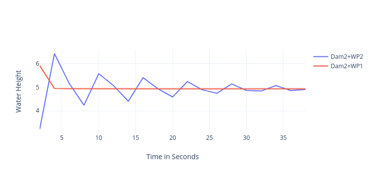

Two-Dimensional Solver
========================

Dimensional Splitting
---------------------------
In this assignment, we'll enhance our wavepropagation to handle two-dimensional problems by implementing Dimensional Splitting.
This approach eliminates the need to modify our fwave solver; instead, we'll perform separate x-sweeps and y-sweeps on the grid using these function:

x-sweep:

.. math:: Q_{i,j}^* = Q_{i,j}^n - \frac{\Delta t}{\Delta x} \left( A^+ \Delta Q_{i-1/2,j} + A^- \Delta Q_{i+1/2,j} \right)  \quad \forall i \in \{ 1, .., n \}, \; j \in \{ 0, .., n+1 \}.

y-sweep: 

.. math:: Q_{i,j}^{n+1} = Q_{i,j}^* - \frac{\Delta t}{\Delta y} \left( B^+ \Delta Q^*_{i,j-1/2} + B^- \Delta Q^*_{i,j+1/2} \right)  \quad \forall i,j \in \{ 1, .., n \}.

We need to transition from wavepropagation1d to wavepropagation2d.

1. There are various approaches to tackle the problem:

- Using a 3D array to store the grid and accessing all elements through it, where the first
  dimension is dedicated to storing the steps, and the other two dimensions represent the x and y coordinates..

- Employing a 2D array with a quadratic number of cells, where the first
  dimension represents the steps, and the second dimension corresponds
  to the x and y coordinates. Specific cells are accessed using a designated formula.

    .. code-block:: cpp

        t_idx l_id = l_iy * i_stride + l_ix;

and we will use the second approach.

2. Now, we will need to create three files. : ``WavePropagation2d.h`` , ``WavePropagation2d.cpp`` and ``WavePropagation2d.test.cpp`` :

    2.1. Let's begin with our ``WavePropagation2d.h``. Our  ``WavePropagation2d.h`` will resemble the 1D version but with some modifications to the following functions:

        .. code-block:: cpp

            private : 

            tsunami_lab::t_idx getIndex(tsunami_lab::t_idx  i_ix,tsunami_lab::t_idx  i_iy){
                return (m_nCells+2) * i_iy +i_ix;
            }

            public:

            void setHeight( t_idx  i_ix,
                    t_idx  i_iy,
                    t_real i_h ) {
                    m_h[m_step][getIndex(i_ix+1,i_iy+1)] = i_h;
            }

            void setBathymetry(t_idx  i_ix,
                    t_idx  i_iy,
                    t_real i_b){
                    m_b[getIndex(i_ix+1,i_iy+1)] = i_b;
            }

            void setMomentumX( t_idx  i_ix,
                       t_idx  i_iy,
                       t_real i_hu ) {
                m_hu[m_step][getIndex(i_ix+1,i_iy+1)] = i_hu;
            }

            void setMomentumY( t_idx  i_ix,
                       t_idx  i_iy,
                       t_real i_hv) {
                m_hv[m_step][getIndex(i_ix+1,i_iy+1)] = i_hv;
             }

    2.2. now lest start implementing ``wavepropagation2d.cpp``. Our  ``WavePropagation2d.cpp`` will resemble the 1D version but with some modifications to the following functions:

        .. code-block:: cpp

            tsunami_lab::patches::WavePropagation2d::WavePropagation2d( t_idx i_nCells, bool i_choice ) {
                    m_choice = i_choice;
                    m_nCells = i_nCells;

                  // allocate memory including a single ghost cell on each side
                  for( unsigned short l_st = 0; l_st < 2; l_st++ ) {
                    m_h[l_st]  = new t_real[ (m_nCells+2) * (m_nCells+2) ];
                    m_hu[l_st] = new t_real[ (m_nCells+2) * (m_nCells+2) ];
                    m_hv[l_st] = new t_real[ (m_nCells+2) * (m_nCells+2) ];
                  }
                  m_b = new t_real[(m_nCells+2) * (m_nCells+2)];

                  // init to zero
                  for( unsigned short l_st = 0; l_st < 2; l_st++ ) {
                    for( t_idx l_ce = 0; l_ce <  (m_nCells+2) * (m_nCells+2) ; l_ce++ ) {
                      m_h[l_st][l_ce] = 0;
                      m_hu[l_st][l_ce] = 0;
                      m_hv[l_st][l_ce] = 0;
                      m_b[l_ce] = 0;
                    }
                  }
                }
                 //free memory
                tsunami_lab::patches::WavePropagation2d::~WavePropagation2d() {
                  for( unsigned short l_st = 0; l_st < 2; l_st++ ) {
                    delete[] m_h[l_st];
                    delete[] m_hu[l_st];
                    delete[] m_hv[l_st];
                  }
                  delete[] m_b;
                }

        Now, let's implement the x-sweep and y-sweep in the " ``wavepropagation2d.cpp``

            .. code-block:: cpp
        
                void tsunami_lab::patches::WavePropagation2d::timeStep( t_real i_scaling) {
                  // pointers to old and new data
                  t_real * l_hOld  = m_h[m_step];
                  t_real * l_huOld = m_hu[m_step];
                  t_real * l_hvOld = m_hv[m_step];

                  t_real * l_b  = m_b; 
                  m_step = (m_step+1) % 2;
                  _real * l_hNew =  m_h[m_step];
                  t_real * l_huNew = m_hu[m_step];
                  t_real * l_hvNew = m_hv[m_step];

                  for( t_idx l_ce = 1; l_ce < ((m_nCells+2) * (m_nCells+2)); l_ce++ ) {
                    l_hNew[l_ce]  = l_hOld[l_ce];
                    l_huNew[l_ce] = l_huOld[l_ce];
                    l_hvNew[l_ce] = l_hvOld[l_ce];
                  }

                  setGhostOutflow(true);
                    //x-sweep
                  for(t_idx l_ex = 0; l_ex < m_nCells +1;l_ex++){ 

                    for(t_idx l_ey = 0; l_ey < m_nCells +1;l_ey++){
                      t_real l_netUpdates[2][2];
                          t_idx l_ceL = getIndex(l_ey,l_ex);
                          t_idx l_ceR = getIndex(l_ey+1,l_ex);
                      if(m_choice){
                        solvers::Roe::netUpdates(l_hOld[l_ceL],
                                                l_hOld[l_ceR],
                                                l_huOld[l_ceL],
                                                l_huOld[l_ceR],
                                                l_netUpdates[0],
                                                l_netUpdates[1]);
                    }else{
                        solvers::fwave::netUpdates( l_hOld[l_ceL],
                                                    l_hOld[l_ceR],
                                                    l_huOld[l_ceL],
                                                    l_huOld[l_ceR],
                                                    l_b[l_ceL],
                                                    l_b[l_ceR],
                                                    l_netUpdates[0],
                                                    l_netUpdates[1]);
                    }
                      l_hNew[l_ceL]  -= i_scaling * l_netUpdates[0][0];
                      l_huNew[l_ceL] -= i_scaling * l_netUpdates[0][1];
                      l_hNew[l_ceR]  -= i_scaling * l_netUpdates[1][0];
                      l_huNew[l_ceR] -= i_scaling * l_netUpdates[1][1];
      
                    }
                }
                    l_hOld  = m_h[m_step];
                    l_huOld = m_hu[m_step];
                    l_hvOld = m_hv[m_step];
                    m_step = (m_step+1) % 2;
                    l_hNew =  m_h[m_step];
                    l_huNew = m_hu[m_step];
                    l_hvNew = m_hv[m_step];

                  for( t_idx l_ce = 1; l_ce < ((m_nCells+2) * (m_nCells+2)); l_ce++ ) {
                    l_hNew[l_ce]  = l_hOld[l_ce];
                    l_huNew[l_ce] = l_huOld[l_ce];
                    l_hvNew[l_ce] = l_hvOld[l_ce];
                  }
                  setGhostOutflow(true);

                    //y-sweep
                  for(t_idx l_ex = 0; l_ex < m_nCells +1;l_ex++){ 
                    for(t_idx l_ey = 0; l_ey < m_nCells +1;l_ey++){
                      t_real l_netUpdates[2][2];
                            t_idx l_ceL = getIndex(l_ey,l_ex);
                            t_idx l_ceR = getIndex(l_ey,l_ex+1);
                      if(m_choice){
                        solvers::Roe::netUpdates( l_hOld[l_ceL],
                                                  l_hOld[l_ceR],
                                                  l_hvOld[l_ceL],
                                                  l_hvOld[l_ceR],
                                                  l_netUpdates[0],
                                                  l_netUpdates[1]);
                      }else{
                        solvers::fwave::netUpdates( l_hOld[l_ceL],
                                                    l_hOld[l_ceR],
                                                    l_hvOld[l_ceL],
                                                    l_hvOld[l_ceR],
                                                    l_b[l_ceL],
                                                    l_b[l_ceR],
                                                    l_netUpdates[0],
                                                    l_netUpdates[1]);
                      }
                      l_hNew[l_ceL]  -= i_scaling * l_netUpdates[0][0];
                      l_hvNew[l_ceL] -= i_scaling * l_netUpdates[0][1];
                      l_hNew[l_ceR]  -= i_scaling * l_netUpdates[1][0];
                      l_hvNew[l_ceR] -= i_scaling * l_netUpdates[1][1];
      
                    }
    
                  }

                }

            Let's implement our boundary:

                .. code-block:: cpp

                    void tsunami_lab::patches::WavePropagation2d::setGhostOutflow(bool i_choiceBoundry) {
                        m_choiceBoundry = i_choiceBoundry;
                        t_real * l_h = m_h[m_step];
                        t_real * l_hu = m_hu[m_step];
                        t_real * l_hv = m_hv[m_step];
                        t_real * l_b = m_b;
                        for (unsigned short l_qw = 0; l_qw < 2; ++l_qw){
                            for (unsigned short l_qe = 0; l_qe < 2; ++l_qe){
                                const int i = l_qw * (m_nCells + 2);
                                const int j = l_qe * (m_nCells + 2);
                                const int targetIndex = (m_nCells + 2 - l_qw) * (m_nCells + 2) + l_qe;

                                l_h[targetIndex] = l_h[i + j + l_qe + 1];
                                if(i_choiceBoundry){
                                l_hu[targetIndex] = -l_hu[i + j + l_qe + 1];
                                l_hv[targetIndex] = -l_hv[i + j + l_qe + 1];
                                }
                                else
                                {
                                    l_hu[targetIndex] = l_hu[i + j + l_qe + 1];
                                    l_hv[targetIndex] = l_hv[i + j + l_qe + 1];
                                }
                                l_b[targetIndex] = l_b[i + j + l_qe + 1];
                            }
                        }
                        // bottom row & top row
                        for (t_idx l_g = 1; l_g < m_nCells; l_g++)
                        { 
                            l_h[l_g] = l_h[getIndex(l_g,1)];
                            l_h[getIndex(l_g,m_nCells+1)] = l_h[getIndex(l_g,m_nCells)];

                            if(i_choiceBoundry)
                            {
                                l_hu[l_g] = -l_hu[getIndex(l_g,1)];
                                l_hu[getIndex(l_g,m_nCells+1)] = -l_hu[getIndex(l_g,m_nCells)];
                                l_hv[l_g] = -l_hv[getIndex(l_g,1)];
                                l_hv[getIndex(l_g,m_nCells+1)] = -l_hv[getIndex(l_g,m_nCells)];
                            }     
                            else
                            {
                                l_hu[l_g] = l_hu[getIndex(l_g,1)];
                                l_hu[getIndex(l_g,m_nCells+1)] = l_hu[getIndex(l_g,m_nCells)];
                                l_hv[l_g] = l_hv[getIndex(l_g,1)];
                                l_hv[getIndex(l_g,m_nCells+1)] = l_hv[getIndex(l_g,m_nCells)];
                            }
                            l_b[l_g] = l_b[getIndex(l_g,1)];
                            l_b[getIndex(l_g,m_nCells+1)] = l_b[getIndex(l_g,m_nCells)];
                        }

                        // leftest and rightest column
                        for (t_idx l_g = 1; l_g < m_nCells; l_g++)
                        {
                            l_h[getIndex(0,l_g)] = l_h[getIndex(1,l_g)];
                            l_h[getIndex(m_nCells+1,l_g)] = l_h[getIndex(m_nCells,l_g)];
                            if(i_choiceBoundry)
                            {
                                l_hu[getIndex(0,l_g)] = -l_hu[getIndex(1,l_g)];
                                l_hu[getIndex(m_nCells+1,l_g)] = -l_hu[getIndex(m_nCells,l_g)];
                                l_hv[getIndex(0,l_g)] = -l_hv[getIndex(1,l_g)];
                                l_hv[getIndex(m_nCells+1,l_g)] = -l_hv[getIndex(m_nCells,l_g)];
                            }
                            else
                            {
                                l_hu[getIndex(0,l_g)] = l_hu[getIndex(1,l_g)];
                                l_hu[getIndex(m_nCells+1,l_g)] = l_hu[getIndex(m_nCells,l_g)];
                                l_hv[getIndex(0,l_g)] = l_hv[getIndex(1,l_g)];
                                l_hv[getIndex(m_nCells+1,l_g)] = l_hv[getIndex(m_nCells,l_g)];
                            }
                                l_b[getIndex(0,l_g)] = l_b[getIndex(1,l_g)];
                                l_b[getIndex(m_nCells+1,l_g)] = l_b[getIndex(m_nCells,l_g)];
                        }

                                // Ecken des Gitters aktualisieren 
                                              //[0/0]
                                l_b[getIndex(0,0)] = l_b[getIndex(1,1)];
                                l_b[getIndex(m_nCells+1,0)] = l_b[getIndex(m_nCells,1)];
                                l_b[getIndex(0,m_nCells+1)] = l_b[getIndex(1,m_nCells)];
                                l_b[getIndex(m_nCells+1,m_nCells+1)] = l_b[getIndex(m_nCells,m_nCells)];
                                      
                                l_h[getIndex(0,0)] = l_h[getIndex(1,1)];
                                l_h[getIndex(m_nCells+1,0)] = l_h[getIndex(m_nCells,1)];
                                l_h[getIndex(0,mopo_nCells+1)] = l_h[getIndex(1,m_nCells)];
                                l_h[getIndex(m_nCells+1,m_nCells+1)] = l_h[getIndex(m_nCells,m_nCells)];

                                l_hu[getIndex(0,0)] = l_hu[getIndex(1,1)];
                                l_hu[getIndex(m_nCells+1,0)] = l_hu[getIndex(m_nCells,1)];
                                l_hu[getIndex(0,m_nCells+1)] = l_hu[getIndex(1,m_nCells)];
                                l_hu[getIndex(m_nCells+1,m_nCells+1)] = l_hu[getIndex(m_nCells,m_nCells)];

                                l_hv[getIndex(0,0)] = l_hv[getIndex(1,1)];
                                l_hv[getIndex(m_nCells+1,0)] = l_hv[getIndex(m_nCells,1)];
                                l_hv[getIndex(0,m_nCells+1)] = l_hv[getIndex(1,m_nCells)];
                                l_hv[getIndex(m_nCells+1,m_nCells+1)] = l_hv[getIndex(m_nCells,m_nCells)];
                         }
                    }
                
      .. important::

        tsunami_lab::t_idx getIndex(tsunami_lab::t_idx  i_ix,tsunami_lab::t_idx  i_iy){
        return (m_nCells+2) * i_iy +i_ix;
        }

        where our strid is m_nCells+2

      finally lets implement the ``WavePropagation2d.test.cpp``: 

      .. code-block:: cpp

            
            #include <catch2/catch.hpp>
            #include "WavePropagation2d.h"
            TEST_CASE( "Test the 2d wave propagation solver.", "[WaveProp2d]" ) {
            

              tsunami_lab::patches::WavePropagation2d m_waveProp( 100 , true );

              std::size_t  l_ce;

              for( std::size_t l_ce = 0; l_ce < 100+1; l_ce++ ) {
                for( std::size_t l_cy = 0; l_cy < 100+1; l_cy++ ){
                  
              
                m_waveProp.setHeight( l_ce,
                                      l_cy,
                                      5 );
                m_waveProp.setMomentumX( l_ce,
                                        l_cy,
                                        0 );
                m_waveProp.setMomentumY( l_ce,
                                        l_cy,
                                        0 );

                m_waveProp.setGhostOutflow(true);                         
              
                }
              }

              // set outflow boundary condition

              // perform a time step
            
                m_waveProp.setGhostOutflow(true);
                m_waveProp.timeStep(0.1);
              

              // steady state
              for( std::size_t l_cy = 1; l_cy < 50  ; l_cy++ ) {  
                for( std::size_t l_cx = 1; l_cx < 100 ; l_cx++ ) {
                  l_ce = (l_cx+1)  + (l_cy+1 ) * (100+2); 
                REQUIRE( m_waveProp.getHeight()[l_ce]   == Approx( 5.0f) );
                REQUIRE( m_waveProp.getMomentumX()[l_ce] == Approx( 0 ) );
                  }
                }

              REQUIRE( m_waveProp.getHeight()[49]   == Approx(5.0) );
              REQUIRE( m_waveProp.getMomentumX()[49] == Approx( 0.0 ));

              REQUIRE( m_waveProp.getHeight()[50]   == Approx(5.0) );
              REQUIRE( m_waveProp.getMomentumX()[50] == Approx(0.0) );

              // steady state
              for( std::size_t l_ce = 50; l_ce < 100; l_ce++ ) {
                REQUIRE( m_waveProp.getHeight()[l_ce]   == Approx(5.0) );
                REQUIRE( m_waveProp.getMomentumX()[l_ce] == Approx(0.0) );
              }

            }

                        
circular dam break setup 
........................

After enabling our wavepropagation to accommodate a 2D system, we can now proceed to implement a circular dam break setup within
the specified domain :math:`[-50, 50]^2` This will be achieved by utilizing the following initial values:

  .. math::

            \begin{cases}
                        [h, hu, hv]^T = [10, 0, 0]^T &\text{if } \sqrt{x^2+y^2} < 10 \\
                        [h, hu, hv]^T = [5, 0, 0]^T  \quad &\text{else}
                        \end{cases}

We need to generate the following files in setup:   ``DamBreak2d.cpp`` , ``DamBreak2d.h`` and ``DamBreak2d.test.cpp``

1. lets start by implemeting ``DamBreak2d.h``

.. code-block:: cpp 

  #ifndef TSUNAMI_LAB_SETUPS_DAM_BREAK_2D_H
  #define TSUNAMI_LAB_SETUPS_DAM_BREAK_2D_H

  #include "../Setup.h"

  namespace tsunami_lab {
    namespace setups {
      class DamBreak2d;
    }
  }

  /**
  * 2d dam break setup.
  **/
  class tsunami_lab::setups::DamBreak2d: public Setup {

  public:

    /**
     * @brief Gets the water height at a given point.
     *
     * @param i_x x-coordinate of the queried point.
     * @return height at the given point.
     **/
    t_real getHeight( t_real i_x,
                      t_real i_y) const;

    /**
     * @brief Gets the momentum in x-direction.
     *
     * @return momentum in x-direction.
     **/
    t_real getMomentumX( t_real,
                         t_real ) const;

    /**
     * @brief Gets the momentum in y-direction.
     * @return momentum in y-direction.
     **/
    t_real getMomentumY( t_real,
                         t_real ) const;

    /**
     * @brief Gets the bathymetry.
     * @return bathymetry.
     **/                
    t_real getBathymetry( t_real,
                          t_real ) const ;
  };

  #endif

2. lets implement the ``DamBreak2d.cpp`` :

  .. code-block:: cpp

   
    #include "DamBreak2d.h"
    #include "cmath"

    tsunami_lab::t_real tsunami_lab::setups::DamBreak2d::getHeight( t_real i_x,
                                                                t_real i_y) const {
      if(std::sqrt((i_x*i_x)+(i_y*i_y)) < 10){
        return 10;
      } else{
        return 5;
      }

    }

    tsunami_lab::t_real tsunami_lab::setups::DamBreak2d::getMomentumX( t_real ,
                                                                   t_real ) const {
      return 0;
    }

    tsunami_lab::t_real tsunami_lab::setups::DamBreak2d::getMomentumY( t_real ,
                                                                   t_real ) const {
      return 0;
    }

    tsunami_lab::t_real tsunami_lab::setups::DamBreak2d::getBathymetry( t_real ,
                                                                    t_real ) const {
      return 0;
    }

3. now lets implement our test unit for the circular dambreak in the ``DamBreak2d.test.cpp``: 

.. code-block:: cpp

      #include <catch2/catch.hpp>
      #include "DamBreak2d.h"

      TEST_CASE( "Test the two-dimensional dam break setup.", "[DamBreak2d]" ) {
        tsunami_lab::setups::DamBreak2d l_damBreak;

        // left side
        REQUIRE( l_damBreak.getHeight( 2, 4 ) == 10.0 );

        REQUIRE( l_damBreak.getMomentumX( 2, 0 ) == 0 );

        REQUIRE( l_damBreak.getMomentumY( 2, 0 ) == 0 );

        REQUIRE( l_damBreak.getHeight( 2, 5 ) == 10.0  );

        REQUIRE( l_damBreak.getMomentumX( 2, 5 ) == 0 );

        REQUIRE( l_damBreak.getMomentumY( 2, 2 ) == 0 );

        // right side
        REQUIRE( l_damBreak.getHeight( 4, 0 ) == 10.0  );

        REQUIRE( l_damBreak.getMomentumX( 4, 0 ) == 0 );

        REQUIRE( l_damBreak.getMomentumY( 4, 0 ) == 0 );

        REQUIRE( l_damBreak.getHeight( 4, 5 ) == 10.0  );

        REQUIRE( l_damBreak.getMomentumX( 4, 5 ) == 0 );

        REQUIRE( l_damBreak.getMomentumY( 4, 2 ) == 0 );  
      }

4. simulation

Now, we'll model the circular DamBreak, incorporating a reflective boundary.

  .. video:: _static/Dambreak2d.mp4
   :width: 700
   :height: 500
   :autoplay:

In the simulation, we will observe how the waves reflect on the border of our domain.

Illustration of the support for bathymetry
................................................

Include bathymetric data in our circular DamBreak simulation:

First, let's modify our 'getBathymetry' function: 

.. code-block:: cpp

  tsunami_lab::t_real tsunami_lab::setups::DamBreak2d::getBathymetry( t_real i_x,
                                                                    t_real ) const {
  if( (i_x > 35) &  (i_x < 40) ){
    return 10 ;
  }else{
    return 0;
    }
  }

And don't forget to set the water height to zero wherever the bathymetry is present

.. code-block:: cpp

  tsunami_lab::t_real tsunami_lab::setups::DamBreak2d::getHeight( t_real i_x,
                                                                t_real i_y) const {

    if( (i_x > 35) &  (i_x < 40) ){
      return 0 ;
    }else{

      if(std::sqrt((i_x*i_x)+(i_y*i_y)) < 10){
        return 10;
      } else{
        return 5;
      }
    }

  }

.. video:: _static/Dambreak2dWithBathymetry.mp4
   :width: 700
   :autoplay:

In the simulation, we'll observe how water waves interact and reflect off the obstacle we've introduced.

Stations
---------

Add a new class Stations
........................

There are numerous methods for implementing a station class, but we chose to implement it using a struct object for the station. Initially, we create a struct object for the station and include it in the ``constant.h`` file.

.. code-block:: cpp

  struct Station {
    std::string i_name;
    tsunami_lab::t_real i_x,i_y;
    }; 

To retrieve user data for the station, we first created a JSON file named ``stations.json`` in the ``configs`` folder.

.. code-block::

    {
        "frequency": 2,
        "stations": [
            {
                "i_name": "Dart",
                "i_x": -51,
                "i_y": -51
            },
            {
                "i_name": "Habibi",
                "i_x": 0.75,
                "i_y": 30.75
            }
        ]
    }
  

.. important::

  You have the option to include station data in the JSON file, and upon running
  the code, the stations will be automatically written to the ``station`` folder.

  The station's coordinates must fall within our designated boundary, in our case within the range of :math:`[-50, 50]^2`.
  If the coordinates lie outside this boundary, they will not be saved in the station folder.

  the boundary can be effected throguh the following inputs (dimension  domain_start) thats can be found in the ``config.json`` file.
  
Now, we need to create functions in the ``\tsunami_lab\src\io\JsReader\Configuration.cpp`` file to read data from a JSON file and . One function should be implemented
to retrieve the coordinates of the stations, and another one to retrieve the frequency.

  .. code-block:: cpp

      void tsunami_lab::io::Configuration::readStationsFromJson(std::vector<tsunami_lab::Station> & stations) {
      std::string filename = "configs/stations.json";
      std::ifstream file(filename);
      if (!file.is_open()) {
          std::cerr << "Error opening file: " << filename << std::endl;
          return;
      }

      json json_data;
      file >> json_data;
      file.close();

      stations.clear(); 

      for (const auto& station_data : json_data["stations"]) {
          tsunami_lab::Station station;
          station.i_name = station_data["i_name"];
          station.i_x = station_data["i_x"];
          station.i_y = station_data["i_y"];
          stations.push_back(station);
      }
    }

    tsunami_lab::t_real  tsunami_lab::io::Configuration::getFrequency(){
        std::string filename = "configs/stations.json";
        std::ifstream file(filename);
        if (!file.is_open()) {
            std::cerr << "Error opening file: " << filename << std::endl;
            return 0;
        }
        json json_data;
        file >> json_data;
        file.close();
        return json_data["frequency"];
    }

lets now add a Station class in the io folder. for the Station class we will need to create the following files : ``Station.cpp``
, ``Station.h`` and ``Station.test.cpp``.

2. lets implement the ``Station.h`` : 

  .. code-block:: cpp

    #ifndef TSUNAMI_LAB_IO_STATIONS
    #define TSUNAMI_LAB_IO_STATIONS

    #include "../../constants.h"
    #include "../JsReader/Configuration.h"
    #include "string"
    #include <fstream>
    #include <vector>

    namespace tsunami_lab {
      namespace io {
        class Station;
      }
    }

    class tsunami_lab::io::Station{
        public:
            static void write(tsunami_lab::t_idx              i_x,
                              tsunami_lab::t_idx              i_y,
                              tsunami_lab::t_idx              i_time_in_seconds,
                              tsunami_lab::t_real             i_water_height,
                              std::string                     i_csv_path);
    };

    #endif

every station has an x , y coordinate , a frequency (which is in seconds and all stations share same Frequency) and a name.

3. now lets implement ``Station.cpp`` file : 

.. code-block:: cpp

  #include "Station.h"

  void tsunami_lab::io::Station::write(tsunami_lab::t_idx              i_x,
                                      tsunami_lab::t_idx              i_y,
                                      tsunami_lab::t_idx              i_time_in_seconds,
                                      tsunami_lab::t_real             i_water_height,
                                      std::string                     i_csv_path){

      std::ofstream io_stream(i_csv_path,std::ios::app);
      if (!io_stream.is_open()) {
          std::cerr << "Error opening file: " << i_csv_path << std::endl;
          return ; 
      }
      std::uintmax_t fileSize = std::filesystem::file_size(i_csv_path);
      if(fileSize == 0){
          io_stream << "x,y,water_height,time_in_seconds";
      }
      io_stream << "\n";
      io_stream << i_x << "," << i_y << "," << i_water_height << "," << i_time_in_seconds;
      io_stream << std::flush;

  }

implementation of a time step-independent output frequency for the stations.
............................................................................

To provide names and locations for our solver, we will utilize the station JSON file. Each station will have its dedicated folder within the station directory, containing its respective CSV solution.
Before implementing this, let's establish a boundary for our stations. If a station falls outside of this boundary, it will be ignored.

.. code-block:: cpp

  l_stations.erase(
  std::remove_if(l_stations.begin(), l_stations.end(), [&](const auto& station) {
  if (station.i_x < l_domain_start || station.i_x >= l_temp_dimension + l_domain_start) {
      std::cout << "\033[1;31m\u2717 " << station.i_name << " is out of boundary \033[0m " << std::endl;
      return true; // Remove the station
  }
  std::cout << "\033[1;32m\u2713 " << station.i_name << " is in boundary \033[0m " << std::endl;
  return false; // Keep the station
  }),
  l_stations.end());

Now, let's implement a time step-independent output frequency for the stations in main.cpp. We will use the following function.
To calculate the index of the x and y coordinates, we will use the following formula:

.. important::

      tsunami_lab::t_idx l_ix = ((station.i_x - l_domain_start ) / l_dxy )+1;
      
      tsunami_lab::t_idx l_iy = ((station.i_y - l_domain_start ) / l_dxy )+1;
  
.. code-block:: cpp

      if(l_current_frequency_time <= l_simTime){
      for (const auto& station : l_stations) {
        std::string l_foldername = "stations/"+station.i_name;
        if (!std::filesystem::exists(l_foldername)){
              std::filesystem::create_directory(l_foldername);
        }
        tsunami_lab::t_idx l_ix = ((station.i_x - l_domain_start ) / l_dxy )+1;
        tsunami_lab::t_idx l_iy = ((station.i_y - l_domain_start ) / l_dxy )+1;
        tsunami_lab::t_idx l_id = l_iy * l_waveProp->getStride() + l_ix; 
        const tsunami_lab::t_real* l_water_height =  l_waveProp->getHeight();
        std::string l_station_path = l_foldername +"/"+ station.i_name+".csv"; 
        tsunami_lab::io::Station::write(l_ix,
                                        l_iy,
                                        l_simTime,
                                        l_water_height[l_id],
                                        l_station_path
                                        );

      }
      l_current_frequency_time = l_current_frequency_time + l_frequency;
    }

Comparison of the two-dimensional solver to our one-dimensional solver at a set of stations
............................................................................................

for the wavepropagation1d we will choose the following station settings: 

.. code-block::

  {
    "frequency": 2,
    "stations": [
        {
            "i_name": "Dam2+WP1",
            "i_x": 5,
            "i_y": 0
        }
    ]
  }

and the following initial settings : 

.. code-block:: 

  {
    "solver" : "fwave",
    "dimension" : 40,
    "setup" :  "dambreak2d",
    "nx" : 40,
    "ny" : 1,
    "hu" : 1,
    "location" : 0,
    "hv":0.0,
    "hr": 55,
    "hl": 25,
    "domain_start" : -20,
    "wavepropagation" : "2d",
    "endtime" : 40
  }
  
For wavepropagation2d, we'll select identical station and initial configurations as those chosen for wavepropagation1d. 

Next, navigate to the station directory and generate plots for the station CSV file corresponding to each wavepropagation scenario.

lets simulate the station data for the both wavepropagation:

During the simulation, it becomes apparent that the height of the 1D wave propagation with dambreak2D start higher than those of the 2D wave propagation. The former reaches a
steady state, while the latter exhibits a non-steady chart.

Personal Contribution
---------------------

- Ward Tammaa, Daniel Schicker Doxygen Documentation
- Mohamad Khaled Minawe, Ward Tammaa, Daniel Schicker Sphnix Documentation
- Daniel Schicker, Mohamad Khaled Minawe , Ward Tammaa functions implementation
- Mohamad Khaled Minawe, Daniel Schicker, Ward Tammaa Unit Testing
- Mohamad Khaled Minawe, Daniel Schicker Geogebra Datei(Calculations for the Unit Tests)
- Ward Tammaa Hosting the code , Action runner

    